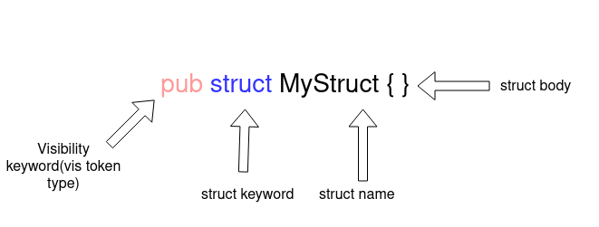

# Rust 中的宏：带有示例的教程

[原文](https://blog.logrocket.com/macros-in-rust-a-tutorial-with-examples/)

</br>


</br>

在本篇教程中，我们将介绍有关 Rust 宏的全部内容，包括 Rust 中宏的引入以及在示例中演示如何使用 Rust 宏。

我们将包含一下内容：

- [什么是 Rust 中的宏？](#什么是-Rust-中的宏？)
- [Rust 宏的类型](#Rust-宏的类型)
- [Rust 中的声明式宏](#Rust-中的声明式宏)
  - [创建声明式宏](#创建声明式宏)
  - [Rust 中声明式宏的高级解析](#Rust-中声明式宏的高级解析)
  - [解析结构体的名称和字段](#解析结构体的名称和字段)
  - [从结构体中解析元数据](#从结构体中解析元数据)
  - [声明式宏的限制](#声明式宏的限制)
- [Rust 中的过程宏](#Rust-中的过程宏)
    - [属性式宏](#属性式宏)
    - [自定义派生宏](#自定义派生宏)
    - [函数式宏](#函数式宏)

## 什么是 Rust 中的宏？

Rust 对宏提供了出色的支持。使用宏可以编写代码，该代码可以在编译期间生成其他的代码，这被称为元编程。

宏提供了类似于函数的功能，却没有运行时成本。但是，由于在编译期间扩展了宏，因此存在一些编译时的开销。

Rust 的宏与 C 中的宏有很大的不同。Rust 宏可以应用于 token 树，但是 C 宏只能用于文本替换 (substitution)。

## Rust 宏的类型

Rust 宏有两种类型：

1. **声明式宏**：使你能够编写类似于在 Rust 代码中作为参数运行的 match 表达式。它使用你提供的代码生成可以替换宏调用的代码。
2. **过程宏**：使你能够在 Rust 代码的抽象语法树 (AST) 上进行操作。过程宏是从一个(或两个)`TokenStream`到另一个`TokenStream`的函数，其输出替换宏调用。

让我们深入学习声明式宏与过程宏，并探讨一些示例，学习如何在 Rust 中使用宏。

## Rust 中的声明式宏

声明式宏通过`macro_rules!`来定义。声明式宏的功能性稍微差一些，但是提供了易于使用的接口来创建宏以移除重复的代码。常见的声明式宏如`println!`。声明式宏提供了类似 match 的接口，在匹配时，宏会被替换为对应的匹配分支内的代码。

### 创建声明式宏

```rust
// use macro_rules! <name of macro>{<Body>}
macro_rules! add{
 // macth like arm for macro
    ($a:expr,$b:expr)=>{
 // macro expand to this code
        {
// $a and $b will be templated using the value/variable provided to macro
            $a+$b
        }
    }
}

fn main(){
 // call to macro, $a=1 and $b=2
    add!(1,2);
}
```

这段代码创建了一个可以将两个数相加的宏。`[macro_rules!]`与宏的名称，`add`以及宏的主体一起使用。

这个宏并没有将两个数相加，它只是将自己替换成了将两个数相加的代码。宏的每一个分支都携带了对应功能需要的参数，并且有多种类型可以分配给参数。如果`add`函数也可以采用单个参数，我们可以添加另一个分支：

```rust
macro_rules! add{
 // first arm match add!(1,2), add!(2,3) etc
    ($a:expr,$b:expr)=>{
        {
            $a+$b
        }
    };
// Second arm macth add!(1), add!(2) etc
    ($a:expr)=>{
        {
            $a
        }
    }
}

fn main(){
// call the macro
    let x=0;
    add!(1,2);
    add!(x);
}
```

一个宏中可以有多个分支，可以根据不同的参数扩展为不同的代码。每个分支可以采用多个参数，以`$`符号开头，后跟 token 的类型。

- `item` - 项，如：函数，结构体，模块等
- `block` - 块 (语句或表达式的代码块，被大括号包含)
- `stmt` - 语句
- `pat` - 模式
- `expr` - 表达式
- `ty` - 类型
- `ident` - 标识符
- `path` - 路径(如：`foo`，`::std::mem::replace`，`transmute::<_, int>`，...)
- `meta` - 元项 (meta item)，即`#[...]`和`#![...]`属性中的内容
- `tt` - 单个 token 树
- `vis` - 可能为空的可见性 (Visibility) 限定词

在本例中，我们使用 token 类型为`ty`的`$typ`参数作为数据类型，如`u8`，`u16`等。在数字相加之前，这个宏会将其转换为指定的类型。

```rust
macro_rules! add_as{
// using a ty token type for macthing datatypes passed to maccro
    ($a:expr,$b:expr,$typ:ty)=>{
        $a as $typ + $b as $typ
    }
}

fn main(){
    println!("{}",add_as!(0,2,u8));
}
```

Rust 宏还支持传入非固定数量的参数。运算符和正则表达式非常类似。`*`用于 0 个或多个 token 类型，`+`用于 0 个或 1 个参数。

```rust
macro_rules! add_as{
    (
  // repeated block
  $($a:expr)
 // seperator
   ,
// zero or more
   *
   )=>{
       { 
   // to handle the case without any arguments
   0
   // block to be repeated
   $(+$a)*
     }
    }
}

fn main(){
    println!("{}",add_as!(1,2,3,4)); // => println!("{}",{0+1+2+3+4})
}
```

重复的 token 类型包含在`$()`中，后面跟一个分隔符以及一个`*`或者`+`，表示 token 将要重复的次数。分隔符用来区分彼此的 token。后面跟`*`或`+`的`$()`用于表示重复的代码块。在上面的示例中，`+$a`是需要重复的代码。

如果你仔细看这段代码，你会发现代码中添加了一个额外的 0 来使语法有效。要删除这个 0 并使`add`表达式和参数一样，我们需要创建一个名为 [TT muncher](https://danielkeep.github.io/tlborm/book/pat-incremental-tt-munchers.html) 的新宏。

```rust
macro_rules! add{
 // first arm in case of single argument and last remaining variable/number
    ($a:expr)=>{
        $a
    };
// second arm in case of two arument are passed and stop recursion in case of odd number ofarguments
    ($a:expr,$b:expr)=>{
        {
            $a+$b
        }
    };
// add the number and the result of remaining arguments 
    ($a:expr,$($b:tt)*)=>{
       {
           $a+add!($($b)*)
       }
    }
}

fn main(){
    println!("{}",add!(1,2,3,4));
}
```

TT muncher 递归式的分别处理每个 token。一次处理一个 token 比较容易。这个宏有三个分支：

1. 第一个分支处理传入单个参数的情况
2. 第二个分支处理传入两个参数的情况
3. 第三个分支通过传入剩余的参数再次调用`add`宏

宏参数不需要逗号分隔符。多个 token 可以使用不同的 token 类型。举个例子，括号可以与`ident` token 类型一起使用。Rust 编译器采用匹配的分支，并从参数字符串中提取变量。

```rust
macro_rules! ok_or_return{
// match something(q,r,t,6,7,8) etc
// compiler extracts function name and arguments. It injects the values in respective varibles.
    ($a:ident($($b:tt)*))=>{
       {
        match $a($($b)*) {
            Ok(value)=>value,
            Err(err)=>{
                return Err(err);
            }
        }
        }
    };
}

fn some_work(i:i64,j:i64)->Result<(i64,i64),String>{
    if i+j>2 {
        Ok((i,j))
    } else {
        Err("error".to_owned())
    }
}

fn main()->Result<(),String>{
    ok_or_return!(some_work(1,4));
    ok_or_return!(some_work(1,0));
    Ok(())
}
```

如果某个操作返回`Err`或者某个操作的值返回`Ok`，则`ok_or_return`宏返回该函数。它将函数作为一个参数并在内部的 match 语句中执行。对于传递给函数的参数，它重复的使用。

通常，很少需要将宏分组为一个宏。在本例中，使用了内部的宏规则。它有助于操作宏输入并编写干净的 TT muncher。

为了创建一个内部规则，添加一个以`@`开头的规则名作为参数。现在，除非明确将其指定为参数，否则该宏将永远不会匹配内部规则。

```rust
macro_rules! ok_or_return{
 // internal rule.
    (@error $a:ident,$($b:tt)* )=>{
        {
        match $a($($b)*) {
            Ok(value)=>value,
            Err(err)=>{
                return Err(err);
            }
        }
        }
    };

// public rule can be called by the user.
    ($a:ident($($b:tt)*))=>{
        ok_or_return!(@error $a,$($b)*)
    };
}

fn some_work(i:i64,j:i64)->Result<(i64,i64),String>{
    if i+j>2 {
        Ok((i,j))
    } else {
        Err("error".to_owned())
    }
}

fn main()->Result<(),String>{
   // instead of round bracket curly brackets can also be used
    ok_or_return!{some_work(1,4)};
    ok_or_return!(some_work(1,0));
    Ok(())
}
```

### Rust 中声明式宏的高级解析

宏有时会执行需要解析 Rust 语言本身的任务。

将到目前为止我们已经介绍的概念放在一起，创建一个宏，该宏通过使`pub`关键字作为前缀，将结构体的可见性设置为公开。

首先，我们需要解析 Rust 结构体以获取它的名称，字段以及字段类型。


### 解析结构体的名称和字段

结构体的声明开头有一个可见性关键字(如`pub`)，后面跟`struct`关键字，接着是结构体的名称，最后是结构体的主体。



```rust
macro_rules! make_public{
    (
  // use vis type for visibility keyword and ident for struct name
     $vis:vis struct $struct_name:ident { }
    ) => {
        {
            pub struct $struct_name{ }
        }
    }
}
```

`$vis`对应可见性，`$struct_name`对应结构体的名称。为了使结构体是外部可见的，我们需要添加`pub`关键字并忽略`$vis`变量。


一个结构体中可能包含多个字段，这些字段可能具有相同或不同的数据类型以及可见性。`ty` token 类型用于数据类型，`vis` 用于可见性以及`ident`用于字段名。我们将使用`*`来重复表示 0 个或多个字段。

```rust
macro_rules! make_public{
    (
     $vis:vis struct $struct_name:ident {
        $(
 // vis for field visibility, ident for field name and ty for field data type
        $field_vis:vis $field_name:ident : $field_type:ty
        ),*
    }
    ) => {
        {
            pub struct $struct_name{
                $(
                pub $field_name : $field_type,
                )*
            }
        }
    }
}
```

### 从结构体中解析元数据

通常结构体会有一些附加的元数据或者过程宏，如`#[derive(Debug)]`。此元数据需要保持不变。解析这个元数据需要使用`meta`类型。

```rust
macro_rules! make_public{
    (
     // meta data about struct
     $(#[$meta:meta])* 
     $vis:vis struct $struct_name:ident {
        $(
        // meta data about field
        $(#[$field_meta:meta])*
        $field_vis:vis $field_name:ident : $field_type:ty
        ),*$(,)+
    }
    ) => {
        { 
            $(#[$meta])*
            pub struct $struct_name{
                $(
                $(#[$field_meta:meta])*
                pub $field_name : $field_type,
                )*
            }
        }
    }
}
```

我们的`make_public`宏已经就绪。为了查看它是如何工作的，我们使用 [Rust Playground](https://play.rust-lang.org/) 将宏扩展为已经编译的实际代码。

```rust
macro_rules! make_public{
    (
     $(#[$meta:meta])* 
     $vis:vis struct $struct_name:ident {
        $(
        $(#[$field_meta:meta])*
        $field_vis:vis $field_name:ident : $field_type:ty
        ),*$(,)+
    }
    ) => {

            $(#[$meta])*
            pub struct $struct_name{
                $(
                $(#[$field_meta:meta])*
                pub $field_name : $field_type,
                )*
            }
    }
}

fn main(){
    make_public!{
        #[derive(Debug)]
        struct Name{
            n:i64,
            t:i64,
            g:i64,
        }
    }
}
```

扩展后的代码如下所示：

```rust
// some imports

macro_rules! make_public {
    ($ (#[$ meta : meta]) * $ vis : vis struct $ struct_name : ident
     {
         $
         ($ (#[$ field_meta : meta]) * $ field_vis : vis $ field_name : ident
          : $ field_type : ty), * $ (,) +
     }) =>
    {

            $ (#[$ meta]) * pub struct $ struct_name
            {
                $
                ($ (#[$ field_meta : meta]) * pub $ field_name : $
                 field_type,) *
            }
    }
}

fn main() {
        pub struct name {
            pub n: i64,
            pub t: i64,
            pub g: i64,
    }
}
```

### 声明式宏的限制

声明式宏有一些限制。一些与 Rust 宏本身有关，一些是声明式宏所特有的。

- 缺少宏的自动提示与扩展的支持
- 调试声明式宏非常困难
- 有限的修改功能
- (编译后产生)超大的二进制文件
- 需要更长的编译时间(声明式宏与过程宏都有这个问题)

## Rust 中的过程宏

[过程宏](https://blog.logrocket.com/procedural-macros-in-rust/)是宏的更高级的版本。过程宏允许你扩展已存在的 Rust 语法。它接受任意的输入并返回合法的 Rust 代码。

过程宏是一个接受`TokenStream`作为输入并返回另一个`TokenStream`作为输出。过程宏操作输入的`TokenStream`以产生一个输出流。

这里有三种类型的过程宏：

1. 属性式宏
2. 派生宏
3. 函数式宏

我们将会在下面详细的介绍每一种类型的过程宏。

### 属性式宏

属性式宏可以让你创建一个依附于某一项的自定义属性，并允许你操作该项。它还可以携带参数。

```rust
#[some_attribute_macro(some_argument)]
fn perform_task(){
// some code
}
```

在上面的代码中，`some_attribute_macros`是一个属性宏，它操作`perform_task`函数。

为了写一个属性式宏，使用`cargo new macro-demo --lib`创建一个项目。一旦项目就绪，更新`Cargo.toml`来告诉项目将要创建一个过程宏。

```toml
# Cargo.toml
[lib]
proc-macro = true
```

现在我们开始尝试编写过程宏。

过程宏是一个接收`TokenStream`作为输入，并返回另一个`TokenStream`的函数。为了编写一个过程宏，我们需要编写一个解析器解析`TokenStream`。Rust 社区有一个非常棒的库：[syn](https://github.com/dtolnay/syn)，用来解析`TokenStream`。

[syn](https://github.com/dtolnay/syn) 为 Rust 语法提供了现成的解析器用来解析`TokenStream`。你也可以通过组合 [syn](https://github.com/dtolnay/syn) 提供的更加底层的解析器来解析你的语法。

在`Cargo.toml`中添加`syn`和`quote`：

```toml
# Cargo.toml
[dependencies]
syn = {version="1.0.57",features=["full","fold"]}
quote = "1.0.8"
```

现在我们可以使用编译器为编写过程宏而提供`proc_macro`库在`lib.rs`中编写属性式宏。一个过程宏库不能导出过程宏以外的其他任何东西，并且在 crate 中定义的过程宏不能在该 crate 中使用。

```rust
// lib.rs
extern crate proc_macro;
use proc_macro::{TokenStream};
use quote::{quote};

// using proc_macro_attribute to declare an attribute like procedural macro
#[proc_macro_attribute]
// _metadata is argument provided to macro call and _input is code to which attribute like macro attaches
pub fn my_custom_attribute(_metadata: TokenStream, _input: TokenStream) -> TokenStream {
    // returing a simple TokenStream for Struct
    TokenStream::from(quote!{struct H{}})
}
```

为了测试我们添加的宏，通过创建一个名为`tests`的文件夹并在其中添加`attribute_macro.rs`文件来创建一个集成测试。在这个文件中，我们测试我们的属性式宏。

```rust
// tests/attribute_macro.rs

use macro_demo::*;

// macro converts struct S to struct H
#[my_custom_attribute]
struct S{}

#[test]
fn test_macro(){
// due to macro we have struct H in scope
    let demo=H{};
}
```

使用`cargo test`命令运行上面的测试代码。

既然我们理解了过程宏的基本概念，让我们使用`syn`来操作并解析更高级的`TokenStream`。

为了学习`syn`是如何解析并操作`TokenStream`的，我们以`syn`的[Github仓库](https://github.com/dtolnay/syn/blob/master/examples/trace-var/trace-var/src/lib.rs) 的一个示例为例。这个示例创建了一个在值变更时跟踪变量的 Rust 宏。

首先，