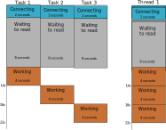

# Rust 中异步编程实用介绍

[原文](http://jamesmcm.github.io/blog/2020/05/06/a-practical-introduction-to-async-programming-in-rust/)

> 在本文中，我们将探讨一个使用 Tokio 运行时在 Rust 中进行异步编程的简短示例，展示了不同的执行场景。这篇文章主要是针对异步编程的初学者的。

这个示例的代码可以在 [Github](https://github.com/jamesmcm/async-rust-example) 中获取，也可以使用基于`async-std`运行时的分支(由 [@BartMassey](https://github.com/BartMassey) 贡献)。

## 什么是异步编程

异步编程可以让你在等待 I/O 操作(通常是网络请求或响应)结果的同时，即使在单个 OS 线程中，也可以继续执行计算。

这是通过使用异步运行时来实现的，该运行时将异步任务(即：[绿色线程](https://en.wikipedia.org/wiki/Green_threads))分配给实际的 OS 线程。

与 OS 线程不同，创建绿色线程并不昂贵，因此我们不必担心是否达到了硬件限制。而 OS 线程需要维护自己的堆栈，因此在处理多个线程时会占用大量内存。在 Linux 中你可以使用`cat /proc/sys/kernel/threads-max`命令来查看每个进程的线程数限制，我的是 127162。

例如，如果我们需要一个单独的 OS 线程来处理 Web 服务器上的每个请求，这将是一个重大的问题，这是 [C10k 问题](https://en.wikipedia.org/wiki/C10k_problem)的根源 - 如何处理 Web 服务器上的 10000 个连接。

早期的 Web 服务器确实为每个请求分配了独立的 OS 线程，以便并行处理每个请求。但是这会造成这些线程花费了大量的时间来等待网络响应，而不是做其他的计算。

## Async 和 await

Rust 已经采用 async/await 语法定义异步代码块和函数。

`async`关键字定义了异步代码块和函数。它被指定返回了一个`Future` - 一个需要在其他地方`.await`以触发任务执行(注意延迟执行)，并等待可用的返回的值。

`.await`关键字(必须被用于`async`代码块/函数中)用于异步等待异步任务的完成并获取返回值。请注意，虽然在`Future`准备好之前任务本身无法进行，但是实际的 OS 线程却可以在运行时分配其他的任务，因此 (OS 线程)可以继续工作。

高效的任务正在通知运行时，这时它可能会导致执行另一个任务(最终，另一个任务也将等待某个事件，如果此任务中的`Future`准备就绪，则该任务可以继续执行) - 这是[多任务协作](https://en.wikipedia.org/wiki/Cooperative_multitasking)的实现。

这种语法非常优雅，它使我们可以编写异步程序，该程序的结构类似于简单的同步程序。

## 我们应该什么时候使用异步？

当线程原本只是在等待 I/O 操作(例如：发出网络请求或响应，对磁盘的读写以及等待用户的输入)时，异步编程将会很有用。

如果你始终都在计算并且没有等待 I/O 操作，异步编程其实用处不大，即使这些计算可以并行运行(如在光线跟踪器中)，它对你的帮助也十分有限。在这种情况下，最好直接在 OS 线程上并行执行计算(利用 CPU 中的多个内核)，如在`rayon`库中使用并行迭代器(如果你想要进行线程级别的控制，则可以使用`crossbeam`和`threadpool`库)。然而，请记住 Amdahl 定律，即算法优化改进可能会比专注于并行化产生更好的回报。

如果在等待 I/O 操作的同时没有其他任务可做，那它也没有用。例如，在上一篇[博客](http://jamesmcm.github.io/blog/2020/04/19/data-engineering-with-rust-and-aws-lambda/#en)中，当我们向 AWS Secrets Manager 请求数据库连接凭证时，`Rusoto`实际上返回的是一个`RusotoFuture`对象，但是在这种情况下，我们对 Lambda 函数的一次调用对应于一次请求 - 等待数据库凭证到达起见无需完成任何工作。因此我们可以仅使用同步编程(幸运的是，`RusotoFuture`提供了`.sync()`函数来做到这一点)。

## 示例

在此示例中，我们将模拟三个非常慢的网络请求，包括三个阶段：

- 连接 - 2秒的异步延迟
- 等待响应 - 8秒的异步延迟(延迟在服务端)
- 计算 - 4秒的同步延迟(如：它必须阻塞当前的 OS 线程去做计算)。

我们将使用 [Tokio](https://tokio.rs) 作为本例中的异步运行时，因为它是目前 Rust 中最流行的异步框架。其他的异步框架如`async-std`运行时 - 基于`async-std`的本示例代码可以在 [Github仓库的 async-std 分支](https://github.com/jamesmcm/async-rust-example/tree/async-std)上获取(由 [@BartMassey](https://github.com/BartMassey)贡献)。

请注意，两者都使用`futures`库，因此你可以在切换异步运行时的同时(whilst)保留大部分相同的 API。

## Server

本示例的 server 代码改编自 [tokio教程](https://tokio.rs/docs/getting-started/echo/)。它在延迟 8 秒后，打印接收到的字节。

完整的改编代码如下：

```rust
use futures::stream::StreamExt;
use tokio::net::TcpListener;

#[tokio::main]
async fn main() {
    let addr = "127.0.0.1:6142";
    let mut listener = TcpListener::bind(addr).await.unwrap();

    let server = {
        async move {
            let mut incoming = listener.incoming();
            while let Some(conn) = incoming.next().await {
                match conn {
                    Err(e) => eprintln!("accept failed = {:?}", e),
                    Ok(mut sock) => {
                        tokio::spawn(async move {
                            let (mut reader, mut writer) = sock.split();
                            tokio::time::delay_for(tokio::time::Duration::from_secs(8)).await;
                            match tokio::io::copy(&mut reader, &mut writer).await {
                                Ok(amt) => {
                                    println!("wrote {} bytes", amt);
                                }
                                Err(err) => {
                                    eprintln!("IO error {:?}", err);
                                }
                            }
                        });
                    }
                }
            }
        }
    };
    println!("Server running on localhost:6142");
    server.await;
}
```

## 同步请求

在同步的情况下，我们只需依次运行每个请求即可。因此我们预测完成 3 个任务的总执行时间为`3 * ( 2 + 8 + 4) = 42`秒。

我们可以用一张图对这种情况进行可视化：


我们实现这个仅需使用标准库：

```rust
use std::io::prelude::*;
use std::net::TcpStream;
use std::thread::sleep;
use std::time::Instant;

fn main() -> Result<(), Box<dyn std::error::Error>> {
    let now = Instant::now();

    task("task1", now.clone())?;
    task("task2", now.clone())?;
    task("task3", now.clone())?;
    Ok(())
}

fn task(label: &str, now: std::time::Instant) -> Result<(), Box<dyn std::error::Error>> {
    // Simulate network delay using thread sleep for 2 seconds
    println!(
        "OS Thread {:?} - {} started: {:?}",
        std::thread::current().id(),
        label,
        now.elapsed(),
    );
    sleep(std::time::Duration::from_secs(2));

    // Write to server - server will echo this back to us with 8 second delay
    let mut stream = TcpStream::connect("127.0.0.1:6142")?;
    stream.write_all(label.as_bytes())?;
    println!(
        "OS Thread {:?} - {} written: {:?}",
        std::thread::current().id(),
        label,
        now.elapsed()
    );

    // Read 5 chars we expect (to avoid dealing with EOF, etc.)
    let mut buffer = [0; 5];
    stream.read_exact(&mut buffer)?;
    stream.shutdown(std::net::Shutdown::Both)?;
    println!(
        "OS Thread {:?} - {} read: {:?}",
        std::thread::current().id(),
        label,
        now.elapsed()
    );

    // Simulate computation work by sleeping actual thread for 4 seconds
    sleep(std::time::Duration::from_secs(4));
    println!(
        "OS Thread {:?} - {} finished: {:?}",
        std::thread::current().id(),
        std::str::from_utf8(&buffer)?,
        now.elapsed()
    );
    Ok(())
}
```

运行这段代码：

```console
$ cargo run --release --bin server
$ cargo run --release --bin client_synchronous
```

```console
OS Thread ThreadId(1) - task1 started: 578ns
OS Thread ThreadId(1) - task1 written: 2.000346788s
OS Thread ThreadId(1) - task1 read: 10.002177173s
OS Thread ThreadId(1) - task1 finished: 14.002328699s
OS Thread ThreadId(1) - task2 started: 14.002387112s
OS Thread ThreadId(1) - task2 written: 16.002673602s
OS Thread ThreadId(1) - task2 read: 24.006071003s
OS Thread ThreadId(1) - task2 finished: 28.006204147s
OS Thread ThreadId(1) - task3 started: 28.006263855s
OS Thread ThreadId(1) - task3 written: 30.00652763s
OS Thread ThreadId(1) - task3 read: 38.008234993s
OS Thread ThreadId(1) - task3 finished: 42.008389223s
```

准确给出了我们上面计算的 42 秒总执行时间。

## 同步请求 (Tokio)

请注意，在使用 Tokio 时(有时是无意间)，可以从异步函数中获取同步行为。用 Tokio 实现上述功能：

```rust
use futures::stream::StreamExt;
use std::error::Error;
use std::thread::sleep;
use std::time::Instant;
use tokio::join;
use tokio::net::TcpStream;
use tokio::prelude::*;

#[tokio::main]
async fn main() -> Result<(), Box<dyn Error + Send + Sync>> {
    let now = Instant::now();

    // Synchronous
    task("task1", now.clone()).await?;
    task("task2", now.clone()).await?;
    task("task3", now.clone()).await?;
    Ok(())
}

async fn task(label: &str, now: std::time::Instant) -> Result<(), Box<dyn Error + Send + Sync>> {
    // Simulate network delay using Tokio async delay for 2 seconds
    println!(
        "OS Thread {:?} - {} started: {:?}",
        std::thread::current().id(),
        label,
        now.elapsed(),
    );
    tokio::time::delay_for(tokio::time::Duration::from_secs(2)).await;

    // Write to server - server will echo this back to us with 8 second delay
    let mut stream = TcpStream::connect("127.0.0.1:6142").await?;
    stream.write_all(label.as_bytes()).await?;
    println!(
        "OS Thread {:?} - {} written: {:?}",
        std::thread::current().id(),
        label,
        now.elapsed()
    );

    // Read 5 chars we expect (to avoid dealing with EOF, etc.)
    let mut buffer = [0; 5];
    stream.read_exact(&mut buffer).await?;
    stream.shutdown(std::net::Shutdown::Both)?;
    println!(
        "OS Thread {:?} - {} read: {:?}",
        std::thread::current().id(),
        label,
        now.elapsed()
    );

    // Simulate computation work by sleeping actual thread for 4 seconds
    sleep(std::time::Duration::from_secs(4));
    println!(
        "OS Thread {:?} - {} finished: {:?}",
        std::thread::current().id(),
        std::str::from_utf8(&buffer)?,
        now.elapsed()
    );
    Ok(())
}
```

运行这段代码，产生的输出和之前一样：

```console
$ cargo run --release --bin client_async
```

```console
OS Thread ThreadId(1) - task1 started: 333ns
OS Thread ThreadId(1) - task1 written: 2.001476012s
OS Thread ThreadId(1) - task1 read: 10.003284491s
OS Thread ThreadId(1) - task1 finished: 14.003404307s
OS Thread ThreadId(1) - task2 started: 14.003476979s
OS Thread ThreadId(1) - task2 written: 16.005013941s
OS Thread ThreadId(1) - task2 read: 24.005471439s
OS Thread ThreadId(1) - task2 finished: 28.005575307s
OS Thread ThreadId(1) - task3 started: 28.005615372s
OS Thread ThreadId(1) - task3 written: 30.007082377s
OS Thread ThreadId(1) - task3 read: 38.009223127s
OS Thread ThreadId(1) - task3 finished: 42.009349576s
```

这是因为串行任务的等待(`.await`)造成了同步。主函数是异步的，但是使用`.await`会使它在继续之前等待`Future`的结果。在这方面，主函数与其他异步函数之间没有什么区别。当时没有任何其他的任务可以产生执行结果，因此任务的执行实际上还是同步的。

请注意，在上面的实现中是不需要`Send + Sync`的(因为它运行在单个 OS 线程中)，但是在下一个示例中，我们将会需要它们。这也是为什么我们会 clone `now` 而不是在`task()`中对其进行借用(我们也可以将其封装在`Arc`中)。

在下面的示例中，我们将使用同样的`async fn task()`定义，在此将其忽略。

## 异步请求(一个 OS 线程)

在异步中单个 OS 线程的场景下，我们同时开始等待步骤(连接并获取服务端的响应)。然而，最终的计算步骤仍然需要在每个任务中依次执行完成。因此我们预期总执行时间是`8 + 2 + (3 * 4) = 22`秒。

对应的图表如下所示：



像之前一样使用相同的`async fn task()`定义：

```rust
use futures::stream::futures_unordered::FuturesUnordered;
use futures::stream::StreamExt;
use std::error::Error;
use std::thread::sleep;
use std::time::Instant;
use tokio::net::TcpStream;
use tokio::prelude::*;

#[tokio::main]
async fn main() -> Result<(), Box<dyn Error + Send + Sync>> {
    let now = Instant::now();

    // Asynchronous single-thread
    let mut futs = FuturesUnordered::new();

    futs.push(task("task1", now.clone()));
    futs.push(task("task2", now.clone()));
    futs.push(task("task3", now.clone()));

    while let Some(_handled) = futs.next().await {}
    Ok(())
}
```

运行这段代码，总执行时间是 22 秒：

```console
OS Thread ThreadId(1) - task1 started: 3.994µs
OS Thread ThreadId(1) - task2 started: 21.174µs
OS Thread ThreadId(1) - task3 started: 25.511µs
OS Thread ThreadId(1) - task3 written: 2.002221984s
OS Thread ThreadId(1) - task2 written: 2.002406898s
OS Thread ThreadId(1) - task1 written: 2.002483563s
OS Thread ThreadId(1) - task3 read: 10.003326999s
OS Thread ThreadId(1) - task3 finished: 14.003478669s
OS Thread ThreadId(1) - task2 read: 14.00365763s
OS Thread ThreadId(1) - task2 finished: 18.00379238s
OS Thread ThreadId(1) - task1 read: 18.003951713s
OS Thread ThreadId(1) - task1 finished: 22.004094444s
```

在本示例中，我们使用`FuturesUnordered`集合以便我们可以重复等待不同的 Future。然而，我们不会使用`tokio::spawn()`因此它只能运行在单个 OS 线程中(因为我们不允许创建更多的 OS 线程)。

请注意，在这里我们可以使用`join!`宏而不必分配一个`FuturesUnordered`，我们将在之后的示例中这么做。然而，它仅对数量很少的 Future 具有实用性。

我们也可以通过设置主函数上的属性参数来强制 Tokio 只能使用一个线程。

```rust
#[tokio::main(core_threads = 1, max_threads = 1)]
async fn main() -> Result<(), Box<dyn Error + Send + Sync>> {
...
}
```

## 异步请求(多个 OS 线程)

在跨多个 OS 线程的异步请求中，我们可以同时进行每一步(并在 OS 线程可以在任务等待的时候去完成其他的任务)。这就意味着我们可以在不同的 OS 线程中并行的进行最终的计算。


因此我们预测 3 次请求的总执行时间为`2 + 8 + 4 = 14`秒。这是我们能够实现的最好的方案 - 与完成单个请求的用时一样。

请注意，这需要我们跨进程发送的类型是`线程安全`的，也就是说需要实现`Send`或`Sync` - 就像我们直接使用 OS 线程一样。

它的实现和之前的示例很像，但是不是直接等待 Future 的返回，我们对任务进行`tokio::spawn`并等待它们的处理。这允许 tokio 可以在不同的的 OS 线程中执行它们。

```rust
#[tokio::main]
async fn main() -> Result<(), Box<dyn Error + Send + Sync>> {
    let now = Instant::now();

    let mut futs = FuturesUnordered::new();
    futs.push(tokio::spawn(task("task1", now.clone())));
    futs.push(tokio::spawn(task("task2", now.clone())));
    futs.push(tokio::spawn(task("task3", now.clone())));
    while let Some(_handled) = futs.next().await {}
    Ok(())
}
```

然后我们会观察到 14 秒的执行时间(请注意我们并不关心执行顺序)：

```console
OS Thread ThreadId(2) - task1 started: 17.055µs
OS Thread ThreadId(3) - task2 started: 30.227µs
OS Thread ThreadId(2) - task3 started: 32.513µs
OS Thread ThreadId(2) - task3 written: 2.001499145s
OS Thread ThreadId(3) - task1 written: 2.00153689s
OS Thread ThreadId(5) - task2 written: 2.001721878s
OS Thread ThreadId(3) - task3 read: 10.003403756s
OS Thread ThreadId(2) - task1 read: 10.003501s
OS Thread ThreadId(5) - task2 read: 10.003417328s
OS Thread ThreadId(3) - task3 finished: 14.003584085s
OS Thread ThreadId(2) - task1 finished: 14.003664981s
OS Thread ThreadId(5) - task2 finished: 14.003698375s
```

不同的 OS 线程 ID 证明了任务确实是在 OS 中不同的线程中执行的。

为了本文内容更加完整，这里有一个使用`join!`宏的相同实现，而不是分配一个`FuturesUnordered`：

```rust
#[tokio::main]
async fn main() -> Result<(), Box<dyn Error + Send + Sync>> {
    let now = Instant::now();
    // Asynchronous multi-threaded

    match join!(
        tokio::spawn(task("task1", now.clone())),
        tokio::spawn(task("task2", now.clone())),
        tokio::spawn(task("task3", now.clone()))
    ) {
        (x, y, z) => {
            (x.ok(), y.ok(), z.ok())
        }
    };
    Ok(())
}
```

这样可以节省`FuturesUnordered`的分配，但是处理返回的结果元组(尤其是对于很多的Future来说)，可能会很笨拙。

### 它和 OS 线程并行有什么区别呢？

在一些同步的场景中，你可以直接使用 OS 线程来实现相同的事情，例如之前提到的[rayon](https://crates.io/crates/rayon)库。

然而，这种情况下每个请求都会需要一个自己的 OS 线程，如果我们必须处理 10000 个并行请求，很可能会达到系统的线程限制。

也就是说，执行图如下所示：


请注意，OS 线程可能会花费大量的时间来等待 I/O 操作，而无法启动其他任务。

我们可以使用 rayon 修改我们在上面的第一个同步示例：

```rust
use rayon::prelude::*;

fn main() -> Result<(), Box<dyn std::error::Error + Send + Sync>> {
    let now = Instant::now();

    ["task1", "task2", "task3"]
        .par_iter()
        .map(|x| task(x, now.clone()))
        .collect::<Result<Vec<_>, _>>()?;
    Ok(())
}
```

而且它在预期的 14 秒内结束了(请注意这里每个任务都单独分配了一个 OS 线程)。

```console
OS Thread ThreadId(3) - task1 started: 280.871µs
OS Thread ThreadId(6) - task2 started: 281.03µs
OS Thread ThreadId(7) - task3 started: 283.838µs
OS Thread ThreadId(6) - task2 written: 2.000605562s
OS Thread ThreadId(7) - task3 written: 2.000619598s
OS Thread ThreadId(3) - task1 written: 2.000679853s
OS Thread ThreadId(3) - task1 read: 10.002321036s
OS Thread ThreadId(6) - task2 read: 10.00233185s
OS Thread ThreadId(7) - task3 read: 10.002384653s
OS Thread ThreadId(3) - task1 finished: 14.002447762s
OS Thread ThreadId(6) - task2 finished: 14.002540969s
OS Thread ThreadId(7) - task3 finished: 14.002589621s
```

然而，由于一个任务对应了一个 OS 线程，当处理大量的任务时可能会无法充分利用资源。

而在异步的情况下，我们在(同步的)计算步骤中只需要额外的线程即可。这意味着我们可以使用固定大小的 OS 线程池，并仍然可以在计算步骤的并行化中受益，同时还可以保证系统资源的充分利用(即我们可以限制 OS 线程的最大数量，但是依然可以处理新的请求)。

## 结论

我希望这篇文章可以帮助你更好的理解在 Rust 中何时以及如何去使用异步编程。

优雅的`async/await`语法允许进行简单明了的异步编程。但是，如果你之前没有接触过异步编程，可能需要花一点时间来适应这种方式。

上述的示例也展示了并发和并行之间的区别。在异步单个 OS 线程中，我们并发的处理任务，但是这不是并行执行的(因为我们只有一个 OS 线程)。

## 当前的限制

请注意，现在你还不能在 [trait 中使用异步函数](https://rust-lang.github.io/async-book/07_workarounds/06_async_in_traits.html)，并且你也不能创建[异步的解构](https://boats.gitlab.io/blog/post/poll-drop/)。如果你希望结构在销毁时发出网络请求，但是不希望这么做的同时阻塞 OS 线程，这时就会出现问题 - 你无法使用`.await`因为`drop()`(来自 From) 不是异步的。