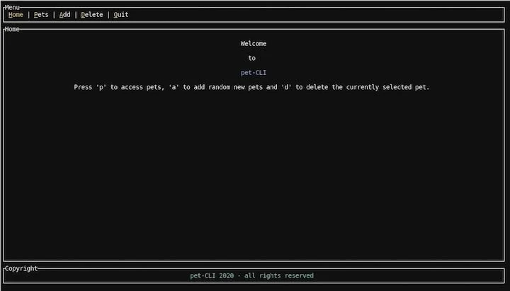
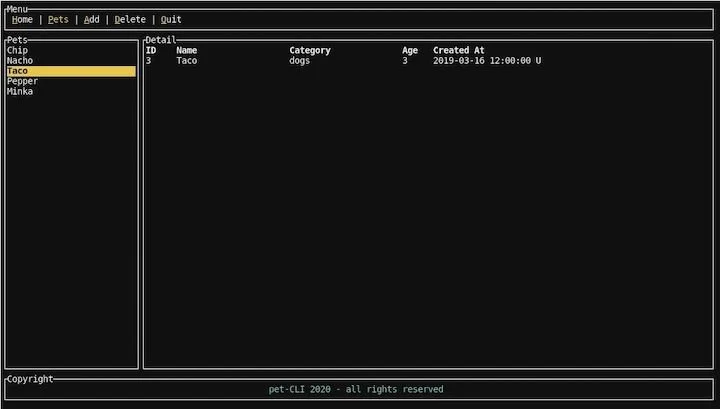

# Rust 和 TUI：在 Rust 中构建命令行界面

[原文](https://blog.logrocket.com/rust-and-tui-building-a-command-line-interface-in-rust/)


Rust 是一门拥有良好的交叉编译支持的底层系统编程语言，这使其成为编写命令行程序的主要候选语言。从重新实现广泛使用的工具 (如 [ripgrep](https://github.com/BurntSushi/ripgrep)，[exa](https://github.com/ogham/exa)，[bat](https://github.com/sharkdp/bat)) 到功能完善的终端 UI 工具（如：[GitUI](https://github.com/extrawurst/gitui)，[Spotify TUI](https://github.com/Rigellute/spotify-tui)，[Bandwhich](https://github.com/imsnif/bandwhich)，[KMon](https://github.com/orhun/kmon)，[Diskonaut](https://github.com/imsnif/diskonaut)）都是比较著名 (Prominent) 的例子。

甚至有比较流行的 shell 实现 (如 [Alacritty](https://github.com/alacritty/alacritty) 和 [Nushell](https://github.com/nushell/nushell))。使用 Rust 重写这众多的工具 (且保持稳定的增长) 的原因包括 [Rewrite it in Rust (RIIR) meme](https://transitiontech.ca/random/RIIR) 以及 Rust 绝佳的编写命令行应用程序的生态系统。

当谈到 Rust 命令行库的生态系统，我想专门提一下 [Clap](https://github.com/clap-rs/clap) 和 [TUI](https://github.com/fdehau/tui-rs)，它们都是上面提到的许多工具中所必须的。Clap 是一个命令行解析器，具有出色的 API 和大量可用的功能，如果不需要，可以禁用其中的许多功能以加快编译速度。

## 什么是 TUI？

TUI 是一个用于构建终端用户界面的框架。它支持多个用于绘制终端的“后端”。这些后端控制与终端交互的实际逻辑，如设置正确的字符集，清空屏幕等，而 TUI 是一个更高级的界面，它提供了用于组成用户界面的小部件和其他帮助程序。

在本篇教程中，我们将学习如何使用将 [Crossterm](https://github.com/crossterm-rs/crossterm) 作为后端的 TUI 实现一个简单的终端应用程序。除了渲染和事件处理管道的初始化之外，我们不会直接与 Crossterm 进行交互，因此该示例只需要做很小的修改，就可以在其他 TUI 后端下工作。

为了演示 TUI 是如何工作的，我们将构建一个简单的 app 来管理你的宠物，其中使用本地 JSON 文件作为数据存储。最终的产品将会如下所示：





第一张图展示了带有菜单的欢迎界面。菜单中的高亮字符表示用户需要点击以执行操作的热键。如果按下`p`键，用户将会来到第二个(宠物)屏幕，他们可以在这里管理宠物。用户可以通过列表进行导航，使用`a`来添加随机的新宠物，使用`d`来删除当前选中的宠物。按下`q`可以关闭 app。

这个 app 相当简单，但是它对于展示 TUI 的工作原理以及如何构建这类应用的基础模块已经足够。使用我为这篇教程编写的 [Rust 命令行示例代码](https://github.com/zupzup/rust-commandline-example)，你可以编辑该代码以对其进行扩展，为添加新宠物新增一个表单等。

使用 TUI 时，可以调整应用程序的大小，并可以响应式的进行更改，从而将不同 UI 的元素配置比例保持在适当的位置。这是使用现有的部件时 TUI 要做的其中一件事。

事不宜迟 (without further ado)，让我们开始吧！

## 设置 Rust app

要进行后续操作，你需要做的是安装最新的 Rust (1.45+；在编写本文时最新版本是 [Rust 1.49.0](https://blog.rust-lang.org/2020/12/31/Rust-1.49.0.html))。

首先，创建一个新的 Rust 项目：

```console
cargo new rust-cli-example
cd rust-cli-example
```

然后编辑`Cargo.toml`文件，并添加以下你所需要的依赖：

```toml
[dependencies]
crossterm = { version = "0.19", features = [ "serde" ] }
serde = {version = "1.0", features = ["derive"] }
serde_json = "1.0"
chrono = { version = "0.4", features = ["serde"] }
rand = { version = "0.7.3", default-features = false, features = ["std"] }
tui = { version = "0.14", default-features = false, features = ['crossterm', 'serde'] }
thiserror = "1.0"
```

除了使用 Crossterm 作为 TUI 的后端。我们还需要 [Serde](https://blog.logrocket.com/json-and-rust-why-serde_json-is-the-top-choice/) 用来处理 JSON，[Chrono](https://blog.logrocket.com/timezone-handling-in-rust-with-chrono-tz/) 用来处理宠物的创建日期以及 [Rand](https://blog.logrocket.com/rust-cryptography-libraries-a-comprehensive-list/#rngs) 用于创建随机数。

正如你在上面的配置中所见，我们在 TUI 中选择了`crossterm`和`serde`特性。

让我们从定义一些基础的数据结构以及常量开始。

## 定义数据结构

首先，让我们为本地“数据库” JSON 文件定义一个常量，以及宠物对应的结构体：

```rust
const DB_PATH: &str = "./data/db.json";

#[derive(Serialize, Deserialize, Clone)]
struct Pet {
    id: usize,
    name: String,
    category: String,
    age: usize,
    created_at: DateTime<Utc>,
}
```

当处理数据库文件时，我们可能会遇到 I/O 异常。虽然为所有的潜在异常实现异常处理不在本文要讲述的范围内，我们仍然定义一些内部的错误类型：

```rust
#[derive(Error, Debug)]
pub enum Error {
    #[error("error reading the DB file: {0}")]
    ReadDBError(#[from] io::Error),
    #[error("error parsing the DB file: {0}")]
    ParseDBError(#[from] serde_json::Error),
}
```

`db.json`文件是一个简单的用 JSON 表示的`Pet`结构的列表。

```rust
[
    {
        "id": 1,
        "name": "Chip",
        "category": "cats",
        "age": 4,
        "created_at": "2020-09-01T12:00:00Z"
    },
    ...
]
```

我们也需要输入事件的数据结构。我们将会使用在 [TUI 示例](https://github.com/fdehau/tui-rs/tree/master/examples)仓库中的 Crossterm 示例中使用的相同的方法。

```rust
enum Event<I> {
    Input(I),
    Tick,
}
```

事件可能是用户的输入或者是简单的`tick`。我们将会定义 tick 的速率(如：200毫秒)，如果在该速率内没有输入事件则发送一个`Tick`，否则提交一个输入。

最后，为菜单结构定义一个枚举，因此可以轻松确定我们在应用程序中的位置：

```rust
#[derive(Copy, Clone, Debug)]
enum MenuItem {
    Home,
    Pets,
}

impl From<MenuItem> for usize {
    fn from(input: MenuItem) -> usize {
        match input {
            MenuItem::Home => 0,
            MenuItem::Pets => 1,
        }
    }
}
```

我们目前只有两个页面 - Home 和 Pets - 我们实现了`From`特征将它们转换成`usize`。这让我们可以使用 TUI 组件中的枚举凸显菜单中当前选中的选项卡。

先不进行初始化，让我们设置 TUI 和 crossterm，以便可以开始在屏幕上渲染内容并对用户事件做出响应。

## 渲染和输入

首先，将终端设置成`raw`模式，这消除了等待用户对输入做出响应时按下`Enter`键的需要。

```rust
fn main() -> Result<(), Box<dyn std::error::Error>> {
    enable_raw_mode().expect("can run in raw mode");
...
```

然后，设置一个`mpsc`(多生产者，单消费者)管道来与输出处理以及渲染循环通信。

```rust
let (tx, rx) = mpsc::channel();
let tick_rate = Duration::from_millis(200);
thread::spawn(move || {
    let mut last_tick = Instant::now();
    loop {
        let timeout = tick_rate
            .checked_sub(last_tick.elapsed())
            .unwrap_or_else(|| Duration::from_secs(0));

        if event::poll(timeout).expect("poll works") {
            if let CEvent::Key(key) = event::read().expect("can read events") {
                tx.send(Event::Input(key)).expect("can send events");
            }
        }

        if last_tick.elapsed() >= tick_rate {
            if let Ok(_) = tx.send(Event::Tick) {
                last_tick = Instant::now();
            }
        }
    }
});
```

创建了通道之后，定义上面提到的 tick 速率并生成一个线程。我们的输入循环将在这个线程中执行。建议按照此代码段使用 TUI 和 Crossterm 来设置输入循环。

这个想法是想要计算下一个 tick (`timeout`)，然后使用`event::poll`一直等待直到事件发生的那一刻，如果有事件发生，则通过我们通道发送该输入事件，该通道中带有用户按下的按键。

如果在这段时间没有发生用户事件，我们简单的发送一个`Tick`事件并重新开始。使用`tick_rate`，你可以调整 (tune) 应用程序的响应能力。但是如果将该值设置的很低同样意味着这个循环运行会占用很多资源。

这个逻辑在另一个线程中生成，因为我们需要主线程渲染这个应用。这么做的话，我们的输入循环就不会阻塞渲染线程。

将后端设置为`Crossterm`的 TUI 终端需要一些步骤：

```rust
let stdout = io::stdout();
let backend = CrosstermBackend::new(stdout);
let mut terminal = Terminal::new(backend)?;
terminal.clear()?;
```

我们使用`stdout`定义了一个`CrosstermBackend`并在 TUI 终端中使用，首先对终端进行 clear，然后隐式的检查一切运行良好。如果有任何出错，我们简单的 panic 并将应用终止；由于我们没有获取更改渲染事件的任何内容，因此这里真的没有其他更好的应对方法。

至此，我们需要一个样板 (boilerplate) 设置来创建一个输入循环以及一个可以绘制的终端。

让我们构建第一个 UI 元素 - 基于 tab 的菜单！

## 渲染 TUI 中的部件

在我们创建菜单之前，我们需要实现一个渲染循环，它在每一次迭代中调用`terminal.draw()`。

```rust
loop {
    terminal.draw(|rect| {
        let size = rect.size();
        let chunks = Layout::default()
            .direction(Direction::Vertical)
            .margin(2)
            .constraints(
                [
                    Constraint::Length(3),
                    Constraint::Min(2),
                    Constraint::Length(3),
                ]
                .as_ref(),
            )
            .split(size);
...
```

我们使用闭包提供了一个`draw`函数，它接收一个`Rect`作为参数。这只是 TUI 中使用的矩形布局原语，用于定义应在何处渲染的部件。

下一步是定义布局的`chunks`。我们有传统垂直布局，其中包含三个框：

1. 菜单
2. 内容
3. 页尾

我们使用 TUI 中的`Layout`来定义这个，设置方向以及一些约束条件。这些约束条件定义了应该如何组合布局中不同的部分。在我们的示例中，我们将菜单部分的长度定义为 3 (本质上是 3 行)，中间的内容部分长度至少是 2，页尾长度是 3。这意味着，如果你在全屏中运行这个 app，菜单和页尾的高度为 3 行始终不变，而内容部分将增长到其余的大小。

这些约束条件是一个功能强大的系统，我们在后面还会介绍设置百分比和比率的选项。最后，我们将布局分成多个布局块。

我们布局中最简单的 UI 组件就是带有假版权的静态页尾，让我们开始感受一下如何创建并渲染一个部件：

```rust
let copyright = Paragraph::new("pet-CLI 2020 - all rights reserved")
    .style(Style::default().fg(Color::LightCyan))
    .alignment(Alignment::Center)
    .block(
        Block::default()
            .borders(Borders::ALL)
            .style(Style::default().fg(Color::White))
            .title("Copyright")
            .border_type(BorderType::Plain),
    );
rect.render_widget(copyright, chunks[2]);
```

我们使用`Paragraph`部件，它是预先存在于 TUI 中许多[部件](https://docs.rs/tui/latest/tui/widgets/index.html)的其中一个。我们使用硬编码文本定义一个段落，通过在默认风格中使用`.fg`来设置不同的前景色来自定义风格，设置居中对齐，然后定义一个块。

这个块很重要因为它是一个“基础”部件，意味着它可以渲染到其他所有的部件中。`Block`定义了一个区域，你可以在该区域中围绕要呈现的内容放置标题和可选边框。

在这里，我们创建了一个标题为 “Copyright” 的框，它具有完整的边框，可以创建漂亮的三框垂直布局。

然后，我们使用`draw`方法中的`rect`调用`render_widget`，将我们的段落渲染成`chunks[2]`，它是布局中的第三个部分(底下的部分)。

这就是在 TUI 中渲染部件的全部内容。很简单，对不堵？

## 构建一个基于 tab 的菜单

现在，我们终于可以处理 (tackle) 基于 tab 的菜单了。幸运的是，TUI 开箱即用 (out of box)，其中有一个`Tabs`部件，我们无需做很多事情即可使其工作。为了管理有关哪个菜单项出于激活状态，我们需要在渲染循环之前添加两行：

```rust
...
let menu_titles = vec!["Home", "Pets", "Add", "Delete", "Quit"];
let mut active_menu_item = MenuItem::Home;
...
loop {
    terminal.draw(|rect| {
...
```

在第一行中，我们定义了硬编码的菜单标题并且`active_menu_item`存储了当前被选中的菜单项，初始化时将其设置为`Home`。

因为我们只有两个页面，所以它只能被设置为`Home`或者`Pets`，但是你可以想象如何将这种方法用于基本的上层路由。

为了渲染菜单，我们首先需要创建一个`Span`(是的，就像是 HTML 中的 [<span> 标签](https://blog.logrocket.com/html-tags-every-frontend-developer-should-know/))元素列表以持有这些菜单标签，然后将它们放置在`Tabs`部件中：

```rust
let menu = menu_titles
    .iter()
    .map(|t| {
        let (first, rest) = t.split_at(1);
        Spans::from(vec![
            Span::styled(
                first,
                Style::default()
                    .fg(Color::Yellow)
                    .add_modifier(Modifier::UNDERLINED),
            ),
            Span::styled(rest, Style::default().fg(Color::White)),
        ])
    })
    .collect();

let tabs = Tabs::new(menu)
    .select(active_menu_item.into())
    .block(Block::default().title("Menu").borders(Borders::ALL))
    .style(Style::default().fg(Color::White))
    .highlight_style(Style::default().fg(Color::Yellow))
    .divider(Span::raw("|"));

rect.render_widget(tabs, chunks[0]);
```

我们遍历硬编码菜单标签，然后在每个标签的第一个字符处分割字符串。我们给第一个字符添加不同的颜色和下划线，让它与其他字符的风格不一样，以提示用户，它们需要按下该字符以激活对应的菜单项。

这个操作的结果是一个`Spans`元素，它是一个`Span`元素列表，其实就是多个可选风格的文本片段。这些`Spans`会被放置在`Tabs`部件中。

我们使用`active_menu_item`调用`.select()`并设置一个高亮风格，它与其它普通风格有所不同。这意味着如果一个菜单项被选中，它将完全变成黄色，而未被选中的只有第一个字符是黄色，其他字符是白色。我们还定义了一个分隔符，然后再设置一个带有边框和标题的基本块，以保持和我们的样式一致。

和 copyright 一致，我们使用`chunk[0]`将 tab 菜单渲染进布局的第一个部分。

现在，三分之二的布局元素已经完成。然而，我们在这里使用`active_menu_item`定义一个有状态的元素来判断哪一个菜单项是激活状态，这将如何改变？

让我们接下来进行输入处理来解决这个秘密。

## 处理 TUI 中的输入

在渲染`loop {}`中，在`terminal.draw()`调用完成之后，我们添加了另一段代码：我们的输入处理。

这意味着我们总是首先渲染当前的状态然后对新的输入做出反应。我们只需在`channel`的接收端等待输入即可，这是我们在开始时就设置的：

```rust
match rx.recv()? {
        Event::Input(event) => match event.code {
            KeyCode::Char('q') => {
                disable_raw_mode()?;
                terminal.show_cursor()?;
                break;
            }
            KeyCode::Char('h') => active_menu_item = MenuItem::Home,
            KeyCode::Char('p') => active_menu_item = MenuItem::Pets,
            _ => {}
        },
        Event::Tick => {}
    }
} // end of render loop
```

当发生了一个事件，我们对传入的`KeyCode`进行匹配。如果用户按下`q`，表示想要关闭 app，这表示我们想要做一些清理，将终端的状态设置成我们最初获得终端时相同的状态。在真实的应用中，这个清理应该发生在任何的严重错误中。否则，终端保持在`raw`模式并看起来很混乱。

我们禁用了`raw`模式并再一次展示光标，因此用户应该在启动 app 之前处于“普通”的终端模式。

如果我们遇到了`h`，我们将激活的菜单设置为`Home`，如果是`p`，则将菜单设置为`Pets`。这是我们需要的全部路由逻辑。

而且，在`terminal.draw`闭包中，我们需要为这个路由添加一些逻辑：

```rust
    match active_menu_item {
        MenuItem::Home => rect.render_widget(render_home(), chunks[1]),
        MenuItem::Pets => {
            ...
        }
    }
...

fn render_home<'a>() -> Paragraph<'a> {
    let home = Paragraph::new(vec![
        Spans::from(vec![Span::raw("")]),
        Spans::from(vec![Span::raw("Welcome")]),
        Spans::from(vec![Span::raw("")]),
        Spans::from(vec![Span::raw("to")]),
        Spans::from(vec![Span::raw("")]),
        Spans::from(vec![Span::styled(
            "pet-CLI",
            Style::default().fg(Color::LightBlue),
        )]),
        Spans::from(vec![Span::raw("")]),
        Spans::from(vec![Span::raw("Press 'p' to access pets, 'a' to add random new pets and 'd' to delete the currently selected pet.")]),
    ])
    .alignment(Alignment::Center)
    .block(
        Block::default()
            .borders(Borders::ALL)
            .style(Style::default().fg(Color::White))
            .title("Home")
            .border_type(BorderType::Plain),
    );
    home
}
```

我们匹配`active_menu_item`，如果是`Home`，则简单的渲染一个基本的欢迎信息告诉用户他们在哪儿，并给他们一些说明如何与这个 app 进行交互。

这就是我们需要的输入处理的全部内容。如果我们运行这段代码，我们已经可以与 tab 进行交互了。但是我们还缺少宠物管理应用程序的实质：宠物的处理。

## 在 TUI 中创建有状态的部件

第一步是从 JSON 文件中加载宠物然后在左侧展示宠物的名字，以及在右侧展示选中宠物的细节(默认选中第一个)。

在此申明一下，由于本教程的范围有限，因此该应用程序无法处理错误；如果读取文件失败，则应用程序将会崩溃，而不显示有用的错误。从本质上将，错误处理与其他 UI 应用程序中的工作方式相同：对错误进行分类，如：像用户显示有用的错误`Paragraph`，以提示纠正问题或采取某个行为。

顺便说一句，让我们看一下上一节中`active_menu_item`匹配项的缺失部分：

```rust
match active_menu_item {
    MenuItem::Home => rect.render_widget(render_home(), chunks[1]),
    MenuItem::Pets => {
        let pets_chunks = Layout::default()
            .direction(Direction::Horizontal)
            .constraints(
                [Constraint::Percentage(20), Constraint::Percentage(80)].as_ref(),
            )
            .split(chunks[1]);
        let (left, right) = render_pets(&pet_list_state);
        rect.render_stateful_widget(left, pets_chunks[0], &mut pet_list_state);
        rect.render_widget(right, pets_chunks[1]);
    }
}
```

如果我们在`Pets`页面，我们创建一个新的布局。这一次，我们想要一个水平布局，因为我们想要彼此相邻的展示两个元素：列表视图以及详情视图。在这里，我们想要列表视图占据屏幕的 20%，剩下的留给详情视图。

请注意，在`.split`中，我们使用`chunk[1]`而不是矩形的大小。这意味着我们将描述的`chunk[1]`矩形区域分割成两块水平视图。然后调用`render_pets`，返回我们要渲染的左右部分，我们只需将它们渲染到响应的`pets_chunks`中即可。

但是等一下，这是什么？我们为列表视图调用`render_stateful_widget`，这代表什么意思？

TUI，作为一个完整且出色的框架，它具有创建有状态的部件的能力。`List`部件是可以带状态的部件之一。为此，我们需要先在渲染循环之前创建一个`ListState`：

```rust
let mut pet_list_state = ListState::default();
pet_list_state.select(Some(0));

loop {
...
```

我们初始化宠物列表状态并默认选择第一个项。我们还将`pet_list_state`传入`render_pets`函数中。这个函数执行以下所有逻辑：

- 从数据库文件中获取宠物信息
- 将它们转换成列表项
- 创建宠物列表
- 查找当前选中的宠物
- 使用选中的宠物数据渲染一个表格
- 返回这两个部件

这内容有点多，因此代码比较长，但是我们将逐行介绍：

```rust
fn read_db() -> Result<Vec<Pet>, Error> {
    let db_content = fs::read_to_string(DB_PATH)?;
    let parsed: Vec<Pet> = serde_json::from_str(&db_content)?;
    Ok(parsed)
}

fn render_pets<'a>(pet_list_state: &ListState) -> (List<'a>, Table<'a>) {
    let pets = Block::default()
        .borders(Borders::ALL)
        .style(Style::default().fg(Color::White))
        .title("Pets")
        .border_type(BorderType::Plain);

    let pet_list = read_db().expect("can fetch pet list");
    let items: Vec<_> = pet_list
        .iter()
        .map(|pet| {
            ListItem::new(Spans::from(vec![Span::styled(
                pet.name.clone(),
                Style::default(),
            )]))
        })
        .collect();

    let selected_pet = pet_list
        .get(
            pet_list_state
                .selected()
                .expect("there is always a selected pet"),
        )
        .expect("exists")
        .clone();

    let list = List::new(items).block(pets).highlight_style(
        Style::default()
            .bg(Color::Yellow)
            .fg(Color::Black)
            .add_modifier(Modifier::BOLD),
    );

    let pet_detail = Table::new(vec![Row::new(vec![
        Cell::from(Span::raw(selected_pet.id.to_string())),
        Cell::from(Span::raw(selected_pet.name)),
        Cell::from(Span::raw(selected_pet.category)),
        Cell::from(Span::raw(selected_pet.age.to_string())),
        Cell::from(Span::raw(selected_pet.created_at.to_string())),
    ])])
    .header(Row::new(vec![
        Cell::from(Span::styled(
            "ID",
            Style::default().add_modifier(Modifier::BOLD),
        )),
        Cell::from(Span::styled(
            "Name",
            Style::default().add_modifier(Modifier::BOLD),
        )),
        Cell::from(Span::styled(
            "Category",
            Style::default().add_modifier(Modifier::BOLD),
        )),
        Cell::from(Span::styled(
            "Age",
            Style::default().add_modifier(Modifier::BOLD),
        )),
        Cell::from(Span::styled(
            "Created At",
            Style::default().add_modifier(Modifier::BOLD),
        )),
    ]))
    .block(
        Block::default()
            .borders(Borders::ALL)
            .style(Style::default().fg(Color::White))
            .title("Detail")
            .border_type(BorderType::Plain),
    )
    .widths(&[
        Constraint::Percentage(5),
        Constraint::Percentage(20),
        Constraint::Percentage(20),
        Constraint::Percentage(5),
        Constraint::Percentage(20),
    ]);

    (list, pet_detail)
}
```

首先，我们定义了`read_db`函数，它简单的读取 JSON 文件并将它解析成宠物的`Vec`。

然后在`render_pets`中，该函数返回`List`和`Table`的元组(都是 TUI 部件)，我们首先为列表视图定义周围的`pets`块。

在获取到宠物数据之后，我们将宠物名字转换成`ListItems`。然后，我们试图在基于`pet_list_state`的列表中查找选中的宠物。如果失败或者我们没有宠物，在这个简单的版本中，该应用将会崩溃，因为我们正如上面所说，没有做任何有意义的错误处理。

一旦我们有了一个选中的宠物，我们将使用列表项创建一个`List`部件，定义一个高亮的风格，因此我们可以看到当前选中的是哪一个宠物。

最后，我们创建了`pet_details`表格，其中为宠物结构中的列名设置一个硬编码的 header。我们还定义了`Rows`列表，它包含每个宠物数据转换后的字符串。

我们将此表格渲染为带有`Details`标题和边框的基本块。并使用百分比定义五列的相对宽度。因此，该表格在调整大小时也会做出响应。

这是宠物的整个渲染逻辑。剩下的要添加的唯一功能是添加随机新宠物和删除所选宠物的功能，以使该应用更具交互性。

首先，我们先添加两个辅助函数来新增和删除宠物：

```rust
fn add_random_pet_to_db() -> Result<Vec<Pet>, Error> {
    let mut rng = rand::thread_rng();
    let db_content = fs::read_to_string(DB_PATH)?;
    let mut parsed: Vec<Pet> = serde_json::from_str(&db_content)?;
    let catsdogs = match rng.gen_range(0, 1) {
        0 => "cats",
        _ => "dogs",
    };

    let random_pet = Pet {
        id: rng.gen_range(0, 9999999),
        name: rng.sample_iter(Alphanumeric).take(10).collect(),
        category: catsdogs.to_owned(),
        age: rng.gen_range(1, 15),
        created_at: Utc::now(),
    };

    parsed.push(random_pet);
    fs::write(DB_PATH, &serde_json::to_vec(&parsed)?)?;
    Ok(parsed)
}

fn remove_pet_at_index(pet_list_state: &mut ListState) -> Result<(), Error> {
    if let Some(selected) = pet_list_state.selected() {
        let db_content = fs::read_to_string(DB_PATH)?;
        let mut parsed: Vec<Pet> = serde_json::from_str(&db_content)?;
        parsed.remove(selected);
        fs::write(DB_PATH, &serde_json::to_vec(&parsed)?)?;
        pet_list_state.select(Some(selected - 1));
    }
    Ok(())
}
```

在这两个函数中，我们加载宠物列表，操作后将其写回文件。在`remove_pet_at_index`中，我们也需要减少`pet_list_state`，因此如果我们在列表中最后一个宠物上时，我们将自动跳到前一个宠物上。

最后，我们需要使用`Up`和`Down`在宠物列表中为导航添加错误处理，用法和使用`a`和`d`对宠物进行增减一样。

```rust
KeyCode::Char('a') => {
    add_random_pet_to_db().expect("can add new random pet");
}
KeyCode::Char('d') => {
    remove_pet_at_index(&mut pet_list_state).expect("can remove pet");
}
KeyCode::Down => {
    if let Some(selected) = pet_list_state.selected() {
        let amount_pets = read_db().expect("can fetch pet list").len();
        if selected >= amount_pets - 1 {
            pet_list_state.select(Some(0));
        } else {
            pet_list_state.select(Some(selected + 1));
        }
    }
}
KeyCode::Up => {
    if let Some(selected) = pet_list_state.selected() {
        let amount_pets = read_db().expect("can fetch pet list").len();
        if selected > 0 {
            pet_list_state.select(Some(selected - 1));
        } else {
            pet_list_state.select(Some(amount_pets - 1));
        }
    }
}
```

在`Up`和`Down`这两种情况中，我们需要确定列表不会下溢或上溢。在这里简单的例子中，我们只是在这些键被按下时读取宠物列表，这非常的低效，但是足够简单。比如：在真实的应用中，当前数量的宠物将在共享内存的某个地方中持有，但是在本篇教程中，这种幼稚的方法就足够 (suffice) 了。

在任何情况下，我们只需增加或减少`pet_list_state`选择的值，可以让用户使用`Up`和`Down`滚动浏览宠物列表。如果使用`cargo run`启动应用，你可以测试不同的热键绑定，使用`a`添加一些随机的宠物，导航到宠物列表并再次使用`d`删除它们。

你可以在 [Github](https://github.com/zupzup/rust-commandline-example) 上找到本教程的完整代码。

## 结论

正如我在本教程的介绍中所提到的，Rust 创建终端应用的生态非常好，我希望这篇文章可以帮助你了解到使用　TUI 和 Crossterm 之类的库都能干些什么。

我是命令行应用的脑残粉。它们真的非常块，轻量且足够小，而且作为 Vimer，我对于使用键盘来与应用进行交互不是很恐惧。终端 UI 的另一个好处是它们可以被用于无头 (headless) 的环境，如：使用 SSH 登陆的远程服务器或者在恢复/调试的场景。

Rust 及其丰富的生态系统使构建命令行应用变得轻而易举，我为人们将来在该领域构建和发布的内容感到兴奋。