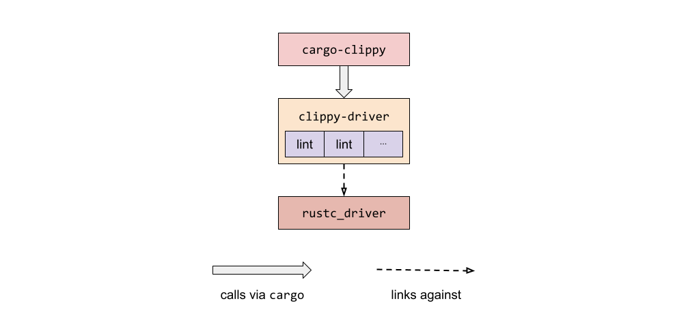
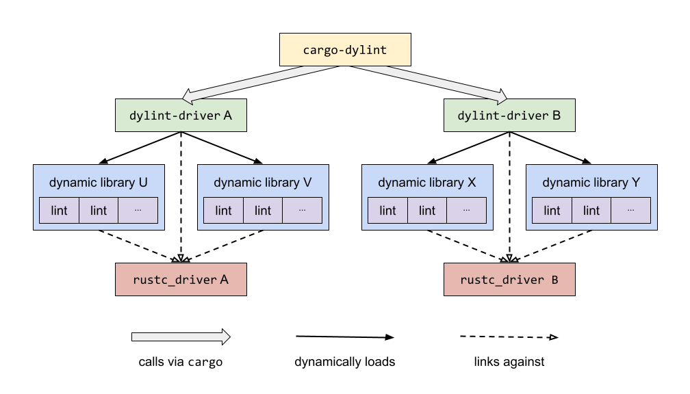

# 无需 fork Clippy 就可以编写 Rust lints

[原文](https://www.trailofbits.com/post/write-rust-lints-without-forking-clippy)

本文主要介绍 [Dylint](https://github.com/trailofbits/dylint)，它是一个可以从动态库中加载 Rust lints 规则的工具。Dylint 可以让开发人员轻松维护自己的个人 lint 集合。

在此之前，编写一个新的 Rust lint 的最简单的方式就是 fork [Clippy](https://github.com/rust-lang/rust-clippy)，它是 Rust 事实上的 (de facto) lint 工具。但是这种方式在运行或维护新 lint 时存在缺陷 (drawback)。Dylint 最大程度的减少了这方面的干扰 (distraction)，让开发者可以专注于编写 lint。

首先，我们将回顾 (go over) Rust linting 的当前状态以及 Clippy 的工作原理。然后，我们将解释 Dylint 是如何改善现状 (quo) 并提供一些关于如何开始使用它的提示。如果你想直接编写 lint，请跳到最后一节。

### Rust linting 和 Clippy

Clippy 等工具利用了 Rust 编译器对 linting 的专用支持。Rust linter 的核心组件(即“驱动程序”)可以链接到对应的库 (rustc_driver) 中。通过这种方式，驱动程序本质上是对 Rust 编译器做了封装。

为了运行 linter，环境变量 [RUSTC_WORKSPACE_WRAPPER](https://doc.rust-lang.org/cargo/reference/environment-variables.html#environment-variables-cargo-reads) 需要指向驱动程序并运行`cargo check`。Cargo 会注意到该环境变量已被赋值并调用该驱动程序，而不是调用 **rustc**。当驱动程序被调用时，它在 Rust 编译器中的 [Config](https://doc.rust-lang.org/nightly/nightly-rustc/rustc_interface/interface/struct.Config.html) 结构体中设置了一个 [callback](https://doc.rust-lang.org/nightly/nightly-rustc/rustc_interface/interface/struct.Config.html#structfield.register_lints)。该 [callback](https://doc.rust-lang.org/nightly/nightly-rustc/rustc_interface/interface/struct.Config.html#structfield.register_lints) 注册了一些 lint，它们将会与 Rust [内置的 lint](https://doc.rust-lang.org/rustc/lints/listing/index.html) 一起运行。

Clippy 执行一些[检查](https://github.com/rust-lang/rust-clippy/blob/12fce557669a0de230399cf8e6eee4f5307bf87b/src/driver.rs#L329-L338)以确保它已被启用，否则将以上述方式进行工作。(关于 Clippy 架构，请参阅图 1)。尽管它在安装之后人们对它的认识依旧不是那么的清晰，但是 Clippy 实际上有两个二进制文件：一个 Cargo 命令以及一个 **rustc** 驱动。你可以输入以下命令进行验证：

```console
which cargo-clippy
which clippy-driver
```

<center></center>
<center><span style="font-size: 1em">图 1：Clippy 架构</span></center>

现在假设你想编写自己的 lint。你该怎么办？你需要一个驱动程序来运行它们，而 Clippy 有一个驱动程序，因此 fork Clippy 看起来是一个合理的步骤。但是这个解决方案有一些缺陷，即 (namely) 运行和维护你将开发的 lint。

首先，你的 fork 将拥有两个二进制文件的副本，确保它们可以被找到是一件很麻烦 (hassle) 的事情。你必须确保至少 cargo 命令在你的`PATH`中，并且你可能必须将二进制文件重命名，以保证它们不会干扰 Clippy。虽然这些问题不是难以克服 (insurmountable)，但你可能会选择尽量避免它们。

其次，所有的 lint (包括 Clippy 的 lint) 都是在 [unstable](https://doc.rust-lang.org/stable/nightly-rustc/rustc_lint/index.html#note) 编译器 API 之上构建的。一起编译的 lint 必须使用相同版本的 API。为了理解为什么会出现这个问题，我们将参考 [clippy_utils](https://github.com/rust-lang/rust-clippy/tree/master/clippy_utils) - Clippy 作者慷慨地公开的一组实用程序。请注意，**clippy_utils** 使用与 lint 相同的编译器 API，并且同样不提供稳定性保证(参见下文)。

假设你已经 fork Clippy，然后你希望添加一个新的 lint。很显然，你希望新的 lint 使用最新版本 **clippy_utils**。但是假设 **clippy_utils** 使用的编译器版本是 B，而你 fork 的 Clippy 使用的编译器版本是 A。然后你将面临一个困境 (dilemma)：你应该使用一个旧版本的 **clippy_utils** (使用的 A 版本的编译器)还是将 fork 中所有 lint 更新到 B 版本的编译器？两者都不是理想的选择。

Dylint 同时解决了这两个问题。首先，它提供了一个 Cargo 命令，使你不必管理多个这样的命令。其次，对于 Dylint，lint 是在一起编译的以生成动态库。因此在上述情况下，你可以简单地将新的 lint 存储在使用B 版本的编译器的新动态库中。你可以根据需要将这个新库与现有库一起使用，如果你愿意的话，可以将现有库升级到更新的库的编译器版本。

Dylint 提供了与重用中间编译结果相关的额外好处。要理解它，我们需要了解 Dylint 的工作原理。

### Dylint 的工作原理

和 Clippy 一样，Dylint 提供了一个 cargo 命令。可以指定用户想要加载 lint 的动态库。Dylint 以确保在将控制权移交给 Rust 编译器之前注册 lint 的方式运行`cargo check`。

然而，Dylint 的 lint 注册过程比 Clippy 更复杂。Clippy 的所有 lint 都使用相同的编译器版本，因此只需要一个驱动程序。但是 Dylint 用户可以选择从不同编译器版本的库中加载 lint。

Dylint 按需即时 (on-the-fly) 构建驱动程序来处理此类情况。换句话说，如果用户想要 A 版本的编译器库中加载 lint，并且找不到 A 版本的驱动程序，Dylint 将构建一个新的 A 版本的驱动程序。驱动程序缓存在用户的主目录中，因此仅在必要时重建它们。

<center></center>
<center><span style="font-size: 1em">图 2：Dylint 架构</span></center>

这给我们带来了上面暗指 (alluded to) 的额外好处。Dylint 根据它们使用的编译器版本对库进行分组，使用相同编译器版本的库一起加载，并在它们的 lint 一起运行。这允许在 lint 之间共享中间编译结果(如：符号解析，类型检查，特征求解等)。

举个例子，在图 2 中，如果库 U 和 V 都使用了 A 版本的编译器，这两个库将被放到同一个分组中。A 版本编译器的驱动程序将只被调用一次。驱动程序在将控制权移交给 Rust 编译器之前会在库 U 和库 V 中注册 lint。

为了理解为什么这种方式更好，可以做如下思考。假设 lint 由编译器驱动程序(而不是动态库)直接存储，并回顾一下驱动程序本质上是 Rust 编译器的封装。因此，如果在使用相同编译器版本的两个编译器的驱动程序中有两个 lint，则在同一代码上运行这两个驱动程序将等同于该代码进行了两次编译。通过将 lint 存储在动态库中并按照编译器版本对它们进行分组，Dylint 避免了这些低效的操作。

### 应用：特定项目的 lint

