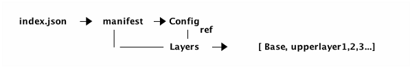
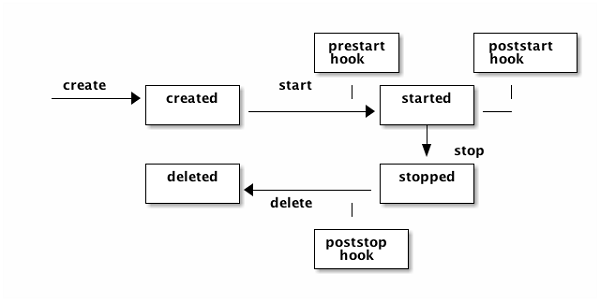
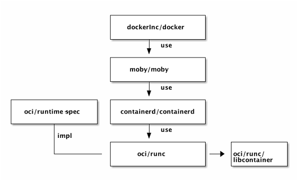
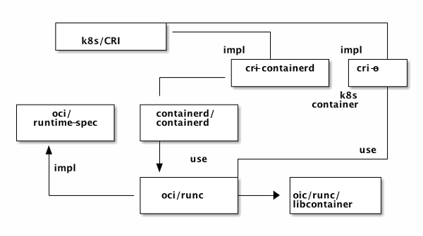

# 开放容器倡议 (OCI) 规范概述

[原文](https://alibaba-cloud.medium.com/open-container-initiative-oci-specifications-375b96658f55)

OCI (Open Container Initiative) 是一个由行业合作提出的倡议，旨在定义有关容器镜像格式与运行时的开放[容器](https://www.alibabacloud.com/product/container-service)规范。就开源世界的合作与竞争而言，从最初的分歧到如何一步步到达今天地位上的历史是一个非常有趣的故事。

如今，容器生态系统的所有主要玩家都遵循 OCI 容器规范。对于任何想要了解容器工作原理的同学，这是一门你绝不想错过的技术。

## 概览

OCI 有两项规范，[Image spec](https://github.com/opencontainers/image-spec) 和 [Runtime spec](https://github.com/opencontainers/runtime-spec)。

下图显示了它们涵盖的内容和交互的方式。


OCI 镜像可以从其他地方下载(如 Docker Hub) 并在 OCI 运行时文件系统包中解压。然后 OCI 运行时包将会运行在 OCI 运行时中。其中，OCI 运行时规范定义了如何运行一个”文件系统包“。

## 镜像规范 (image-spec)

镜像规范定义了 OCI 容器镜像的格式，其中包含 manifest，镜像索引 (image index)，一组文件系统层以及一个配置文件。这个规范的目标是创建互操作工具，用于构建，传输，以及准备要运行的容器镜像。

在顶层视角，容器镜像只是个 tarball 压缩包，在解压之后，它拥有以下`布局`。

```console
├── blobs
│   └── sha256
│       ├── 4297f0*      (image.manifest)
│       └── 7ea049       (image.config)
├── index.json
└── oci-layout
```

如果没有说明这些东西都是些什么以及它们是如何关联的，该布局就没那么有用。

我们可以简单的忽略`oci-layout`文件。`index.json`是入口点，它包含了主要的`manifest`，其中列出了所有用于单个容器镜像的”资源“。

`manifest`包含主要的`config`和`layers`。

将它使用图表表示：



[配置 (config)](https://github.com/opencontainers/image-spec/blob/master/config.md) 包含：
- 镜像的配置，它将会转换成 OCI 运行时包的运行时配置文件。
- layers，构成 OCI 运行时包的根文件系统
- 一些与镜像历史相关的元数据

[层级 (layers)](https://github.com/opencontainers/image-spec/blob/master/layer.md) 构成最终的`rootfs`。第一层级是基础，其他所有层级仅包含第一次层级的变更。在下一节中我们深入研究一下什么是 OCI 层级规范。

## 层级

规范中本质上关于层级定义了以下两点：

1. 如何表示一个层级

  - 对于基础层级， 压缩所有的内容
  - 对于非基础层级，压缩所有与其主层级比较后变更内容的集合
  - 因此，首先检测变更，形成一个`changeset`；然后压缩此变更集合以表示该层级

2. 如何联合所有层级

在主层级的顶层应用所有的变更集合。将会给你带来`rootfs`。

## 运行时规范 (runtime-spec)

一旦在磁盘文件系统中将镜像解压到 OCI 运行时包中，你可以将其运行起来。此时是 OCI 运行时规范在起作用。该规范指定了容器的配置，执行环境以及生命周期。

容器配置包含必要的元数据用来创建及运行此容器。其中包含要使用的运行线程，环境变量，资源限制以及沙盒功能等。一些配置与平台无关，可用于 Linux，Windows，Solaris 以及特定的虚拟机；但另一些配置与平台相关，可能仅适用于 Linux。

OCI 运行时规范还定义了容器的生命周期，这是一系列从容器创建到停止时发生的事件。

## 容器生命周期

容器拥有生命周期，从本质上讲，它可以用以下状态图建模。

你可以添加一些其他的动作和状态，如`pause`和`paused`，但是这些都是最oci基础的。



此状态图比较常规，但是这里有一个重要的事情需要提及一下 - `Hooks`。你可能有些惊讶，容器规范并没有定义如何设置网络，它实际上依赖 hook 来正确的设置网络，比如在容器启动之前创建网络并在容器停止之后删除它。

## 容器配置

我们之前提过容器的配置包含创建和运行容器的必要配置，我们将更仔细地查看一些配置，以了解容器的真正含义，并且我们将专注于 Linux 平台上的所有配置。

1. Root

    它定义了容器的根文件系统。

2. Mounts
    
    它指定了可以挂在到根文件系统上的附加文件系统。你在使用它挂载本地路径或者分布式路径(如 Ceph)。

3. Process

    它指定了与你要在容器中运行的进程相关的所有内容。包括环境变量和进程参数。

对于 Linux 进程，你可以额外指定有关进程安全方面的内容，如 capabilities，rlimits 以及 selinux 标签。

1. Hooks

    你可以在此处连接到容器的生命周期，并执行网络设置与清理操作。

2. Linux 命名空间

Linux 平台的大量配置专用于命名空间配置。实际上，命名空间是容器技术的基础。换句话说，没有命名空间就没有容器。Linux 提供了 7 种命名空间，它们都得到了 OCI 运行时规范的支持。

|名称|宏定义|隔离的资源|
|---|---|---|
|IPC|CLONE_NEWIPC|System V IPC (信号量，消息队列和共享内存)，POSIX message queues|
|Network|CLONE_NEWNET|Network devices，stacks，ports (网络设备，网络栈，端口等)|
|Mount|CLONE_NEWNS|Mount points (文件系统挂载点)|
|PID|CLONE_NEWPID|Process IDs (进程编号)|
|User|CLONE_NEWUSER|User and group IDs (用户和用户组)|
|UTS|CLONE_NEWUTS|Hostname and NIS domain name (主机名与 NIS 域名)|
|Cgroup|CLONE_NEWCGROUP|Cgroup root directory (cgroup 的根目录)|

3. 注释

除了容器应该运行的内容和方式之外，还可以通过注释标记容器。基于某些属性标记和选择容器的能力是容器编排 (orchestration) 平台的基本要求。

## 镜像，容器和进程

容器通过(容器)镜像创建。你可以通过一个镜像创建多个容器，还可以重新打包容器(这些容器通常带有一些基础容器的变更内容)以创建新的镜像。

在你获取容器之后，你可以在容器内部运行进程，而无需容器的所有优点。最值得注意的是，一旦我们容器化一个应用程序，它就会称为自包含的，不会与宿主环境混淆，因此它可以”run everwhere“。

以下是各种概念，镜像，容器和进程之间的关系，将它们理清楚是至关重要的。


## Docker 和 Kubernetes

Docker 使容器称为行业趋势，很多人认为 Docker 是容器，容器是 Docker。Docker 在这里绝对值得称赞，但从技术角度来看，Docker 是应用最广泛的容器实现。Docker 实现的架构从一个版本到另一个版本的演变非常快。在撰写本文时，它如下所示：



该图遵循`github]Org/project`的格式。大多数组件源自 Docker，但目前在不同的 Github 组织和项目下。最上面使我们日常使用的 Docker 命令工具，它是 Docker Inc. 的商业产品；Docker 工具以来于一个名为 moby 的开源项目，该项目又使用了 runc，它是 oci 运行时规范的参考实现。runc 严重以来 libcontainer，它也是 Docker Inc. 捐赠的。

## 容器编排

如果我们只需要 1 到 2 个容器，Docker 可能就够了。但是如果我们要运行成千上万的容器，我们就有很多的问题需要解决。仅举几例：

1. 调度：容器放在哪个主机上？
2. 更新：如何更新容器镜像？
3. 伸缩性：当需要扩容时如何添加更多的容器？

这是容器编排系统的工作。Kubernetes 是其中之一，但是截至目前，我认为它是最有前途。这里我们不会深入研究 Kubernetes，而是从容器运行时如何适应容器编排平台的角度简要介绍一下。

下图中展示了 Kubernetes 是如何与容器运行时进行交互的。



Kubernetes 使用容器运行时接口对运行时实现进行解耦。简单来说，CRI 定义了创建，启动，停止和删除容器的接口。它允许 Kubernetes 使用可插拔式容器运行时，你不必锁定到某一个特定的运行时。目前有几种实现方式，如`cri-containerd`和`cri-o`，两者最终都会使用`oci/runc`。

## 总结

本文是对 OCI 运行时镜像和运行时规范的概述。它涵盖了每个规范的责任以及它们如何相互协作，我们回顾了容器生命周期和运行时规范的主要配置。然后介绍了 Docker 和`runc`的关系，并简要介绍了容器编排以及容器运行时是如何融入其中的。