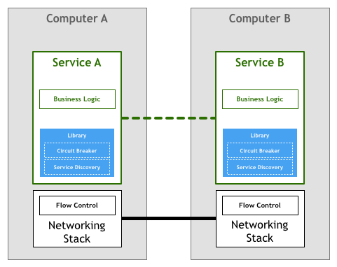
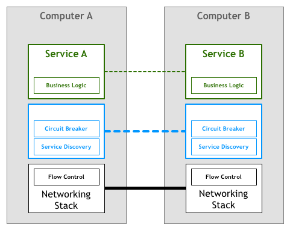

# Service Mesh

[原文](https://philcalcado.com/2017/08/03/pattern_service_mesh.html)

自从数十年前首次推出以来，我们了解到分布式系统可以提供我们之前甚至无法想到的用例，但是它们也引入了很多新的问题。

当这些系统很少且很简单的时候，工程师们通过减少远程交互的数量来应对新增的复杂性。处理分发 (distribution) 最安全的方式就是尽可能避免它，即使这可能导致跨系统的逻辑与数据重复。

但是，我们的工业需求推动我们进一步从几台大型中央计算机发展到成千上万台小型服务器。在这个新的领域，我们必须勇往直前，应对新的挑战和问题。首先逐例使用点对点 (ad-hoc) 的解决方案，然后 (subsequently) 使用更加复杂的解决方案。随着我们发现有关问题领域更多的信息并设计出更好的解决方案，我们开始将一些最通用的需求凝结 (crystallise) 成模式，库，最终是平台。

## 当我们第一次启动网络计算机时发生了什么

自从人们第一次对两个或更多计算机之间相互通信进行思考，他们设想 (envision) 以下模型：

两个服务进行对话以实现用户的某些目标。这显然是过于简化的视图，因为缺少了在代码层面操作的字节与通过电线发送和接收的电信号之间转换的许多层。但是对于我们的讨论而言，这种抽象已经足够。让我们通过将网络堆栈显示为不同的组件来添加更多的细节。

上面模型的变体已经在 1950 年就投入使用。最初，计算机比较稀有且很昂贵，因此两个节点间的每个连接需要被精心设计 (craft) 以及维护。当计算机变得廉价且更加流行时，它们之间的连接数量以及通过它们地数据量会剧烈的 (drastically) 增长。随着人们越来越依赖网络系统，工程师需要确保它们构建的软件符合用户要求的服务质量。

而且，想要达到所需(服务)质量的水平，还需要回答许多问题。人们需要一种方式，让机器可以互相发现；可以在同一根电缆中同时处理多个连接；当机器没有直连时，也允许彼此之间的通信；可以在网络中路由数据包，加密流量等等。

其中，有一个被称为 *流控* 的东西，我们将用它来举个例子。流控是一种机制，它可以阻止服务器发送超过下游服务处理能力的数据包。这是很有必要的，因为在一个网络系统中，你至少有两台彼此独立的计算机，它们互相都不了解。计算机 A 使用指定的速率向 计算机 B 发送字节流，但是不能保证 B 能够以一致且足够快的速度处理接收的字节流。举个例子，B 可能在并行运行其他的任务，或者数据包可能会乱序到达，但是 B 会阻塞等待应该首先到达的数据包。这意味着不仅 A 不会获得 B 的预期性能，它可能还会使事情变得更糟，因为它可能会让 B 过载导致其必须将这些传入的数据包排队进行处理。

一段时间以来，人们期望构建的网络服务和应用程序可以处理上面代码中显示的挑战。在我们的流控示例中，意味着应用程序自身必须包含相应的逻辑以确保我们不会因(传入过多的)数据包而使服务过载。繁重的网络逻辑与你的业务逻辑并存。对应的抽象图表如下所示：

幸运的是，科技迅速发展，并很快有了足够的标准(如 TCP/IP)将流控的解决方案以及网络堆栈中的其他许多问题集成 (incorporate) 起来。这意味着那段代码依然存在，但是它已经从你的应用程序中剥离出来，并放到操作系统提供的网络层中：

这个模型取得了巨大的成功。很多组织仅使用商业操作系统携带的 TCP/IP 协议栈来驱动他们的业务发展，且它已经足以应对高性能和可靠性的要求。

## 当我们第一次启动微服务时发生了什么

几年之后，计算机变得更加便宜并随处可见，上面描述的网络栈已经证明自己是实现系统间可靠连接事实上的 (do-facto) 工具集。有了更多的节点和稳定的连接，行业中就玩起了各种各样的网络系统，从细粒度的 (fine-grained) 的分布式代理和对象到广泛使用的分布式组件组成的面向服务的体系结构。

这种极端的分布带来了许多有趣的高级用例和收益，但是它依然要面对很多挑战。其中的某些挑战是全新的，而其他则只是我们讨论的原始网络挑战的更高版本。

在上世纪 90 年代，Peter Deutsch 和他在 Sun Microsystems 公司的工程师同伴合编了[”分布式计算的 8 个谬论 (Fallacy)“](https://en.wikipedia.org/wiki/Fallacies_of_distributed_computing)，其中列出了人们在使用分布式系统时倾向做出的一些假设。Peter 的观点是，这些可能在原始网络架构或理论模型中是正确的，但是在现代界中却不成立：

1. 网络是可靠的
2. 没有网路延迟
3. 无限带宽
4. 网络是安全的
5. 拓扑结构 (Topology) 不会改变
6. 只有一个管理员
7. 传输是零成本开销
8. 网络是同质的(homogeneous)，即各处的网络状态完全一样

将上述的列表抨击 (Denounce) 为”谬论“是因为工程师无法忽视这些问题，他们需要明确的处理它们。

为了使问题进一步复杂化，在我们经常称之为*微服务架构*的分布式系统中，在可操作性方面引入了新的需求。[我们在之前讨论过这些细节](https://philcalcado.com/2017/06/11/calcados_microservices_prerequisites.html)，但是在这里，我们将其归纳成一个清单：

1. 快速配置 (provisioning) 计算机资源
2. 基础监控
3. 快速发布
4. 易于配置存储
5. 易于访问边界
6. 鉴权/授权
7. 标准化的 RPC

因此，尽管数十年前开发的 TCP/IP 协议栈和通用网络模型仍然是可以让计算机彼此通信的强大工具，但是更复杂的体系构又引入了另一层要求，必须由在这样的架构中工作的工程师来实现。

例如服务发现和服务熔断，这是用于解决上面列出的一些弹性 (resiliency) 和分布式挑战的技术。

正如历史会周期性的出现，基于微服务构建系统的第一批组织使用的策略与前几代联网计算机使用的策略十分相似。这意味着处理上面列出的需求的责任留给了编写服务的工程师。

服务发现是一个自动查找哪些服务实例满足给定查询的过程。例如，一个名为`Teams`的服务使用值为`production`的`environment`属性查询名为`Players`服务的实例。你将会调用一些服务发现的进程，这些进程将返回合适的服务节点的列表。对于更加整体 (monolithic) 架构，这是一个简单的任务，通常使用 DNS，负载均衡和一些关于端口的约定 (convention) 来实现(例如，所有服务将其 HTTP 服务绑定到 8080 端口)。在分布式环境中，这类任务将变得更加复杂，以前可以盲目的依靠 DNS 查找依赖关系的服务现在必须处理诸如客户端的负载均衡，多个不同环境(如：staging 和 production)，地理位置分散的服务器等。如果你之前只需一行代码来解析主机名，那么现在你的服务就需要更多的样板代码来处理分布式引入的各种极端情况 (various corner cases)。

熔断器是 Michael Nygard 在他的 [Release It](http://amzn.to/2viDf23) 书中分类的 (catalogued) 一种模式。我喜欢 [Martin Fowler 对这个模式的总结](https://martinfowler.com/bliki/CircuitBreaker.html)：

> 熔断器的原理非常简单。你在用于检测故障的熔断器对象中封装了一个受保护的函数调用。一旦故障达到某个阈值，熔断器将会跳闸，并且所有对该熔断器进一步的调用都会返回错误，根本不会进行被保护的调用。通常如果熔断器跳闸，你还需要某种监视器告警。

这些都是简单出色的设备，可以为服务之间的交互增加更多的可靠性。然而，就像其他所有的内容一样，随着分布式水平的提高，它们往往会变得更加复杂。系统中出现问题的可能性随着分布式水平的提高呈现指数级增长，因此，即使诸如“熔断器跳闸时出现某种监视器告警”之类的简单事情也不一定变得直接了当。一个组件中的某个故障会在许多客户端之间造成级联影响，从而触发成千上万的线路同时跳闸。过去仅需几行代码，现在又需要大量的样板代码来处理仅在这个新的领域中存在的问题。

事实上，上面的两个例子很难正确的实现，以至于某些大型且复杂的库(如 [Twitter 的 Finagle](https://finagle.github.io/) 和 [Facebook 的 Proxygen](https://code.facebook.com/posts/1503205539947302)) 非常受欢迎，因为它避免在每个服务中重写相同的逻辑。 

上面描述的 (depict) 的模型被大多数开创了微服务架构的组织所采用，例如：Netflix，Twitter 以及 SoundCloud。随着系统中服务数量的增加，它们还偶然发现 (stumble upon) 了这类方法的各种缺点。

即使使用像 Finagle 这样的库，最大的挑战可能是组织仍需要花费其工程团队的时间来构建将库与其他生态系统联系起来的粘合剂。根据我在 SoundCloud 和 DigitalOcean 的经验，我估计在 100 到 250 人的工程师组织中采取这种策略后，需要让 1/10 的员工专门负责构建工具。有时，这笔费用是明确的，因为工程师被分配到了专门负责构建工具的团队中，但是价格标签通常是不可见的，因为它会随着你使用产品时间的增长而消失。

第二个问题是，以上设置限制了微服务的工具，运行时和语言。微服务的库通常是为特定平台编写的，无论是编程语言还是诸如 JVM 之类的运行时。如果组织使用库不支持的平台时，通常需要先将代码移植到新平台中。这浪费了宝贵的 (scarce) 工程时间。工程师不必再致力于核心业务和产品，而必须再次构建工具和基础架构。这就是为什么像 SoundCloud 和 DigitalOcean 之类的中型组织决定仅支持其内部服务的一个平台的原因，分别是 Scala 和 Go。

这个模型值得讨论的最后一个问题是治理 (governance)。库模型可以抽象化处理微服务体系结构中所需功能的实现，但是它本身仍然是需要维护的组件。确保成千上万的服务实例使用相同或至少兼容的库版本并非易事，并且每次更新都意味着所有服务的的集成，测试以及重新部署，即使该服务本身并未发生改动。

## 下一个合乎逻辑的步骤

与我们在网络堆栈中看到的类似，非常需要将大规模分布式服务所需的功能提取到基础平台中。

人们使用 HTTP 等高级协议编写非常复杂的应用程序和服务，而无需考虑 TCP 如何控制该网络上的数据包。这种场景正是微服务所需要的，在微服务中，从事服务的工程师可以专注于他们的业务逻辑，避免浪费时间编写自己的服务基础架构的代码或管理整个团队中的库和框架。

将这个想法整合到我们图表中，我们可能会得到如下所示的结果：

不幸的是，修改网络堆栈以添加此层不是一项可行的 (feasible) 任务。许多从业人员使用的解决方案是将其作为一组代理来实现。这里的想法是，服务不会直接连接其下游依赖项，而是将所有流量通过一小段程序透明的添加所需的功能。

在这个领域中，第一次使用了边车 (sidecat) 的概念。边车是一个辅助 (auxiliary) 进程，运行在你的应用程序周围，并为它提供额外的功能。在 2013 年，[Airbnb 编写了 Synapse 和 Nerve](https://medium.com/airbnb-engineering/smartstack-service-discovery-in-the-cloud-4b8a080de619)，这是边车的开源实现。一年后，[Netflix 推出了 Prana](https://medium.com/netflix-techblog/prana-a-sidecar-for-your-netflix-paas-based-applications-and-services-258a5790a015)，它是一种边车，致力于允许非 JVM 应用从 [Netflix OSS 生态系统](http://netflix.github.io/)中受益。在 SoundCloud 中，我们构建了边车，使我们的传统 Ruby 程序可以使用[我们为 JVM 微服务构建的基础架构](https://www.youtube.com/watch?v=ttmuN8hPQLA)。

尽管所许多此类开源代理的实现，但它们往往被设计成与特定的基础架构的组件一起使用。例如，在服务发现方面，Airbnb 的 Nerve & Synapse 假定服务注册在 Zookeeper 中，而对于 Prana，则应使用 Netflix 自己的 [Eureka](https://github.com/Netflix/eureka) 服务注册组件。

随着微服务架构的日益普及，最近我们看到了新一轮的代理浪潮，这些代理足够灵活，可以适应不同的基础架构组件和偏好设置。这个领域第一个广为人知的系统是 [Linkerd](https://buoyant.io/2016/02/18/linkerd-twitter-style-operability-for-microservices/)，它是由 Buoyant 根据工程师在 Twitter 微服务平台上的先前工作创建的。很快，Lyft 工程团队发布了 [Envoy](https://eng.lyft.com/announcing-envoy-c-l7-proxy-and-communication-bus-92520b6c8191)，它遵循类似的原则。

## Service Mesh

