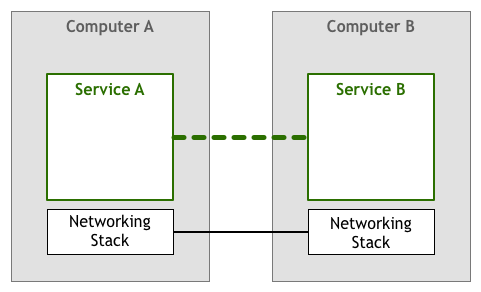

# Service Mesh

[原文](https://philcalcado.com/2017/08/03/pattern_service_mesh.html)

自从数十年前首次推出以来，我们了解到分布式系统可以提供我们之前甚至无法想到的用例，但是它们也引入了很多新的问题。

当这些系统很少且很简单的时候，工程师们通过减少远程交互的数量来应对新增的复杂性。处理分发 (distribution) 最安全的方式就是尽可能避免它，即使这可能导致跨系统的逻辑与数据重复。

但是，我们的工业需求推动我们进一步从几台大型中央计算机发展到成千上万台小型服务器。在这个新的领域，我们必须勇往直前，应对新的挑战和问题。首先逐例使用点对点 (ad-hoc) 的解决方案，然后 (subsequently) 使用更加复杂的解决方案。随着我们发现有关问题领域更多的信息并设计出更好的解决方案，我们开始将一些最通用的需求凝结 (crystallise) 成模式，库，最终是平台。

## 当我们第一次启动网络计算机时发生了什么

自从人们第一次对两个或更多计算机之间相互通信进行思考，他们设想 (envision) 以下模型：

两个服务进行对话以实现用户的某些目标。这显然是过于简化的视图，因为缺少了在代码层面操作的字节与通过电线发送和接收的电信号之间转换的许多层。但是对于我们的讨论而言，这种抽象已经足够。让我们通过将网络堆栈显示为不同的组件来添加更多的细节。

上面模型的变体已经在 1950 年就投入使用。最初，计算机比较稀有且很昂贵，因此精心设计 (craft) 和维护了两个节点间的每个连接。当计算机不再昂贵并变得更加流行时，lianj