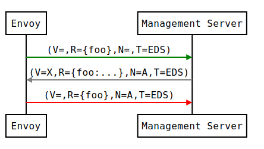

## xDS REST 和 gRPC 协议

[原文](https://www.envoyproxy.io/docs/envoy/latest/api-docs/xds_protocol)

Envoy 通过文件系统或查询一台或多台管理服务器来发现它的各种动态资源。这些发现服务和它们对应的 API 统称为 xDS。可以通过订阅，指定要监控的文件系统路径，初始化 gRPC 流或轮询 REST-JSON 的 URL 来请求资源。后两种方法中涉及发送带有 [DiscoveryRequest] 协议载荷的请求。在所有方法中，资源都是通过 [DiscoveryResponse] 协议载荷进行交付的。我们在下面讨论每种类型的订阅。

## 资源类型

xDS API 中的每个配置资源都有与之相关联的类型。资源类型遵循[版本控制方案]。资源类型的版本与下面描述的传输方式无关。

支持以下 v3 版本的 xDS 资源类型。

- [envoy.config.listener.v3.Listener]
- [envoy.config.route.v3.RouteConfiguration]
- [envoy.config.route.v3.ScopedRouteConfiguration]
- [envoy.config.route.v3.VirtualHost]
- [envoy.config.cluster.v3.Cluster]
- [envoy.config.endpoint.v3.ClusterLoadAssignment]
- [envoy.extensions.transport_sockets.tls.v3.Secret]
- [envoy.service.runtime.v3.Runtime]

类型的 URL 的概念显示在下面，格式为`type.googleapis.com/<resource type>` - 例如，`Cluster`资源的 URL 是`type.googleapis.com/envoy.config.cluster.v3.Cluster`。在来自 Envoy 的各种请求以及管理服务器的响应中，都声明了资源类型的 URL。

## 文件系统订阅

下发动态配置最简单的方式就是将其放置在 [ConfigSource] 指定的文件系统路径下。Envoy 将会使用`inotify` (macOS 中的`kqueue`) 监控文件的变更并解析更新文件中的 [DiscoveryResponse] 协议，[DiscoveryResponse] 支持二进制 protobuf，JSON，YAML 以及 proto 文本格式。

除了统计计数器和日志外，文件系统订阅没有其他可用于更新 ACK/NACK 的机制。如果配置更新请求被拒，则 xDS API 上一次更新的配置将仍然有效。

## 流式 gRPC 订阅

### API 流

对于典型的 HTTP 路由场景 (scenarios)，客户端配置的核心资源类型是`Listener`，`RouteConfiguration`，`Cluster`以及`ClusterLoadAssignment`。每个`Listener`资源可能指向一个`RouteConfiguration`资源，每个`RouteConfiguration`资源可能指向一个或多个`Cluster`资源，每个`Cluster`资源可能指向一个`ClusterLoadAssignment`资源。

Envoy 在启动时会拉取所有的`Listener`和`Cluster`资源。然后它会拉取`Listener`和`Cluster`资源所需的`RouteConfiguration`和`ClusterLoadAssignment`资源。实际上，每个`Listener`和`Cluster`资源都是 Envoy 配置树的根的一部分。

诸如 gRPC 之类的非代理客户端在启动时可能仅会拉取它感兴趣的特定`Listener`资源。然后再拉取这些`Listener`资源所需的`RouteConfiguration`资源，`RouteConfiguration`资源所需的`Cluster`资源，以及`Cluster`资源所学的`ClusterLoadAssignment`资源。实际上，最初的`Listener`资源是客户端配置树的根。

## xDS 传输协议的变体

## 四种变体

流式 gRPC 使用了四种 xDS 传输协议的变体，它涵盖了二维的所有组合。

第一个维度是世界状态 (SotW) vs 增量。SotW 方法是 xDS 最初使用的机制，其中客户端必须在每个请求中指定它感兴趣的所有资源的名称(在 LDS/CDS 中发出的通配符请求除外)，服务端必须返回客户端在每个 (LDS/CDS) 请求中订阅的所有资源。这意味着如果客户端已经订阅了 99 个资源，并且想要添加一个额外的资源，它必须发送带有这 100 个资源名称的请求，而不是仅发送新添加资源的名称。并且服务端必须发送全部的 100 个资源对其做出响应，即使那 99 个已订阅的资源并没有做任何变更(在 LDS/CDS 中)。这个机制可能导致弹性(可伸缩性)受限，这也是引入增量协议变体的原因。增量方式允许客户端和服务端仅指示相对于其先前状态的增量 - 即客户端可以告诉服务端它想要添加或移除一个特定资源名称的订阅关系，而不必重发那些未发生改变的资源的名称，服务端也只需发送那些变更资源的更新即可。增量协议也提供了一种资源的懒加载机制。有关增量协议的详细内容，可以参阅下面的[增量 xDS]。

第二个维度是每个资源类型使用单独的 gRPC 流 vs 将所有资源类型聚合到一个 gRPC 流中。前者是 xDS 最初使用的机制，它提供了最终一致性模型。而后者是在需要显示控制顺序的环境中所使用。可以在[最终一致性思考]中查看更详细的内容。

因此，这四种 xDS 传输协议的变体是：

1. 世界的状态(基础 xDS)：SotW，为每个资源类型提供独立的 gRPC 流
2. 增量 xDS：增量的，为每个资源类型提供独立的 gRPC 流
3. 聚合发现服务 (ADS：Aggregated Discovery Service)：SotW，为所有的资源类型提供一个聚合的 gRPC 流
4. 增量 ADS：增量的，为所有的资源类型提供一个聚合的 gRPC 流

### 每种变体的 RPC 服务和方法

对于非聚合的协议变体，每个资源类型都有一个独立的 RPC 服务。每个 RPC 服务都可以为每个 SotW 和增量协议变体提供一个方法。以下是每一种资源类型的 RPC 服务和方法：

- Listener：Listener 发现服务 (LDS：Listener Discovery Service) 
    - SotW：ListenerDiscoveryService.StreamListeners 
    - 增量：ListenerDiscoveryService.DeltaListeners
- RouteConfiguration：路由发现服务 (RDS：Route Discovery Service)
    - SotW：RouteDiscoveryService.StreamRoutes
    - 增量：RouteDiscoveryService.DeltaRoutes
- ScopedRouteConfiguration：域路由发现服务 (SRDS：Scoped Route Discovery Service)
    - SotW：ScopedRouteDiscoveryService.StreamScopedRoutes 
    - 增量：ScopedRouteDiscoveryService.DeltaScopedRoutes
- VirtualHost：虚拟主机发现服务 (VHDS：Virtual Host Discovery Service)
    - SotW：N/A
    - 增量：VirtualHostDiscoveryService.DeltaVirtualHosts
- Cluster：集群发现服务 (CDS：Cluster Discovery Service)
    - SotW：ClusterDiscoveryService.StreamClusters
    - 增量：ClusterDiscoveryService.DeltaClusters
- ClusterLoadAssignment：终结点发现服务 (EDS：Endpoint Discovery Service)
    - SotW：EndpointDiscoveryService.StreamEndpoints
    - 增量：EndpointDiscoveryService.DeltaEndpoints
- Secret：隐秘服务发现 (SDS：Secret Discovery Service)
    - SotW：SecretDiscoveryService.StreamSecrets
    - 增量：SecretDiscoveryService.DeltaSecrets
- Runtime：运行时服务发现 (RTDS：Runtime Discovery Service)
    - SotW：RuntimeDiscoveryService.StreamRuntime
    - 增量：RuntimeDiscoveryService.DeltaRuntime

在聚合的协议变体中，所有的资源类型都会多路复用到一个 gRPC 流中，在该聚合流中，每一个资源类型都被当做一个独立的逻辑流对待。实际上，它通过将每种资源类型的请求和响应视为单个聚合流上的独立子流，从而将上述所有独立的 API 简单的组合到单个流中。聚合协议变体的 RPC 服务和方法是：

- SotW：AggregatedDiscoveryService.StreamAggregatedResources
- 增量：AggregatedDiscoveryService.DeltaAggregatedResources

对于所有的 SotW 方法，请求类型都是 [DiscoveryRequest]，且响应类型是 [DiscoveryResponse]。

对于所有的增量方法，请求类型是 [DeltaDiscoveryRequest]，且响应类型是 [DeltaDiscoveryResponse]。

### 配置使用哪一种变体

在 xDS API 中，[ConfigSource] 消息指示如何获取指定类型的资源。如果 [ConfigSource] 包含一个 gRPC 的 [ApiConfigSource]，它指向管理服务器的上游集群；这将为每种资源类型 (可能到不提供的管理服务器) 初始化一个独立的双向 (bidirectional) gRPC 流。如果 [ConfigSource] 包含一个 [AggregatedConfigSource]，它是在告诉客户端使用 [ADS]。

目前，客户端需要一些本地配置以获知如何获取 [Listener] 和 [Cluster] 资源。[Listener] 资源可能包含一个 [ConfigSource]，该 [ConfigSource] 指示如何获取 [RouteConfiguration] 资源，[Cluster] 资源可能包含一个 [ConfigSource]，该 [ConfigSource] 指示如何获取 [ClusterLoadAssignment] 资源。

### 客户端配置

在 Envoy 中，引导 (bootstrap) 文件包含两个 [ConfigSource] 消息，一个指示如何获取 [Listener] 资源，另一个指示如何获取 [Cluster] 资源。它还包含一个独立的 [ApiConfigSource] 消息指示如何与 ADS 服务器通信，只要 [ConfigSource] 消息(在引导文件中或在从管理服务器中获取到的 [Listener] 或 [Cluster] 资源中)包含一个 [AggregatedConfigSource] 消息，就会使用该消息。

在使用 xDS 的 gRPC 客户端中，仅支持 ADS，并且包含 ADS 服务器名称的引导文件将会用于所有的资源。[Listener] 和 [Cluster] 资源中的 [ConfigSource] 消息必须包含 [AggregatedConfigSource] 消息。

## xDS 传输协议

### Transport API 版本

除了上述描述的资源类型版本之外，xDS 有线协议还要与之关联的 transport 版本。它为诸如 [DiscoveryRequest] 和 [DiscoveryResponse] 的消息提供了类型版本控制 (versioning)。它也以 gRPC 方法名称进行编码，因此服务器可以根据调用的方法确定客户端使用的版本。

### 基础协议概览

每个 xDS 流从客户端发送的 [DiscoveryRequest] 消息开始，该消息指定了将要订阅的资源列表，与已订阅资源相对应的类型 URL，节点标志符以及一个可选的资源类型实例版本，该版本表明客户端已经感知到资源类型的最新版本(详细信息请查阅 [ACK/NACK 及资源类型的实例版本](https://www.envoyproxy.io/docs/envoy/latest/api-docs/xds_protocol#xds-ack-nack))。

然后，服务端将会发送一个 [DiscoveryResponse] 消息，其中包含客户端指示其已感知到的自上一个资源类型实例版本以来，客户端已订阅且发生变更的任何资源。当订阅的资源发生变更时，服务器可以随时发送其他响应。

客户端无论何时接收到一个新的响应，它将会发送另一个请求，该请求指示响应中的资源是否有效(详细信息请查阅 [ACK/NACK 及资源类型的实例版本](https://www.envoyproxy.io/docs/envoy/latest/api-docs/xds_protocol#xds-ack-nack))。

每个服务器的响应都会包含一个[随机数] (nonce)，并且随后所有的客户端请求都必须将 [response_nonce] 字段设置为从该流中的服务端接收到的最新随机数。这可以让服务端决定给定的请求与哪一个响应相关联，它避免了在 SotW 协议变体中的各种竞争 (race) 条件。请注意，随机数仅在单个 xDS 流的上下文中有效；它在流重启后不再存活。

只有流上的第一个请求保证携带节点标志符。该流中随后的发现请求可能携带空的节点标志符。无论是否接受同一流上的发现响应，都是正确的。如果流中出现了多个节点标志符时，节点标志符应该总是完全相同的 (identical)。仅检查第一条消息中的节点标志符作为结果即可。

### ACK/NACK 和 资源类型实例版本

每一个 xDS 资源类型都有一个字符串类型的版本，它表示该资源类型的版本。当某个资源类型改变时，该版本字符串也将改变。

在 xDS 服务器发送的响应中，[version_info] 字段表示该资源类型的当前版本。然后客户端向服务端发送另一个带有 [version_info] 字段的请求，表明客户端已经知道最新的合法版本。这为服务端提供了一种确定何时发送客户端认为无效版本的方法。

(在[增量协议变体]中，[system_version_info] 字段中的资源类型实例版本被服务端发送。然而，客户端实际上并不使用此信息来传达哪些资源有效，因为增量 API 变体对此有单独的机制)。

对于每一个资源类型来说，资源类型实例版本是独立的。当使用了聚合协议变体，尽管所有资源类型都被发送到了同一个流中，但是每个资源类型都具有它自己的版本。

对于每一个 xDS 服务器 (其中 xDS 服务器由唯一的 [ConfigSource] 标识) 来说，资源类型实例版本同样是独立的。当在多个 xDS 服务器中获取到给定类型的资源时，每个 xDS 服务器将会有不同的版本概念 (notion)。

请注意，资源类型实例版本不是单个 xDS 流的属性，而是资源本身的属性。如果流被中断且客户端创建了一个新流，客户端在新流上的初始化请求应该表明是客户端在之前的流中看到的最新版本。服务端将会决定不重发客户端在上一个流中已看到的资源进行优化，但是仅当它们知道该客户端没有订阅在上一个流中未订阅的新资源时会进行重发。举个例子，对于服务端来说，对通配符 LDS 和 CDS 请求执行此优化通常是安全的，并且在客户端将始终订阅完全相同的资源集的环境中这么做是安全的。

一个 EDS 请求示例可能如下所示：

```xds
version_info:
node: { id: envoy }
resource_names:
- foo
- bar
type_url: type.googleapis.com/envoy.config.endpoint.v3.ClusterLoadAssignment
response_nonce:
```

管理服务器可以立即响应请求，也可以在请求带有 [DiscoveryResponse] 的资源可用时进行响应，例如：

```xds
version_info: X
resources:
- foo ClusterLoadAssignment proto encoding
- bar ClusterLoadAssignment proto encoding
type_url: type.googleapis.com/envoy.config.endpoint.v3.ClusterLoadAssignment
nonce: A
```

在处理完 [DiscoveryResponse] 之后，Envoy 将在流中发送一个新请求，指定成功应用的最新版本以及管理服务器提供的随机数。该版本为 Envoy 和管理服务器提供了当前已应用配置的共享概念，以及 ACK/NACK 配置更新的机制。


### ACK

如果成功应用了更新，则按照顺序图所示，[version_info] 将会是 X：


### NACK

如果 Envoy 拒绝了配置更新 X，它将使用 [error_detail] 和先前的版本 (在此图中是空的初始化版本) 对其进行回应。[error_detail] 在消息字段中具有关于确切错误消息的更多详细信息：



在顺序图中，以下格式被用于缩略消息：

- DiscoveryRequest：(V = version_info，R = resource_names，N = response_nonce，T = type_url)
- DiscoveryResponse：(V = version_info，R = resources，N = nonce，T = type_url)

在 NACK 之后，API 可能会在新版本 Y 上更新成功：


[ConfigSource]: https://www.envoyproxy.io/docs/envoy/latest/api-v3/config/core/v3/config_source.proto#envoy-v3-api-msg-config-core-v3-configsource
[RouteConfiguration]: https://www.envoyproxy.io/docs/envoy/latest/api-v3/config/route/v3/route.proto#envoy-v3-api-msg-config-route-v3-routeconfiguration
[Listener]: https://www.envoyproxy.io/docs/envoy/latest/api-v3/config/listener/v3/listener.proto#envoy-v3-api-msg-config-listener-v3-listener
[DiscoveryRequest]: https://www.envoyproxy.io/docs/envoy/latest/api-v3/service/discovery/v3/discovery.proto#envoy-v3-api-msg-service-discovery-v3-discoveryrequest
[DiscoveryResponse]: https://www.envoyproxy.io/docs/envoy/latest/api-v3/service/discovery/v3/discovery.proto#envoy-v3-api-msg-service-discovery-v3-discoveryresponse
[DeltaDiscoveryRequest]: https://www.envoyproxy.io/docs/envoy/latest/api-v3/service/discovery/v3/discovery.proto#envoy-v3-api-msg-service-discovery-v3-deltadiscoveryrequest
[DeltaDiscoveryResponse]: https://www.envoyproxy.io/docs/envoy/latest/api-v3/service/discovery/v3/discovery.proto#envoy-v3-api-msg-service-discovery-v3-deltadiscoveryresponse
[ApiConfigSource]: https://www.envoyproxy.io/docs/envoy/latest/api-v3/config/core/v3/config_source.proto#envoy-v3-api-msg-config-core-v3-apiconfigsource
[AggregatedConfigSource]: https://www.envoyproxy.io/docs/envoy/latest/api-v3/config/core/v3/config_source.proto#envoy-v3-api-msg-config-core-v3-aggregatedconfigsource
[ADS]: https://www.envoyproxy.io/docs/envoy/latest/api-docs/xds_protocol#xds-protocol-ads
[Cluster]: https://www.envoyproxy.io/docs/envoy/latest/api-v3/config/cluster/v3/cluster.proto#envoy-v3-api-msg-config-cluster-v3-cluster
[ClusterLoadAssignment]: https://www.envoyproxy.io/docs/envoy/latest/api-v3/config/endpoint/v3/endpoint.proto#envoy-v3-api-msg-config-endpoint-v3-clusterloadassignment
[envoy.config.listener.v3.Listener]: https://www.envoyproxy.io/docs/envoy/latest/api-v3/config/listener/v3/listener.proto#envoy-v3-api-msg-config-listener-v3-listener
[envoy.config.route.v3.RouteConfiguration]: https://www.envoyproxy.io/docs/envoy/latest/api-v3/config/route/v3/route.proto#envoy-v3-api-msg-config-route-v3-routeconfiguration
[envoy.config.route.v3.ScopedRouteConfiguration]: https://www.envoyproxy.io/docs/envoy/latest/api-v3/config/route/v3/scoped_route.proto#envoy-v3-api-msg-config-route-v3-scopedrouteconfiguration
[envoy.config.route.v3.VirtualHost]: https://www.envoyproxy.io/docs/envoy/latest/api-v3/config/route/v3/route_components.proto#envoy-v3-api-msg-config-route-v3-virtualhost
[envoy.config.cluster.v3.Cluster]: https://www.envoyproxy.io/docs/envoy/latest/api-v3/config/cluster/v3/cluster.proto#envoy-v3-api-msg-config-cluster-v3-cluster
[envoy.config.endpoint.v3.ClusterLoadAssignment]: https://www.envoyproxy.io/docs/envoy/latest/api-v3/config/endpoint/v3/endpoint.proto#envoy-v3-api-msg-config-endpoint-v3-clusterloadassignment
[envoy.extensions.transport_sockets.tls.v3.Secret]: https://www.envoyproxy.io/docs/envoy/latest/api-v3/extensions/transport_sockets/tls/v3/secret.proto#envoy-v3-api-msg-extensions-transport-sockets-tls-v3-secret
[envoy.service.runtime.v3.Runtime]: https://www.envoyproxy.io/docs/envoy/latest/api-v3/service/runtime/v3/rtds.proto#envoy-v3-api-msg-service-runtime-v3-runtime
[最终一致性思考]: https://www.envoyproxy.io/docs/envoy/latest/api-docs/xds_protocol#xds-protocol-eventual-consistency-considerations
[增量 xDS]: https://www.envoyproxy.io/docs/envoy/latest/api-docs/xds_protocol#xds-protocol-delta
[版本控制方案]: https://github.com/envoyproxy/envoy/blob/69effc247ba258b9f6c93f2931723b3aa336c84c/api/API_VERSIONING.md
[随机数]: https://www.envoyproxy.io/docs/envoy/latest/api-v3/service/discovery/v3/discovery.proto#envoy-v3-api-field-service-discovery-v3-discoveryresponse-nonce
[response_nonce]: https://www.envoyproxy.io/docs/envoy/latest/api-v3/service/discovery/v3/discovery.proto#envoy-v3-api-field-service-discovery-v3-discoveryrequest-response-nonce
[version_info]: https://www.envoyproxy.io/docs/envoy/latest/api-v3/service/discovery/v3/discovery.proto#envoy-v3-api-field-service-discovery-v3-discoveryresponse-version-info
[增量协议变体]: https://www.envoyproxy.io/docs/envoy/latest/api-docs/xds_protocol#xds-protocol-delta
[system_version_info]: https://www.envoyproxy.io/docs/envoy/latest/api-v3/service/discovery/v3/discovery.proto#envoy-v3-api-field-service-discovery-v3-deltadiscoveryresponse-system-version-info
[error_detail]: https://www.envoyproxy.io/docs/envoy/latest/api-v3/service/discovery/v3/discovery.proto#envoy-v3-api-field-service-discovery-v3-discoveryrequest-error-detail