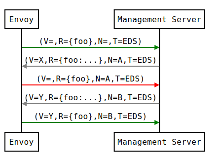
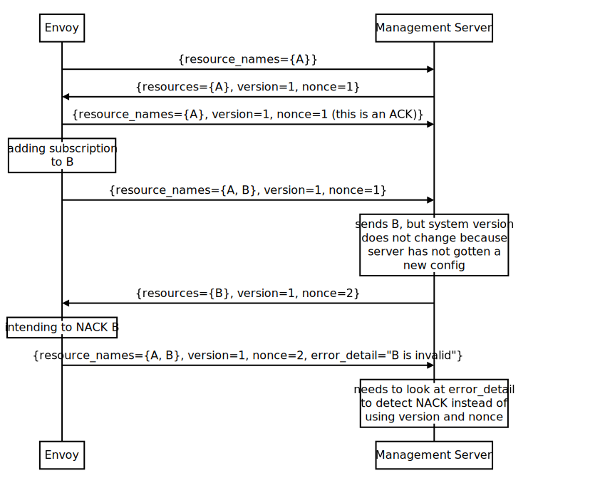

## xDS REST 和 gRPC 协议

[原文](https://www.envoyproxy.io/docs/envoy/latest/api-docs/xds_protocol)

Envoy 通过文件系统或查询一台或多台管理服务器来发现它的各种动态资源。这些发现服务和它们对应的 API 统称为 xDS。可以通过订阅，指定要监控的文件系统路径，初始化 gRPC 流或轮询 REST-JSON 的 URL 来请求资源。后两种方法中涉及发送带有 [DiscoveryRequest] 协议载荷的请求。在所有方法中，资源都是通过 [DiscoveryResponse] 协议载荷进行交付的。我们在下面讨论每种类型的订阅。

## 资源类型

xDS API 中的每个配置资源都有与之相关联的类型。资源类型遵循[版本控制方案]。资源类型的版本与下面描述的传输方式无关。

支持以下 v3 版本的 xDS 资源类型。

- [envoy.config.listener.v3.Listener]
- [envoy.config.route.v3.RouteConfiguration]
- [envoy.config.route.v3.ScopedRouteConfiguration]
- [envoy.config.route.v3.VirtualHost]
- [envoy.config.cluster.v3.Cluster]
- [envoy.config.endpoint.v3.ClusterLoadAssignment]
- [envoy.extensions.transport_sockets.tls.v3.Secret]
- [envoy.service.runtime.v3.Runtime]

类型的 URL 的概念显示在下面，格式为`type.googleapis.com/<resource type>` - 例如，`Cluster`资源的 URL 是`type.googleapis.com/envoy.config.cluster.v3.Cluster`。在来自 Envoy 的各种请求以及管理服务器的响应中，都声明了资源类型的 URL。

## 文件系统订阅

下发动态配置最简单的方式就是将其放置在 [ConfigSource] 指定的文件系统路径下。Envoy 将会使用`inotify` (macOS 中的`kqueue`) 监控文件的变更并解析更新文件中的 [DiscoveryResponse] 协议，[DiscoveryResponse] 支持二进制 protobuf，JSON，YAML 以及 proto 文本格式。

除了统计计数器和日志外，文件系统订阅没有其他可用于更新 ACK/NACK 的机制。如果配置更新请求被拒，则 xDS API 上一次更新的配置将仍然有效。

## 流式 gRPC 订阅

### API 流

对于典型的 HTTP 路由场景 (scenarios)，客户端配置的核心资源类型是`Listener`，`RouteConfiguration`，`Cluster`以及`ClusterLoadAssignment`。每个`Listener`资源可能指向一个`RouteConfiguration`资源，每个`RouteConfiguration`资源可能指向一个或多个`Cluster`资源，每个`Cluster`资源可能指向一个`ClusterLoadAssignment`资源。

Envoy 在启动时会拉取所有的`Listener`和`Cluster`资源。然后它会拉取`Listener`和`Cluster`资源所需的`RouteConfiguration`和`ClusterLoadAssignment`资源。实际上，每个`Listener`和`Cluster`资源都是 Envoy 配置树的根的一部分。

诸如 gRPC 之类的非代理客户端在启动时可能仅会拉取它感兴趣的特定`Listener`资源。然后再拉取这些`Listener`资源所需的`RouteConfiguration`资源，`RouteConfiguration`资源所需的`Cluster`资源，以及`Cluster`资源所学的`ClusterLoadAssignment`资源。实际上，最初的`Listener`资源是客户端配置树的根。

## xDS 传输协议的变体

## 四种变体

流式 gRPC 使用了四种 xDS 传输协议的变体，它涵盖了二维的所有组合。

第一个维度是世界状态 (SotW) vs 增量。SotW 方法是 xDS 最初使用的机制，其中客户端必须在每个请求中指定它感兴趣的所有资源的名称(在 LDS/CDS 中发出的通配符请求除外)，服务端必须返回客户端在每个 (LDS/CDS) 请求中订阅的所有资源。这意味着如果客户端已经订阅了 99 个资源，并且想要添加一个额外的资源，它必须发送带有这 100 个资源名称的请求，而不是仅发送新添加资源的名称。并且服务端必须发送全部的 100 个资源对其做出响应，即使那 99 个已订阅的资源并没有做任何变更(在 LDS/CDS 中)。这个机制可能导致弹性(可伸缩性)受限，这也是引入增量协议变体的原因。增量方式允许客户端和服务端仅指示相对于其先前状态的增量 - 即客户端可以告诉服务端它想要添加或移除一个特定资源名称的订阅关系，而不必重发那些未发生改变的资源的名称，服务端也只需发送那些变更资源的更新即可。增量协议也提供了一种资源的懒加载机制。有关增量协议的详细内容，可以参阅下面的[增量 xDS]。

第二个维度是每个资源类型使用单独的 gRPC 流 vs 将所有资源类型聚合到一个 gRPC 流中。前者是 xDS 最初使用的机制，它提供了最终一致性模型。而后者是在需要显示控制顺序的环境中所使用。可以在[最终一致性思考]中查看更详细的内容。

因此，这四种 xDS 传输协议的变体是：

1. 世界的状态(基础 xDS)：SotW，为每个资源类型提供独立的 gRPC 流
2. 增量 xDS：增量的，为每个资源类型提供独立的 gRPC 流
3. 聚合发现服务 (ADS：Aggregated Discovery Service)：SotW，为所有的资源类型提供一个聚合的 gRPC 流
4. 增量 ADS：增量的，为所有的资源类型提供一个聚合的 gRPC 流

### 每种变体的 RPC 服务和方法

对于非聚合的协议变体，每个资源类型都有一个独立的 RPC 服务。每个 RPC 服务都可以为每个 SotW 和增量协议变体提供一个方法。以下是每一种资源类型的 RPC 服务和方法：

- Listener：Listener 发现服务 (LDS：Listener Discovery Service) 
    - SotW：ListenerDiscoveryService.StreamListeners 
    - 增量：ListenerDiscoveryService.DeltaListeners
- RouteConfiguration：路由发现服务 (RDS：Route Discovery Service)
    - SotW：RouteDiscoveryService.StreamRoutes
    - 增量：RouteDiscoveryService.DeltaRoutes
- ScopedRouteConfiguration：域路由发现服务 (SRDS：Scoped Route Discovery Service)
    - SotW：ScopedRouteDiscoveryService.StreamScopedRoutes 
    - 增量：ScopedRouteDiscoveryService.DeltaScopedRoutes
- VirtualHost：虚拟主机发现服务 (VHDS：Virtual Host Discovery Service)
    - SotW：N/A
    - 增量：VirtualHostDiscoveryService.DeltaVirtualHosts
- Cluster：集群发现服务 (CDS：Cluster Discovery Service)
    - SotW：ClusterDiscoveryService.StreamClusters
    - 增量：ClusterDiscoveryService.DeltaClusters
- ClusterLoadAssignment：终结点发现服务 (EDS：Endpoint Discovery Service)
    - SotW：EndpointDiscoveryService.StreamEndpoints
    - 增量：EndpointDiscoveryService.DeltaEndpoints
- Secret：隐秘服务发现 (SDS：Secret Discovery Service)
    - SotW：SecretDiscoveryService.StreamSecrets
    - 增量：SecretDiscoveryService.DeltaSecrets
- Runtime：运行时服务发现 (RTDS：Runtime Discovery Service)
    - SotW：RuntimeDiscoveryService.StreamRuntime
    - 增量：RuntimeDiscoveryService.DeltaRuntime

在聚合的协议变体中，所有的资源类型都会多路复用到一个 gRPC 流中，在该聚合流中，每一个资源类型都被当做一个独立的逻辑流对待。实际上，它通过将每种资源类型的请求和响应视为单个聚合流上的独立子流，从而将上述所有独立的 API 简单的组合到单个流中。聚合协议变体的 RPC 服务和方法是：

- SotW：AggregatedDiscoveryService.StreamAggregatedResources
- 增量：AggregatedDiscoveryService.DeltaAggregatedResources

对于所有的 SotW 方法，请求类型都是 [DiscoveryRequest]，且响应类型是 [DiscoveryResponse]。

对于所有的增量方法，请求类型是 [DeltaDiscoveryRequest]，且响应类型是 [DeltaDiscoveryResponse]。

### 配置使用哪一种变体

在 xDS API 中，[ConfigSource] 消息指示如何获取指定类型的资源。如果 [ConfigSource] 包含一个 gRPC 的 [ApiConfigSource]，它指向管理服务器的上游集群；这将为每种资源类型 (可能到不提供的管理服务器) 初始化一个独立的双向 (bidirectional) gRPC 流。如果 [ConfigSource] 包含一个 [AggregatedConfigSource]，它是在告诉客户端使用 [ADS]。

目前，客户端需要一些本地配置以获知如何获取 [Listener] 和 [Cluster] 资源。[Listener] 资源可能包含一个 [ConfigSource]，该 [ConfigSource] 指示如何获取 [RouteConfiguration] 资源，[Cluster] 资源可能包含一个 [ConfigSource]，该 [ConfigSource] 指示如何获取 [ClusterLoadAssignment] 资源。

### 客户端配置

在 Envoy 中，引导 (bootstrap) 文件包含两个 [ConfigSource] 消息，一个指示如何获取 [Listener] 资源，另一个指示如何获取 [Cluster] 资源。它还包含一个独立的 [ApiConfigSource] 消息指示如何与 ADS 服务器通信，只要 [ConfigSource] 消息(在引导文件中或在从管理服务器中获取到的 [Listener] 或 [Cluster] 资源中)包含一个 [AggregatedConfigSource] 消息，就会使用该消息。

在使用 xDS 的 gRPC 客户端中，仅支持 ADS，并且包含 ADS 服务器名称的引导文件将会用于所有的资源。[Listener] 和 [Cluster] 资源中的 [ConfigSource] 消息必须包含 [AggregatedConfigSource] 消息。

## xDS 传输协议

### Transport API 版本

除了上述描述的资源类型版本之外，xDS 有线协议还要与之关联的 transport 版本。它为诸如 [DiscoveryRequest] 和 [DiscoveryResponse] 的消息提供了类型版本控制 (versioning)。它也以 gRPC 方法名称进行编码，因此服务器可以根据调用的方法确定客户端使用的版本。

### 基础协议概览

每个 xDS 流从客户端发送的 [DiscoveryRequest] 消息开始，该消息指定了将要订阅的资源列表，与已订阅资源相对应的类型 URL，节点标志符以及一个可选的资源类型实例版本，该版本表明客户端已经感知到资源类型的最新版本(详细信息请查阅 [ACK/NACK 及资源类型的实例版本](https://www.envoyproxy.io/docs/envoy/latest/api-docs/xds_protocol#xds-ack-nack))。

然后，服务端将会发送一个 [DiscoveryResponse] 消息，其中包含客户端指示其已感知到的自上一个资源类型实例版本以来，客户端已订阅且发生变更的任何资源。当订阅的资源发生变更时，服务器可以随时发送其他响应。

客户端无论何时接收到一个新的响应，它将会发送另一个请求，该请求指示响应中的资源是否有效(详细信息请查阅 [ACK/NACK 及资源类型的实例版本](https://www.envoyproxy.io/docs/envoy/latest/api-docs/xds_protocol#xds-ack-nack))。

每个服务器的响应都会包含一个[随机数] (nonce)，并且随后所有的客户端请求都必须将 [response_nonce] 字段设置为从该流中的服务端接收到的最新随机数。这可以让服务端决定给定的请求与哪一个响应相关联，它避免了在 SotW 协议变体中的各种竞争 (race) 条件。请注意，随机数仅在单个 xDS 流的上下文中有效；它在流重启后不再存活。

只有流上的第一个请求保证携带节点标志符。该流中随后的发现请求可能携带空的节点标志符。无论是否接受同一流上的发现响应，都是正确的。如果流中出现了多个节点标志符时，节点标志符应该总是完全相同的 (identical)。仅检查第一条消息中的节点标志符作为结果即可。

### ACK/NACK 和 资源类型实例版本

每一个 xDS 资源类型都有一个字符串类型的版本，它表示该资源类型的版本。当某个资源类型改变时，该版本字符串也将改变。

在 xDS 服务器发送的响应中，[version_info] 字段表示该资源类型的当前版本。然后客户端向服务端发送另一个带有 [version_info] 字段的请求，表明客户端已经知道最新的合法版本。这为服务端提供了一种确定何时发送客户端认为无效版本的方法。

(在[增量协议变体]中，[system_version_info] 字段中的资源类型实例版本被服务端发送。然而，客户端实际上并不使用此信息来传达哪些资源有效，因为增量 API 变体对此有单独的机制)。

对于每一个资源类型来说，资源类型实例版本是独立的。当使用了聚合协议变体，尽管所有资源类型都被发送到了同一个流中，但是每个资源类型都具有它自己的版本。

对于每一个 xDS 服务器 (其中 xDS 服务器由唯一的 [ConfigSource] 标识) 来说，资源类型实例版本同样是独立的。当在多个 xDS 服务器中获取到给定类型的资源时，每个 xDS 服务器将会有不同的版本概念 (notion)。

请注意，资源类型实例版本不是单个 xDS 流的属性，而是资源本身的属性。如果流被中断且客户端创建了一个新流，客户端在新流上的初始化请求应该表明是客户端在之前的流中看到的最新版本。服务端将会决定不重发客户端在上一个流中已看到的资源进行优化，但是仅当它们知道该客户端没有订阅在上一个流中未订阅的新资源时会进行重发。举个例子，对于服务端来说，对通配符 LDS 和 CDS 请求执行此优化通常是安全的，并且在客户端将始终订阅完全相同的资源集的环境中这么做是安全的。

一个 EDS 请求示例可能如下所示：

```xds
version_info:
node: { id: envoy }
resource_names:
- foo
- bar
type_url: type.googleapis.com/envoy.config.endpoint.v3.ClusterLoadAssignment
response_nonce:
```

管理服务器可以立即响应请求，也可以在请求带有 [DiscoveryResponse] 的资源可用时进行响应，例如：

```xds
version_info: X
resources:
- foo ClusterLoadAssignment proto encoding
- bar ClusterLoadAssignment proto encoding
type_url: type.googleapis.com/envoy.config.endpoint.v3.ClusterLoadAssignment
nonce: A
```

在处理完 [DiscoveryResponse] 之后，Envoy 将在流中发送一个新请求，指定成功应用的最新版本以及管理服务器提供的随机数。该版本为 Envoy 和管理服务器提供了当前已应用配置的共享概念，以及 ACK/NACK 配置更新的机制。


### ACK

如果成功应用了更新，则按照顺序图所示，[version_info] 将会是 X：


### NACK

如果 Envoy 拒绝了配置更新 X，它将使用 [error_detail] 和先前的版本 (在此图中是空的初始化版本) 对其进行回应。[error_detail] 在消息字段中具有关于确切错误消息的更多详细信息：


在顺序图中，以下格式被用于缩略消息：

- DiscoveryRequest：(V = version_info，R = resource_names，N = response_nonce，T = type_url)
- DiscoveryResponse：(V = version_info，R = resources，N = nonce，T = type_url)

在 NACK 之后，API 可能会在新版本 Y 上更新成功：



服务器检测 NACK 的首选机制是在客户端发送的请求中查找 [error_detail] 字段的存在。某些较旧的服务器可能会通过查看请求中的版本和随机数来检测 NACK：如果请求中的版本与服务器使用该随机数发送的版本不相等，则客户端已拒绝了最新版本。但是这种方法不适用于客户端的 LDS 和 CDS 以外的 API，这些 API 可能会动态修改其订阅的资源集，除非服务器以某种方式安排了每当一个客户端订阅一个新资源时就增加资源类型实例版本。具体来说，请考虑以下示例：



### ACK 与 NACK 语义总结

- xDS 客户端应该对管理服务器收到的每个 [DiscoveryResponse] 进行 ACK 或 NACK。[response_nonce] 字段告诉服务器，ACK 或 NACK 关联的是哪一个响应。
- ACK 表示更新配置成功，且包含来自 [DiscoveryResponse] 中的 [version_info]
- NACK 表示更新配置失败，且此值是通过出现 [error_detail] 字段来表示的。[version_info] 表示客户端正在使用的最新版本，尽管在客户端在现有版本中订阅了新的资源且该新资源无效的情况下，该版本可能不是较旧的版本(参考上面的示例)。

### 何时发送一个更新请求

管理服务器仅当 [DiscoveryResponse] 中的资源发生变更时才会将更新发送给 Envoy 客户端。Envoy 在被接受或拒绝后，立即使用包含 ACK/NACK 的 [DiscoveryRequest] 答复 [DiscoveryResponse]。如果管理服务器提供了相同的资源集而不是等待 (资源) 发生变更，这将导致客户端和服务管理器进行不必要的工作，可能会严重的影响性能。

在流中，新的 [DiscoveryRequests] 将会取代 (supersede) 所有具有相同资源类型的先前 [DiscoveryRequests]。这意味着对于任何给定的资源类型，管理服务器只需响应每个流上的最新 [DiscoveryRequest]。

### 客户端如何指定返回哪一种资源

xDS 允许客户端指定一组资源名称，作为服务器对客户端感兴趣资源的提示。在 SotW 协议变体中，这是通过在 [DiscoveryRequest] 中指定 [resource_names] 完成的；在增量协议变体中，是通过 [DeltaDiscoveryRequest] 中的 [resource_names_subscribe] 和 [resource_names_unsubscribe] 字段来完成的。

通常(查看下面的异常)，请求必须指定客户端感兴趣的资源集的名称。管理服务器必须提供被请求的资源(如果存在)。客户端将忽略未明确请求任何提供的资源。当客户端发送一个新请求来更改请求的资源集时，服务器必须重新发送任何新请求的资源，即使该服务没有请求先前发送的那些资源，并且自那时以来资源也没有发生变化。如果资源名称列表为空，则意味着客户端不再对指定类型的任何资源感兴趣。

对于 [Listener] 和 [Cluster] 资源类型，这里也有一个“通配符”模式，它将在该资源类型的流上初始化不包含资源名称的请求时被触发。在这种情况下，服务端通常根据客户端的[节点]标识，使用特定站点的业务逻辑来确定客户端感兴趣的全部资源。请注意对于给定的资源类型，一旦流进入了通配符模式，就无法让流脱离通配符模式；流上随后请求中的特定资源名称将被忽略。

### 客户端行为

对于 [Listener] 和 [Cluster] 资源，Envoy 将总是使用通配符模式。然而，其他的 xDS 客户端(如使用 xDS 的 gRPC 的客户端)将会为这些资源类型指定明确的资源名称，例如，如果它们只有一个 listener 且已经从某些带外 (out-of-band) 数据中知道了它的名称。

### 将资源分组到响应中

在增量协议变体中，服务端会在它自己的响应中发送每个资源。这意味着如果服务端在之前发送了 100 个资源且其中只有一个资源发生了变更，它可能发送只包含变更资源的响应；它不需要重发那 99 个未发生变更的资源，客户端也不会删除未改变的资源。

在 SotW 协议变体中，除 [Listener] 和 [Cluster] 之外，所有的资源类型都会以增强协议变体相同的方式分组到响应中。然而，[Listener] 和 [Cluster] 资源类型处理的方式不一样：服务端必须包括世界的完整状态，意味着必须包括客户端需要的相关类型的所有资源，即使自从上一个响应之后它们不再发生改变。这意味着服务端之前已经发送了 100 中资源并且只有其中一种资源发生了变更，它必须重发所有的资源，即使那 99 种资源并没有发生变更。

请注意，所有协议变体都以整个命名资源为单位进行操作。这里没有机制提供命名资源中重复字段的增量更新。最值得注意 (notably) 的是，目前尚无增量更新 EDS 响应中各个终结点的机制。

### 重复资源名称

服务器发送的单个响应中包含两个相同的资源名是错误的。客户端应该对包含多个相同资源名称的实例进行 NACK 响应。

### 删除资源

在增量协议变体中，服务端通过响应中的 [removed_resources] 字段告诉客户端该资源应该被删除。这告诉客户端需要从其本地的缓存中移除资源。

在 SotW 协议变体中，删除资源的标准 (criteria) 更加复杂。对于 [Listener] 和 [Cluster] 资源来说，如果在新的响应中没有发现之前的资源，则表示资源已经被移除了，因此客户端必须将它删除；一个不包含任何资源的响应表示删除了该类型的所有资源。然而，对于其他资源类型来说，API 没有提供任何机制让服务端告诉客户端该资源已被删除；取而代之的是，通过将父资源更改为不再引用子资源来隐式表示删除操作。例如，当客户端接收到一个 LDS 更新时，移除之前指向 [RouteConfiguration] A 的 [Listener]，如果没有其他 [Listener] 指向 [RouteConfiguration] A，客户端可能会将 A 删除。对这些资源类型，从客户端的角度来说，空的 [DiscoveryResponse] 是一个有效的空操作。

### 知道何时请求的资源不存在

SotW 协议变体不提供给任何显式的机制来确定何时请求的资源不存在。

[Listener] 和 [Cluster] 资源类型的响应必须包含客户端请求的所有资源。然而，客户端无法仅 (solely) 基于响应中缺少的资源来判断资源是否不存在，因为更新操作最终是一致的：如果客户端最初发送对资源 A 的请求，然后发送对资源 A 和 B 的请求，然后看到某个响应中仅包含资源 A，客户端不能得出资源 B 不存在的结论，因为在服务器看到第二个请求之前，是根据第一个请求发送的响应。

对于其他资源类型，由于每个资源类型可以在它们各自响应中发送，(客户端) 没有任何办法知道在下一个响应中是否存在新请求的资源，因为下一个响应可能是先前已订阅的另一个资源的更新。

因此，客户端应在发送新资源的请求后使用超时 (建议持续时间为 15 秒)，此后，如果未收到资源，客户端将认为请求的资源不存在。在 Envoy 中，这是在 [资源预热] 期间对 [RouteConfiguration] 和 [ClusterLoadAssignment] 资源所做的事情。

注意到，在 [Listener] 和 [Cluster] 资源类型使用通配符模式时，该超时并非绝对需要，因为在这种情况下，每个响应都包含与客户端相关的所有现有资源，因此客户端在下一个响应中没有发现某个资源，就可以确定该资源不存在。然而，在这种情况下，仍建议使用超时，因为这样可以防止管理服务器无法及时发送响应的情况

请注意，尽管该资源可能在客户端请求的那一刻不存在，但是它可以在任何时间被创建。管理服务器必须记住客户端请求的资源集，如果这些资源在之后出现 (spring into)，服务端必须将这些新资源的更新发送给客户端。最初看到资源不存在的客户端必须为随时创建该资源做好准备。

### 取消资源的订阅

在增量协议变体中，资源可以通过 [resource_names_unsubscribe] 字段取消订阅。

在 SotW 协议变体中，每一个请求必须在 [resource_names] 字段中包含将要订阅的完整资源名称列表，因此，取消订阅资源集是通过发送一个新请求来完成的，该请求包含仍在订阅的所有资源名称，但是不包含将要取消订阅的资源名称。举个例子，如果客户端之前已经订阅了资源 A 和 B，但是想要取消订阅资源 B，它必须发送一个仅包含资源 A 的新请求。

请注意，对于流处于“通配符”模式的 [Listener] 和 [Cluster] 资源类型(有关详细信息，请参见 [客户端如何指定要返回的资源])，


[ConfigSource]: https://www.envoyproxy.io/docs/envoy/latest/api-v3/config/core/v3/config_source.proto#envoy-v3-api-msg-config-core-v3-configsource
[RouteConfiguration]: https://www.envoyproxy.io/docs/envoy/latest/api-v3/config/route/v3/route.proto#envoy-v3-api-msg-config-route-v3-routeconfiguration
[Listener]: https://www.envoyproxy.io/docs/envoy/latest/api-v3/config/listener/v3/listener.proto#envoy-v3-api-msg-config-listener-v3-listener
[DiscoveryRequest]: https://www.envoyproxy.io/docs/envoy/latest/api-v3/service/discovery/v3/discovery.proto#envoy-v3-api-msg-service-discovery-v3-discoveryrequest
[DiscoveryResponse]: https://www.envoyproxy.io/docs/envoy/latest/api-v3/service/discovery/v3/discovery.proto#envoy-v3-api-msg-service-discovery-v3-discoveryresponse
[DeltaDiscoveryRequest]: https://www.envoyproxy.io/docs/envoy/latest/api-v3/service/discovery/v3/discovery.proto#envoy-v3-api-msg-service-discovery-v3-deltadiscoveryrequest
[DeltaDiscoveryResponse]: https://www.envoyproxy.io/docs/envoy/latest/api-v3/service/discovery/v3/discovery.proto#envoy-v3-api-msg-service-discovery-v3-deltadiscoveryresponse
[ApiConfigSource]: https://www.envoyproxy.io/docs/envoy/latest/api-v3/config/core/v3/config_source.proto#envoy-v3-api-msg-config-core-v3-apiconfigsource
[AggregatedConfigSource]: https://www.envoyproxy.io/docs/envoy/latest/api-v3/config/core/v3/config_source.proto#envoy-v3-api-msg-config-core-v3-aggregatedconfigsource
[ADS]: https://www.envoyproxy.io/docs/envoy/latest/api-docs/xds_protocol#xds-protocol-ads
[Cluster]: https://www.envoyproxy.io/docs/envoy/latest/api-v3/config/cluster/v3/cluster.proto#envoy-v3-api-msg-config-cluster-v3-cluster
[ClusterLoadAssignment]: https://www.envoyproxy.io/docs/envoy/latest/api-v3/config/endpoint/v3/endpoint.proto#envoy-v3-api-msg-config-endpoint-v3-clusterloadassignment
[envoy.config.listener.v3.Listener]: https://www.envoyproxy.io/docs/envoy/latest/api-v3/config/listener/v3/listener.proto#envoy-v3-api-msg-config-listener-v3-listener
[envoy.config.route.v3.RouteConfiguration]: https://www.envoyproxy.io/docs/envoy/latest/api-v3/config/route/v3/route.proto#envoy-v3-api-msg-config-route-v3-routeconfiguration
[envoy.config.route.v3.ScopedRouteConfiguration]: https://www.envoyproxy.io/docs/envoy/latest/api-v3/config/route/v3/scoped_route.proto#envoy-v3-api-msg-config-route-v3-scopedrouteconfiguration
[envoy.config.route.v3.VirtualHost]: https://www.envoyproxy.io/docs/envoy/latest/api-v3/config/route/v3/route_components.proto#envoy-v3-api-msg-config-route-v3-virtualhost
[envoy.config.cluster.v3.Cluster]: https://www.envoyproxy.io/docs/envoy/latest/api-v3/config/cluster/v3/cluster.proto#envoy-v3-api-msg-config-cluster-v3-cluster
[envoy.config.endpoint.v3.ClusterLoadAssignment]: https://www.envoyproxy.io/docs/envoy/latest/api-v3/config/endpoint/v3/endpoint.proto#envoy-v3-api-msg-config-endpoint-v3-clusterloadassignment
[envoy.extensions.transport_sockets.tls.v3.Secret]: https://www.envoyproxy.io/docs/envoy/latest/api-v3/extensions/transport_sockets/tls/v3/secret.proto#envoy-v3-api-msg-extensions-transport-sockets-tls-v3-secret
[envoy.service.runtime.v3.Runtime]: https://www.envoyproxy.io/docs/envoy/latest/api-v3/service/runtime/v3/rtds.proto#envoy-v3-api-msg-service-runtime-v3-runtime
[最终一致性思考]: https://www.envoyproxy.io/docs/envoy/latest/api-docs/xds_protocol#xds-protocol-eventual-consistency-considerations
[增量 xDS]: https://www.envoyproxy.io/docs/envoy/latest/api-docs/xds_protocol#xds-protocol-delta
[版本控制方案]: https://github.com/envoyproxy/envoy/blob/69effc247ba258b9f6c93f2931723b3aa336c84c/api/API_VERSIONING.md
[随机数]: https://www.envoyproxy.io/docs/envoy/latest/api-v3/service/discovery/v3/discovery.proto#envoy-v3-api-field-service-discovery-v3-discoveryresponse-nonce
[response_nonce]: https://www.envoyproxy.io/docs/envoy/latest/api-v3/service/discovery/v3/discovery.proto#envoy-v3-api-field-service-discovery-v3-discoveryrequest-response-nonce
[version_info]: https://www.envoyproxy.io/docs/envoy/latest/api-v3/service/discovery/v3/discovery.proto#envoy-v3-api-field-service-discovery-v3-discoveryresponse-version-info
[增量协议变体]: https://www.envoyproxy.io/docs/envoy/latest/api-docs/xds_protocol#xds-protocol-delta
[system_version_info]: https://www.envoyproxy.io/docs/envoy/latest/api-v3/service/discovery/v3/discovery.proto#envoy-v3-api-field-service-discovery-v3-deltadiscoveryresponse-system-version-info
[error_detail]: https://www.envoyproxy.io/docs/envoy/latest/api-v3/service/discovery/v3/discovery.proto#envoy-v3-api-field-service-discovery-v3-discoveryrequest-error-detail
[DiscoveryRequests]: https://www.envoyproxy.io/docs/envoy/latest/api-v3/service/discovery/v3/discovery.proto#envoy-v3-api-msg-service-discovery-v3-discoveryrequest
[resource_names]: https://www.envoyproxy.io/docs/envoy/latest/api-v3/service/discovery/v3/discovery.proto#envoy-v3-api-field-service-discovery-v3-discoveryrequest-resource-names
[resource_names_subscribe]: https://www.envoyproxy.io/docs/envoy/latest/api-v3/service/discovery/v3/discovery.proto#envoy-v3-api-field-service-discovery-v3-deltadiscoveryrequest-resource-names-subscribe
[resource_names_unsubscribe]: https://www.envoyproxy.io/docs/envoy/latest/api-v3/service/discovery/v3/discovery.proto#envoy-v3-api-field-service-discovery-v3-deltadiscoveryrequest-resource-names-unsubscribe
[节点]: https://www.envoyproxy.io/docs/envoy/latest/api-v3/config/core/v3/base.proto#envoy-v3-api-msg-config-core-v3-node
[removed_resources]: https://www.envoyproxy.io/docs/envoy/latest/api-v3/service/discovery/v3/discovery.proto#envoy-v3-api-field-service-discovery-v3-deltadiscoveryresponse-removed-resources
[资源预热]: https://www.envoyproxy.io/docs/envoy/latest/api-docs/xds_protocol#xds-protocol-resource-warming
[客户端如何指定要返回的资源]: https://www.envoyproxy.io/docs/envoy/latest/api-docs/xds_protocol#xds-protocol-resource-hints