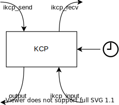
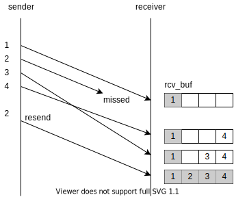
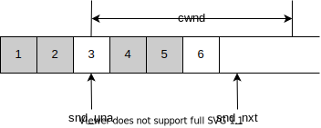
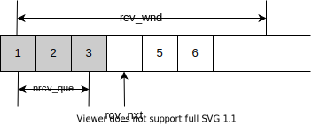
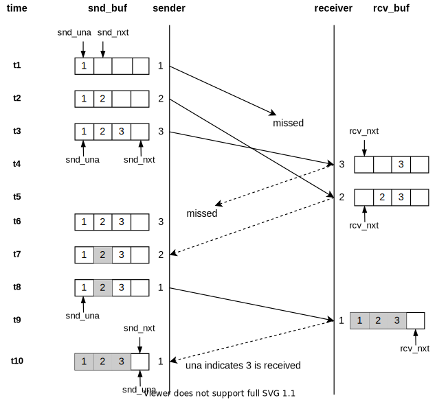
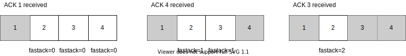

# 「转」详解 KCP 协议的原理和实现

> [原文](https://luyuhuang.tech/2020/12/09/kcp.html)

## 1. 引言

[KCP](https://github.com/skywind3000/kcp) 是一个快速可靠的 ARQ (Automatic Repeat-reQuest, 自动重传请求) 协议, 采用了不同于 TCP 的自动重传策略, 有着比 TCP 更低的网络延迟. 实际通常使用 KCP over UDP 代替 TCP, 应用在网络游戏和音视频传输中. KCP 的实现短小精悍, 非常适合学习. KCP 的 ARQ 机制与 TCP 类似, 只是部分策略不同, 学习 KCP 也有助于我们理解 TCP. 本文讨论 KCP 的原理和实现, 包括它的 ARQ 机制, 拥塞控制等.

笔者并不想直接贴出大段代码然后逐行分析, 因此本文各节会先用图文介绍 KCP 的各个机制, 然后再展示代码并分析它的实现. KCP 源码的可读性还是比较好的, 建议大家阅读本文的同时也结合 KCP 源码.

我们首先在第 2 节看下 KCP 的各个主要的接口; 接着第 3 节开始介绍 KCP 中的数据结构, 包括报文段, KCP 对象, 队列; 第 4 节开始介绍 KCP 的发送, 接收与重传机制; 第 5 节分析 KCP 的拥塞控制机制; 最后简单做一个总结. 本文的篇幅有些长, 不过其中很多是代码展示, 我认为整体还是不复杂的.

## 2. 使用接口

我们从 KCP 的使用接口出发. 打开 `ikcp.h`, 关注这几个接口:

```c
// 一个 ikcpcb 实例代表一个 KCP 连接
typedef struct IKCPCB ikcpcb;

// 创建一个 KCP 实例
ikcpcb* ikcp_create(IUINT32 conv, void *user);

// 释放一个 KCP 实例
void ikcp_release(ikcpcb *kcp);

// 设置下层协议输出回调函数
void ikcp_setoutput(ikcpcb *kcp, int (*output)(const char *buf, int len,
    ikcpcb *kcp, void *user));

// 接收数据
int ikcp_recv(ikcpcb *kcp, char *buffer, int len);

// 发送数据
int ikcp_send(ikcpcb *kcp, const char *buffer, int len);

// 时钟更新
void ikcp_update(ikcpcb *kcp, IUINT32 current);

// 下层协议输入
int ikcp_input(ikcpcb *kcp, const char *data, long size);

// flush 发送缓冲区, 会在 ikcp_update 中调用
void ikcp_flush(ikcpcb *kcp);
```

`ikcp_create` 创建一个 KCP 实例. 传入的 `conv` 参数标识这个 KCP 连接, 也就是说, 这个连接发出去的每个报文段都会带上 `conv`, 它也只会接收 `conv` 与之相等的报文段. 通信的双方必须先协商一对相同的 `conv`. KCP 本身不提供任何握手机制, 协商 `conv` 交给使用者自行实现, 比如说通过已有的 TCP 连接协商.

KCP 是纯算法实现的, 不负责下层协议收发, 内部没有任何系统调用, 连时钟都要外部传进来. 因此我们需要:

- 调用 `ikcp_setoutput` 设置下层协议输出函数. 每当 KCP 需要发送数据时, 都会回调这个输出函数. 例如下层协议是 UDP 时, 就在输出回调中调用 `sendto` 将数据发送给对方. 输出回调的 `user` 参数等于 `ikcp_create` 传入的 `user` 参数.
- 当下层协议数据到达时, 调用 `ikcp_input` 将数据传给 KCP.
- 以一定的频率调用 `ikcp_update` 以驱动 KCP 的时钟. `current` 表示当前时间, 单位为毫秒.

设置好下层协议和时钟后, 就可以调用 `ikcp_recv` 和 `ikcp_send` 收发 KCP 数据了.



在深入细节之前, 先简单浏览下这几个函数, 我们就能知道它们大概会做什么:

- `ikcp_send` 将数据放在发送队列中等待发送;
- `ikcp_recv` 从接收队列中读取数据;
- `ikcp_input` 读取下层协议输入数据, 解析报文段; 如果是数据, 就将数据放入接收缓冲区; 如果是 ACK, 就在发送缓冲区中标记对应的报文段为已送达;
- `ikcp_flush` 调用输出回调将发送缓冲区中的数据发送出去.

接下来几节我们会逐步深入探索 KCP 的实现细节.

## 3. 数据结构

### 3.1 报文段

#### 3.1.1 报文段结构

我们先来看 KCP 的报文段结构. 首先, KCP 的有四种报文段, 或者说四个 Command:

- 数据报文 `IKCP_CMD_PUSH`
- 确认报文 `IKCP_CMD_ACK`
- 窗口探测报文 `IKCP_CMD_WASK`, 询问对端剩余接收窗口的大小.
- 窗口通知报文 `IKCP_CMD_WINS`, 通知对端剩余接收窗口的大小.

无论是那种报文段, 其结构都是这样的:

```
0               4   5   6       8 (BYTE)
+---------------+---+---+-------+
|     conv      |cmd|frg|  wnd  |
+---------------+---+---+-------+   8
|     ts        |     sn        |
+---------------+---------------+  16
|     una       |     len       |
+---------------+---------------+  24
|                               |
|        DATA (optional)        |
|                               |
+-------------------------------+
```

可以看到有这么几个字段:

- `conv` 4 字节: 连接标识, 前面已经讨论过了.
- `cmd` 1 字节: Command.
- `frg` 1 字节: 分片数量. 表示随后还有多少个报文属于同一个包.
- `wnd` 2 字节: 发送方剩余接收窗口的大小.
- `ts` 4 字节: 时间戳.
- `sn` 4 字节: 报文编号.
- `una` 4 字节: 发送方的接收缓冲区中最小还未收到的报文段的编号. 也就是说, 编号比它小的报文段都已全部接收.
- `len` 4 字节: 数据段长度.
- `data`: 数据段. 只有数据报文会有这个字段.

首先, 每个数据报文和 ACK 都会带上 sn, 唯一标识一个报文; 发送方发送一个数据报文, 接收方收到后回一个 ACK, 接收方收到 ACK 后根据 sn 将对应的报文标记为已送达; 同时, 每个报文都会带上 una, 发送方也会根据 una 将相应的报文标记已送达.

ts 可以用来估算 RTT (Round-Trip Time, 往返时间), 从而计算出 RTO (Retransmission TimeOut, 重传超时时间). 我们会根据 RTO 确定每个报文的超时时间, 如果报文在超时时间内未被标记为已送达, 就会被重传.

数据包的大小可能会超过一个 MSS (Maximum Segment Size, 最大报文段大小). 这个时候需要进行分片, frg 表示随后的分片数量, 即随后还有多少个报文属于同一个包.

每个报文都会带上 wnd, 告诉对端发送方剩余接收窗口的大小, 这有助于对端控制发送速率. 我们会在第 5 节详细讨论.

#### 3.1.2 实现

在 KCP 的实现中, 使用如下的结构体表示一个 KCP 报文段:

```c
struct IKCPSEG
{
    struct IQUEUEHEAD node;
    IUINT32 conv;
    IUINT32 cmd;
    IUINT32 frg;
    IUINT32 wnd;
    IUINT32 ts;
    IUINT32 sn;
    IUINT32 una;
    IUINT32 len;
    IUINT32 resendts;
    IUINT32 rto;
    IUINT32 fastack;
    IUINT32 xmit;
    char data[1];
};
```

除了报文的几个字段之外, 还有如下字段:

- `node`: 链表节点. 我们会在 3.3 节详细讨论.
- `resendts`: 重传时间戳. 超过这个时间表示该报文超时, 需要重传.
- `rto`: 该报文的 RTO.
- `fastack`: ACK 失序次数. 也就是 [KCP Readme 中](https://github.com/skywind3000/kcp#%E5%BF%AB%E9%80%9F%E9%87%8D%E4%BC%A0)所说的 "跳过" 次数.
- `xmit`: 该报文传输的次数.

### 3.2 KCP 实例

一个 `struct IKCPCB` 实例表示一个 KCP 连接. 它的字段比较多, 这里先列出每个字段的含义. 不必现在就细看每个字段的含义, 可以先跳过这一段, 需要的时候再返回来查.

```c
struct IKCPCB
{
    IUINT32 conv, mtu, mss, state;
    IUINT32 snd_una, snd_nxt, rcv_nxt;
    IUINT32 ts_recent, ts_lastack, ssthresh;
    IINT32 rx_rttval, rx_srtt, rx_rto, rx_minrto;
    IUINT32 snd_wnd, rcv_wnd, rmt_wnd, cwnd, probe;
    IUINT32 current, interval, ts_flush, xmit;
    IUINT32 nrcv_buf, nsnd_buf;
    IUINT32 nrcv_que, nsnd_que;
    IUINT32 nodelay, updated;
    IUINT32 ts_probe, probe_wait;
    IUINT32 dead_link, incr;
    struct IQUEUEHEAD snd_queue;
    struct IQUEUEHEAD rcv_queue;
    struct IQUEUEHEAD snd_buf;
    struct IQUEUEHEAD rcv_buf;
    IUINT32 *acklist;
    IUINT32 ackcount;
    IUINT32 ackblock;
    void *user;
    char *buffer;
    int fastresend;
    int fastlimit;
    int nocwnd, stream;
    int logmask;
    int (*output)(const char *buf, int len, struct IKCPCB *kcp, void *user);
    void (*writelog)(const char *log, struct IKCPCB *kcp, void *user);
};
```

- `conv`: 连接标识, 前面已经讨论过了.
- `mtu`, `mss`: 最大传输单元 (Maximum Transmission Unit) 和最大报文段大小. mss = mtu - 包头长度(24).
- `state`: 连接状态, 0 表示连接建立, -1 表示连接断开. (注意 `state` 是 unsigned int, -1 实际上是 `0xffffffff`)
- `snd_una`: 发送缓冲区中最小还未确认送达的报文段的编号. 也就是说, 编号比它小的报文段都已确认送达.
- `snd_nxt`: 下一个等待发送的报文段的编号.
- `rcv_nxt`: 下一个等待接收的报文段的编号.
- `ts_recent`, `ts_lastack`: 未使用.
- `ssthresh`: Slow Start Threshold, 慢启动阈值.
- `rx_rto`: Retransmission TimeOut(RTO), 超时重传时间.
- `rx_rttval`, `rx_srtt`, `rx_minrto`: 计算 `rx_rto` 的中间变量.
- `snd_wnd`, `rcv_wnd`: 发送窗口和接收窗口的大小.
- `rmt_wnd`: 对端剩余接收窗口的大小.
- `cwnd`: congestion window, 拥塞窗口. 用于拥塞控制.
- `probe`: 是否要发送控制报文的标志.
- `current`: 当前时间.
- `interval`: flush 的时间粒度.
- `ts_flush`: 下次需要 flush 的时间.
- `xmit`: 该链接超时重传的总次数.
- `nrcv_buf`, `nsnd_buf`, `nrcv_que`, `nsnd_que`: 接收缓冲区, 发送缓冲区, 接收队列, 发送队列的长度.
- `nodelay`: 是否启动快速模式. 用于控制 RTO 增长速度.
- `updated`: 是否调用过 `ikcp_update`.
- `ts_probe`, `probe_wait`: 确定何时需要发送窗口询问报文.
- `dead_link`: 当一个报文发送超时次数达到 `dead_link` 次时认为连接断开.
- `incr`: 用于计算 cwnd.
- `snd_queue`, `rcv_queue`: 发送队列和接收队列.
- `snd_buf`, `rcv_buf`: 发送缓冲区和接收缓冲区.
- `acklist`, `ackcount`, `ackblock`: ACK 列表, ACK 列表的长度和容量. 待发送的 ACK 的相关信息会先存在 ACK 列表中, flush 时一并发送.
- `buffer`: flush 时用到的临时缓冲区.
- `fastresend`: ACK 失序 `fastresend` 次时触发快速重传.
- `fastlimit`: 传输次数小于 `fastlimit` 的报文才会执行快速重传.
- `nocwnd`: 是否不考虑拥塞窗口.
- `stream`: 是否开启流模式, 开启后可能会合并包.
- `logmask`: 用于控制日志. 本文不讨论它.
- `output`: 下层协议输出函数.
- `writelog`: 日志函数. 本文不讨论它.

### 3.3 队列与缓冲区

我们先来看 `snd_queue`, `rcv_queue`, `snd_buf` 和 `rcv_buf` 这四个字段. 它们分别是发送队列, 接收队列, 发送缓冲区和接收缓冲区. 队列和缓冲区其实都是循环双链表, 链表节点的类型都是 `struct IKCPSEG`.

调用 `ikcp_send` 发送数据时会先将数据加入 `snd_queue` 中, 然后再伺机加入 `snd_buf`. 每次调用 `ikcp_flush` 时都将 `snd_buf` 中满足条件的报文段都发送出去. 之所以不将报文直接加入 `snd_buf` 是为了防止一次发送过多的报文导致拥塞, 需要再拥塞算法的控制下伺机加入 `snd_buf` 中.

调用 `ikcp_input` 收到的数据解包后会先放入 `rcv_buf` 中, 再在合适的情况下转移到 `rcv_queue` 中. 调用 `ikcp_recv` 接收数据时会从 `rcv_queue` 取出数据返回给调用者. 这样做是因为报文传输的过程中会出现丢包, 失序等情况. 为了保证顺序, 需要将收到的报文先放入 `rcv_buf` 中, 只有当 `rcv_buf` 中的报文段顺序正确才能将其移动到 `rcv_queue` 中供调用者接收. 如下图所示, `rcv_buf` 中节点为灰色表示可以移动到 `rcv_queue` 中. 只有当 2 号报文重传成功后, 才能将 2, 3, 4 号报文移动到 `rcv_queue` 中.



#### 3.3.1 链表的实现

队列和缓冲区都是循环双链表, 它是由一组宏实现的:

```c
struct IQUEUEHEAD {
    struct IQUEUEHEAD *next, *prev;
};

#define IQUEUE_HEAD_INIT(name) { &(name), &(name) }
#define IQUEUE_HEAD(name) \
    struct IQUEUEHEAD name = IQUEUE_HEAD_INIT(name)

#define IQUEUE_INIT(ptr) ( \
    (ptr)->next = (ptr), (ptr)->prev = (ptr))

#define IOFFSETOF(TYPE, MEMBER) ((size_t) &((TYPE *)0)->MEMBER)

#define ICONTAINEROF(ptr, type, member) ( \
        (type*)( ((char*)((type*)ptr)) - IOFFSETOF(type, member)) )

#define IQUEUE_ENTRY(ptr, type, member) ICONTAINEROF(ptr, type, member)

#define IQUEUE_ADD(node, head) ( \
    (node)->prev = (head), (node)->next = (head)->next, \
    (head)->next->prev = (node), (head)->next = (node))

#define IQUEUE_ADD_TAIL(node, head) ( \
    (node)->prev = (head)->prev, (node)->next = (head), \
    (head)->prev->next = (node), (head)->prev = (node))

#define IQUEUE_DEL(entry) (\
    (entry)->next->prev = (entry)->prev, \
    (entry)->prev->next = (entry)->next, \
    (entry)->next = 0, (entry)->prev = 0)

#define IQUEUE_IS_EMPTY(entry) ((entry) == (entry)->next)
```

`struct IQUEUEHEAD` 为带头节点的循环双链表的一个节点, 它有两个指针, `next` 指向后一个节点, `prev` 指向前一个节点; `IQUEUE_INIT` 初始化时将 `next` 和 `prev` 都指向自己, 这标志着链表为空 (见 `IQUEUE_IS_EMPTY`). `IQUEUE_ADD` 将节点插入到 `head` 后面; `IQUEUE_ADD_TAIL` 将节点插入到 `head` 前面, 因为是循环链表, 所以插到头节点前面就相当于插到链表末尾. 这些都很好理解.

`struct IKCPSEG` 中的 `node` 字段为链表节点. 将一个报文段插入链表时, 实际上是将它的 `node` 字段插入链表中. 那么从链表中取出节点时怎么将它还原成报文段呢? `IQUEUE_ENTRY` 这个宏通过链表节点获取包含这个节点的对象. `IQUEUE_ENTRY` 需要传入节点的指针, 包含这个节点的对象的类型, 以及节点所在的成员. 例如对于链表节点指针 `p`, 我们要还原成 `struct IKCPSEG` 指针, 只需调用 `IQUEUE_ENTRY(p, struct IKCPSEG, node)`. 原理是通过 `IOFFSETOF` 这个宏获取节点成员在结构体中的地址偏移, 然后再用节点的地址减去地址偏移, 就能得到这个结构体对象的地址. `&((TYPE *)0)->MEMBER` 这个表达式对 `NULL` 指针执行 `->` 操作, 但因为只是取地址而并没有访问那个地址, 所以没有任何问题.

## 4. 发送, 接收与重传

前面介绍数据结构时我们知道了 ACK 报文为数据报文的确认, 队列和缓冲区的关系. 这一节我们详细讨论 KCP 的整个 ARQ 流程. 首先介绍发送, 接收和重传的整体流程, 然后是 KCP 发送和接收的滑动窗口, 以及它们在发送和接收中的变化情况; 接着会讨论快速重传和 RTO 计算方式; 最后展示 KCP 的代码, 看它具体是如何实现的.

### 4.1 整体流程

KCP 的整个发送, 接收与重传的流程大体如下:

- 调用 `ikcp_send` 发送数据, 创建报文段实例, 加入 `snd_queue` 中.
- `ikcp_update` 会在合适的时刻调用 `ikcp_flush`.
- `ikcp_flush` 会做:
    - 发送 ACK 列表中所有的 ACK;
    - 检查是否需要发送窗口探测和通知报文, 如果需要就发送相应的报文;
    - 根据发送窗口大小, 将适量的报文段从 `snd_queue` 移入到 `snd_buf` 中;
    - 将 `snd_buf` 中满足<u>条件</u>的报文段都发送出去. 这里的<u>条件</u>有:
        - 新加入 `snd_buf` 中, 从未发送过的报文直接发送出去;
        - 发送过的, 但是在 RTO 内未收到 ACK 的报文, 需要重传;
        - 发送过的, 但是 ACK 失序若干次的报文, 需要执行快速重传.
    - 根据丢包情况计算 ssthresh 和 cwnd.

    这样, 刚才调用 `ikcp_send` 传入的数据就在 `ikcp_flush` 中被发送出去了.
- 报文到达对端.
- `ikcp_input` 会被调用, 解析收到的数据:
    - 所有的报文都有 una 字段, 根据 una 将相应的报文标记为已送达;
    - 如果是 ACK 报文, 就将相应的报文标记为已送达;
    - 如果是数据报文, 就将它放入 `rcv_buf`, 然后将 `rcv_buf` 中顺序正确的报文移入 `rcv_queue`; 接着将相关信息插入 ACK 列表, 在稍后的 `ikcp_flush` 调用中会发送相应的 ACK;
    - 如果是窗口探测报文, 就标记 "需要发送窗口通知". 在稍后的 `ikcp_flush` 调用中会发送窗口通知报文;
    - 包括窗口通知报文在内的所有报文都有 wnd 字段, 据此更新 `rmt_wnd`;
    - 根据 ACK 失序情况决定快速重传;
    - 计算 cwnd.
- 调用 `ikcp_recv` 接收数据, 从 `rcv_queue` 中读取数据.

之后 ACK 会返回给发送方, 发送方在 `ikcp_input` 中解析到 ACK, 将对应的报文标记为已送达, 这就完成了一次发送. 如果发生了丢包, 发送方最终收不到 ACK. 这会导致重传.

发送队列和接收队列确实是队列, 报文总是先进先出的, 因此上面说的诸如 "加入 `snd_queue`" 和 "从 `rcv_queue` 中读取", 都是简单的入队出队. 但是发送缓冲区和接收缓冲区就相对复杂些, 下一节我们详细讨论这个问题.

### 4.2 滑动窗口

发送缓冲区 `snd_buf` 和接收缓冲区 `rcv_buf` 中活动的报文都是在滑动窗口之中的. 滑动窗口实际是一个抽象的概念, 不能简单地认为它是缓冲区的一部分, 稍后我们能看到, 接收窗口的一部分是接收队列.

#### 4.2.1 发送

发送窗口的结构如下图所示. 灰色节点表示已送达的报文, 白色节点表示已发送但尚未确认到达的报文. 其中白色节点表示的报文存在于 `snd_buf` 中, 而灰色节点表示的已确认送达的报文已经从 `snd_buf` 中删除. 这里还有两个指针: `snd_una` 指向第一个尚未确认到达的报文, 也就是说在它之前的报文都已确认到达; `snd_nxt` 指向下一个插入缓冲区的位置. 滑动窗口的起始位置是 `snd_una`, 大小为 cwnd.



每次 flush 时都会从 `snd_queue` 中取出报文插入 `snd_buf` 中 `snd_nxt` 指向的位置, 然后 `snd_nxt` 向右移动. KCP 会动态计算窗口大小 cwnd, 当 `snd_nxt - snd_una >= cwnd` 时, 便不允许新的报文加入 `snd_buf`. 这时须等报文确认到达, `snd_una` 向右移动, 方可继续发送. 每次 flush 其实是将发送窗口中的报文尽可能地发送出去. 因此, cwnd 的大小决定了发送速率.

在 KCP 的实现中, `snd_buf` 是一个报文段链表, 链表中的报文段编号始终递增. 报文段插入 `snd_buf` 时会追加到链表的尾部, 确认到达的报文段则会从链表中删除.

发送窗口中未确认到达的报文何时重传, 取决于这个报文的 RTO. 报文在一个 RTO 时间内仍未确认到达, 就会重传. 报文的 RTO 初始值会被赋为 `rx_rto`, 之后每次超时重传, RTO 都会以某种方式增长. KCP 的 RTO 增长速率可配置, 或翻倍, 或翻 0.5 倍. 此外还有快速重传机制, 我们会在 4.3 节中讨论.

#### 4.2.2 接收

接收窗口结构如下图所示. 这里灰色节点表示顺序正确, 已经移动到 `rcv_queue` 中的报文. 注意下图表示的是 `snd_queue` 和 `snd_buf` 的结合体, 灰色节点都在 `rcv_queue` 中, 其余 `rcv_nxt` 及其右边的部分为 `rcv_buf`. 滑动窗口的起始位置为 `rcv_queue` 的队首, 大小为 `rcv_wnd`.



每收到一个数据报文, 都会根据它的编号将它插入到 `rcv_buf` 对应的位置中. 接着检查 `rcv_nxt` 能否向右移动, 只有当报文的顺序正确且连续才能移动. 在上图的例子中由于 4 号报文的缺失, `rcv_nxt` 只能处于 4 号位置等待, 5, 6 号报文也不能移动到 `rcv_queue` 中. 需等到 4 号报文到达后, 才能将 4, 5, 6 号报文一并移动到 `rcv_queue` 中; 同时 `rcv_nxt` 会右移到 7 号位置.

`nrcv_que` 为接收队列的长度. KCP 会通知发送方剩余接收窗口的大小为 `rcv_wnd - nrcv_que`, 发送方应根据这个值调整 cwnd, 确保发送速率不超过对方的接收速率; 接收方也应该及时读取 `rcv_queue` 中的数据, 让窗口向右滑动, 以保证有充足的接收窗口. 如果接收到数据报文的编号大于 `rcv_nxt + rcv_wnd`, 远超窗口之外, 这个报文就会被丢弃.

在 KCP 的实现中, `rcv_buf` 同样是一个报文段链表, 链表中报文段编号始终递增. 当收到新的报文时, 会根据编号插入到链表中相应的位置中; 顺序正确的报文会从链表头部弹出, 移动到 `rcv_queue` 中.

回想起 3.1 节中所说的, 每个报文都会带上 una 字段, 表示该报文发送者的接收缓冲区中最小还未收到的报文编号. 不难发现, 这其实就是 `rcv_nxt`. 因此 KCP 发送的每个报文都会将 una 字段赋值为 `rcv_nxt`. 这样就有了 ACK + UNA 双重确认机制, 即使 ACK 丢包, 也可以通过稍后的 una 确认报文已送达.

#### 4.2.3 例子

我们举个简单的例子演示整个 ARQ 的流程. 下图中实线箭头表示数据报文, 虚线箭头表示 ACK.



- t1 时刻发送方发送 1 号报文, 1 号报文放入发送缓冲区中, `snd_una` 指向 1, `snd_nxt` 指向 2.
- t2 至 t3 时刻发送方依次发送 2 至 3 号报文, `snd_nxt` 依次后移.
- 1 号报文丢包.
- t4, t5 时刻接收方收到 3 号和 2 号报文, 放入 `rcv_buf` 中; 随后回复 3 号和 2 号 ACK. 此时由于 1 号报文缺失, `rcv_nxt` 始终指向 1.
- 3 号 ACK 丢包.
- t7 时刻发送方收到 2 号 ACK, 将 2 号报文标记为已送达. 此时由于 3 号 ACK 丢包, 3 号报文未标记为已送达. 由于 1 号报文未确认送达, `snd_una` 亦指向 1.
- t8 时刻 1 号报文超时, 重传.
- t9 时刻接收方收到 1 号报文, 放入 `rcv_buf` 中; 这时 1, 2, 3 号报文顺序正确, `rcv_nxt` 右移到 4 号位置. 接收方回复 1 号 ACK, 同时带上 una = 4.
- t10 时刻发送方收到 1 号 ACK, 将 1 号报文标记为已送达. 同时 una 表明 1, 2, 3 号报文均已送达, 因此也将 3 号报文标记为已送达. `snd_una` 移动到 4.

### 4.3 快速重传

除了超时重传, KCP 还有快速重传机制. 假设发送方依次发送了 1, 2, 3, 4 号报文, 随后收到 1, 3, 4 号 ACK. 收到 3 号 ACK 时, 我们知道 2 号 ACK 失序了一次, 收到 4 号 ACK 时, 我们知道 2 号失序了两次. ACK 失序次数越多说明它丢包的概率越大, KCP 会直接重传失序次数过多的报文, 而不用等待其超时.



每个报文的 `fastack` 字段记录了它检测到 ACK 失序的次数. 每当 KCP 收到一个编号为 sn 的 ACK 时, 就会检查 `snd_buf` 中编号小于 sn 且未确认送达的报文, 将其 `fastack` 加一. 我们可以通过配置 `fastresend` 指定失序多少次就执行快速重传. 每次调用 `ikcp_flush` 时都会重传 `snd_buf` 中 `fastack` 不小于 `fastresend` 的报文.

报文也不会无限制地执行快速重传. 每个报文的 `xmit` 字段记录它被传输的次数, KCP 的 `fastlimit` 字段规定了传输次数小于 `fastlimit` 的报文才能执行快速重传.

### 4.4 计算 RTO

每个报文 RTO 的会随着重传次数的增加而增加, 其初始值保存在字段 `rx_rto` 中. 一个设置得当的 RTO 是保证 ARQ 性能的关键. KCP 计算 RTO 初始值的方法是 TCP 的标准方法, 规定在 [RFC 6298](https://tools.ietf.org/html/g) 中.

标准方法通过 RTT 计算 RTO. 这是容易理解的: 报文从发出到收到 ACK 经过的时间应为一个 RTT, 如果某个报文在一个 RTT 内未收到 ACK, 说明它很有可能丢包了. 因此 RTO 应该与 RTT 呈正相关, 且应高于 RTT 以容忍一定程度的抖动.

计算过程要维护两个中间变量, srtt 和 rttvar, 每次收到一个 ACK 都能得到一个 RTT, 然后计算更新中间变量, 然后得出 RTO. 具体方法如下:

$$
\begin{align}

srtt &\leftarrow (1 - g)\cdot srtt + g \cdot rtt \\
rttvar &\leftarrow (1 - h)\cdot rttvar + h \cdot |rtt - srtt| \\
RTO &= \max(interval, srtt + 4 \cdot rttvar)

\end{align}
$$

$g$ 和 $h$ 是常数, $g$ 取 $1/8$ , $h$ 取 $1/4$. $interval$ 为计时器粒度, 也就是调用 `ikcp_flush` 的时间间隔. 这种算法称为**指数加权移动平均**, srtt 是对一段时间内 RTT 平均值的估计, 新的 srtt 有 $7/8$ 取决于旧的 srtt, $1/8$ 取决于当前 RTT; 而 rttvar 是对 RTT 平均偏差的估计, 新的 rttvar 有 $3/4$ 取决于旧的 rttvar, $1/4$ 取决于当前偏差. 最终 RTO 等于 RTT 的平均值加上四倍的 RTT 平均抖动值, 并且至少为一个计时器粒度.

srtt 和 rttvar 会按上述方法更新, 但在此之前也需要设置初始值. 标准方法的做法是测得第一个 RTT 时初始化 srtt 和 rttvar, 其值为:

$$
\begin{align}

srtt &\leftarrow rtt \\
rttvar &\leftarrow rtt / 2 \\

\end{align}
$$

### 4.5 实现

我们最后再来看 KCP 的代码是如何实现的. 前面几节已经介绍过 KCP 的 ARQ 原理, 这一节就直接展示注释过的 KCP 源码. 代码比较长, 这里适当做精简, 建议读者对照 KCP 源码阅读.

#### 4.5.1 发送

`ikcp_send` 根据传入的数据, 创建若干个报文段对象, 放入 `snd_queue` 中.

```c
int ikcp_send(ikcpcb *kcp, const char *buffer, int len)
{
    IKCPSEG *seg;
    int count, i;

    assert(kcp->mss > 0);
    if (len < 0) return -1;

    if (kcp->stream != 0) {
        // 如果是流模式就合并包, 将 buffer 中的数据尽可能地追加到 snd_queue 中的最后一个报文中
        ...
    }

    // 计算出分片数量 = buffer 长度 / 最大报文段大小(mss), 向上取整.
    if (len <= (int)kcp->mss) count = 1;
    else count = (len + kcp->mss - 1) / kcp->mss;

    if (count >= (int)IKCP_WND_RCV) return -2;
    if (count == 0) count = 1;

    // 创建 count 个报文段对象并加入 snd_queue
    for (i = 0; i < count; i++) {
        int size = len > (int)kcp->mss ? (int)kcp->mss : len;
        seg = ikcp_segment_new(kcp, size); // 创建报文段对象
        assert(seg);
        if (seg == NULL) {
            return -2;
        }
        if (buffer && len > 0) {
            memcpy(seg->data, buffer, size); // 复制数据
        }
        seg->len = size;
        seg->frg = (kcp->stream == 0)? (count - i - 1) : 0; // 剩余分片数量
        iqueue_init(&seg->node);
        iqueue_add_tail(&seg->node, &kcp->snd_queue); // 加入 snd_queue
        kcp->nsnd_que++;
        if (buffer) {
            buffer += size; // buffer 指针后移
        }
        len -= size;
    }

    return 0;
}
```

之后在 `ikcp_update` 的驱动下, 会调用到 `ikcp_flush`.

```c
void ikcp_flush(ikcpcb *kcp)
{
    IUINT32 current = kcp->current; // 当前时间
    char *buffer = kcp->buffer; // 临时缓冲区
    char *ptr = buffer;
    int count, size, i;
    IUINT32 resent, cwnd;
    IUINT32 rtomin;
    struct IQUEUEHEAD *p;
    int change = 0; // 是否执行过快速重传
    int lost = 0; // 是否执行过超时重传
    IKCPSEG seg;

    if (kcp->updated == 0) return;

    seg.conv = kcp->conv;
    seg.cmd = IKCP_CMD_ACK; // ACK 报文段
    seg.wnd = ikcp_wnd_unused(kcp); // 通知对端剩余接收窗口大小为 rcv_wnd - nrcv_que (4.2.2 节)
    seg.una = kcp->rcv_nxt; // 将 una 赋值为 rcv_nxt (4.2.2 节)
    // seg.frg, seg.len, seg.sn, seg.ts 均赋值为 0
    ...

    // 发送 ACK 列表中所有的 ACK
    count = kcp->ackcount;
    for (i = 0; i < count; i++) {
        size = (int)(ptr - buffer);
        if (size + (int)IKCP_OVERHEAD > (int)kcp->mtu) { // buffer 中累计的数据将要大于一个 MTU, 就发送 buffer 中的数据.
            ikcp_output(kcp, buffer, size);              // 之后会多次出现这段代码, 以 <FLUSH_BUFFER> 代替之.
            ptr = buffer;
        }
        ikcp_ack_get(kcp, i, &seg.sn, &seg.ts); // 从 ACK 列表中取出 ACK 的编号和时间戳
        ptr = ikcp_encode_seg(ptr, &seg); // ACK 报文写入 buffer
    }
    kcp->ackcount = 0;

    if (kcp->rmt_wnd == 0) {
        // 对端剩余接收窗口大小为 0, 可能需要发送窗口探测报文. 根据 ts_probe 和 probe_wait 确定当前时刻是否需要发送探测报文.
        ...
    } else {
        kcp->ts_probe = 0;
        kcp->probe_wait = 0;
    }

    if (kcp->probe & IKCP_ASK_SEND) { // 检查是否需要发送窗口探测报文
        seg.cmd = IKCP_CMD_WASK;
        <FLUSH_BUFFER>
        ptr = ikcp_encode_seg(ptr, &seg); // 报文写入 buffer
    }

    if (kcp->probe & IKCP_ASK_TELL) { // 检查是否需要发送窗口通知报文
        seg.cmd = IKCP_CMD_WINS;
        ... // 同窗口探测报文
    }
    kcp->probe = 0;

    cwnd = ... // 计算 cwnd
    // 将报文从 snd_queue 移动到 snd_buf. snd_nxt - snd_una 不超过 cwnd. (4.2.1 节)
    while (_itimediff(kcp->snd_nxt, kcp->snd_una + cwnd) < 0) {
        IKCPSEG *newseg;
        if (iqueue_is_empty(&kcp->snd_queue)) break; // snd_queue 为空, break

        newseg = iqueue_entry(kcp->snd_queue.next, IKCPSEG, node); // 取队首的报文段
        iqueue_del(&newseg->node); // 出队

        iqueue_add_tail(&newseg->node, &kcp->snd_buf); // 插入 snd_buf
        kcp->nsnd_que--;
        kcp->nsnd_buf++;

        // 给 newseg 的各个字段赋值. 这里作部分省略
        newseg->cmd = IKCP_CMD_PUSH;
        newseg->sn = kcp->snd_nxt++; // snd_nxt 自增
        ...
    }

    // 快速重传, fastresend 为 0 便不执行快速重传
    resent = (kcp->fastresend > 0)? (IUINT32)kcp->fastresend : 0xffffffff;
    rtomin = (kcp->nodelay == 0)? (kcp->rx_rto >> 3) : 0;

    // 将 snd_buf 中满足条件的报文段都发送出去 (4.1 节)
    for (p = kcp->snd_buf.next; p != &kcp->snd_buf; p = p->next) {
        IKCPSEG *segment = iqueue_entry(p, IKCPSEG, node);
        int needsend = 0;
        if (segment->xmit == 0) { // 新加入 snd_buf 中, 从未发送过的报文直接发送出去
            needsend = 1;
            segment->xmit++;
            segment->rto = kcp->rx_rto; // RTO 初始为 rx_rto
            segment->resendts = current + segment->rto + rtomin; // 重传时间戳
        }
        else if (_itimediff(current, segment->resendts) >= 0) { // 发送过的, 但是在 RTO 内未收到 ACK 的报文, 需要重传
            needsend = 1;
            segment->xmit++;
            kcp->xmit++; // 超时重传的总次数
            // 每超时重传一次, RTO 都增长
            if (kcp->nodelay == 0) {
                segment->rto += _imax_(segment->rto, (IUINT32)kcp->rx_rto); // RTO 翻倍增长
            } else {
                IINT32 step = (kcp->nodelay < 2)?
                    ((IINT32)(segment->rto)) : kcp->rx_rto;
                segment->rto += step / 2; // RTO 翻 0.5 倍增长
            }
            segment->resendts = current + segment->rto; // 重传时间戳
            lost = 1;
        }
        else if (segment->fastack >= resent) { // 发送过的, 但是 ACK 失序超过 resent 次的报文, 需要执行快速重传. (4.3 节)
            if ((int)segment->xmit <= kcp->fastlimit ||
                kcp->fastlimit <= 0) { // 快速重传次数限制
                needsend = 1;
                segment->xmit++;
                segment->fastack = 0;
                segment->resendts = current + segment->rto;
                change++;
            }
        }

        if (needsend) {
            int need;
            // 赋值 segment->ts, segment->wnd, segment->una
            ...

            <FLUSH_BUFFER>

            ptr = ikcp_encode_seg(ptr, segment); // 报文写入 buffer
            if (segment->len > 0) {
                memcpy(ptr, segment->data, segment->len); // 报文的数据段也要写入 buffer
                ptr += segment->len;
            }

            if (segment->xmit >= kcp->dead_link) { // 报文传输次数大于一定值, 连接断开
                kcp->state = (IUINT32)-1;
            }
        }
    }

    // 发送 buffer 中剩余的报文段
    size = (int)(ptr - buffer);
    if (size > 0) {
        ikcp_output(kcp, buffer, size);
    }

    // 根据丢包情况计算 ssthresh 和 cwnd. 会在第 5 节中讨论
    ...
}
```

#### 4.5.2 接收

数据到达会调用 `ikcp_input`.

```c
int ikcp_input(ikcpcb *kcp, const char *data, long size)
{
    IUINT32 prev_una = kcp->snd_una; // 收到报文后, snd_una 可能会向右移动. 这里保存移动前的 snd_una
    IUINT32 maxack = 0, latest_ts = 0;
    int flag = 0;

    ...

    if (data == NULL || (int)size < (int)IKCP_OVERHEAD) return -1;

    while (1) {
        // 报文的各个字段
        IUINT32 ts, sn, len, una, conv;
        IUINT16 wnd;
        IUINT8 cmd, frg;

        IKCPSEG *seg;

        if (size < (int)IKCP_OVERHEAD) break;

        ... // 调用 ikcp_decode* 解包, 为各个字段赋值.

        if (conv != kcp->conv) return -1; // 检查 conv

        size -= IKCP_OVERHEAD;

        if ((long)size < (long)len || (int)len < 0) return -2;

        if (cmd != IKCP_CMD_PUSH && cmd != IKCP_CMD_ACK &&
            cmd != IKCP_CMD_WASK && cmd != IKCP_CMD_WINS) // 检查 cmd
            return -3;

        kcp->rmt_wnd = wnd; // 更新 rmt_wnd
        ikcp_parse_una(kcp, una); // 根据 una 将相应已确认送达的报文从 snd_buf 中删除
        ikcp_shrink_buf(kcp); // 尝试向右移动 snd_una

        if (cmd == IKCP_CMD_ACK) { // ACK 报文
            if (_itimediff(kcp->current, ts) >= 0) {
                // 这里计算 RTO, _itimediff(kcp->current, ts) 便是 RTT.
                // 其计算方法与 4.4 节列出的公式一致, 具体代码不展示了, 读者可自行参阅 KCP 源码.
                ikcp_update_ack(kcp, _itimediff(kcp->current, ts));
            }
            ikcp_parse_ack(kcp, sn); // 将已确认送达的报文 snd_buf 中删除.
            ikcp_shrink_buf(kcp); // 尝试向右移动 snd_una
            if (flag == 0) { // 这里计算出这次 input 得到的最大 ACK 编号
                flag = 1;
                maxack = sn;
            } else {
                if (_itimediff(sn, maxack) > 0) {
                    maxack = sn;
                    ...
                }
            }
            ...
        }
        else if (cmd == IKCP_CMD_PUSH) { // 数据报文
            ...
            if (_itimediff(sn, kcp->rcv_nxt + kcp->rcv_wnd) < 0) {
                ikcp_ack_push(kcp, sn, ts); // 将相关信息 (报文编号和时间戳) 插入 ACK 列表中
                if (_itimediff(sn, kcp->rcv_nxt) >= 0) {
                    seg = ikcp_segment_new(kcp, len);
                    seg->conv = conv;
                    ... // 赋值各个字段
                    if (len > 0) {
                        memcpy(seg->data, data, len);
                    }

                    ikcp_parse_data(kcp, seg); // 插入 rcv_buf
                }
            }
        }
        else if (cmd == IKCP_CMD_WASK) { // 窗口探测
            kcp->probe |= IKCP_ASK_TELL; // 标记需要发送窗口通知报文
        }
        else if (cmd == IKCP_CMD_WINS) { // 窗口通知
            // 什么都不用做, wnd 字段前面已经取得了
        }
        else {
            return -3;
        }

        data += len;
        size -= len;
    }

    if (flag != 0) {
        ikcp_parse_fastack(kcp, maxack, latest_ts); // 检查 snd_buf 中编号小于 maxack 且未确认送达的报文, 将其 fastack 加一
    }

    ... // 计算 cwnd. 会在第 5 节中讨论

    return 0;
}
```

对于 ACK, 会调用 `ikcp_parse_ack` 将对应已送达的报文从 `snd_buf` 中删除. 删除之后, 之后的 `ikcp_flush` 调用中自然不用考虑重传问题了. `ikcp_parse_una` 的做法与之类似, 这里只展示 `ikcp_parse_ack`:

```c
static void ikcp_parse_ack(ikcpcb *kcp, IUINT32 sn)
{
    struct IQUEUEHEAD *p, *next;

    if (_itimediff(sn, kcp->snd_una) < 0 || _itimediff(sn, kcp->snd_nxt) >= 0)
        return;

    for (p = kcp->snd_buf.next; p != &kcp->snd_buf; p = next) { // 遍历 snd_buf
        IKCPSEG *seg = iqueue_entry(p, IKCPSEG, node);
        next = p->next;
        if (sn == seg->sn) { // 找到对应编号的报文, 将它删除
            iqueue_del(p);
            ikcp_segment_delete(kcp, seg);
            kcp->nsnd_buf--;
            break;
        }
        if (_itimediff(sn, seg->sn) < 0) {
            break;
        }
    }
}
```

对于数据报文, 则调用 `ikcp_parse_data` 将其插入 `rcv_buf`, 然后会尽可能地将顺序正确的报文移入 `rcv_queue`.

```c
void ikcp_parse_data(ikcpcb *kcp, IKCPSEG *newseg)
{
    struct IQUEUEHEAD *p, *prev;
    IUINT32 sn = newseg->sn;
    int repeat = 0;

    // 如果接收到数据报文的编号大于 rcv_nxt + rcv_wnd 或小于 rcv_nxt, 这个报文就会被丢弃. (4.2.2 节)
    if (_itimediff(sn, kcp->rcv_nxt + kcp->rcv_wnd) >= 0 ||
        _itimediff(sn, kcp->rcv_nxt) < 0) {
        ikcp_segment_delete(kcp, newseg);
        return;
    }

    // 在 rcv_buf 中寻找一个合适的位置以便插入
    for (p = kcp->rcv_buf.prev; p != &kcp->rcv_buf; p = prev) { // 从后往前遍历
        IKCPSEG *seg = iqueue_entry(p, IKCPSEG, node);
        prev = p->prev;
        if (seg->sn == sn) { // 如果遇到编号相等的, 则是重复报文
            repeat = 1;
            break;
        }
        if (_itimediff(sn, seg->sn) > 0) { // 找到第一个编号比它小的
            break;
        }
    }

    if (repeat == 0) { // 插入
        iqueue_init(&newseg->node);
        iqueue_add(&newseg->node, p);
        kcp->nrcv_buf++;
    } else { // 重复报文直接丢弃
        ikcp_segment_delete(kcp, newseg);
    }

    while (! iqueue_is_empty(&kcp->rcv_buf)) { // rcv_nxt 尝试向后移动, 将顺序正确的报文移动到 rcv_queue 中 (4.2.2 节)
        IKCPSEG *seg = iqueue_entry(kcp->rcv_buf.next, IKCPSEG, node);
        if (seg->sn == kcp->rcv_nxt && kcp->nrcv_que < kcp->rcv_wnd) { // 保证接收窗口大小不小于 0
            iqueue_del(&seg->node);
            kcp->nrcv_buf--;
            iqueue_add_tail(&seg->node, &kcp->rcv_queue);
            kcp->nrcv_que++;
            kcp->rcv_nxt++;
        } else {
            break;
        }
    }
}
```

最后接收方调用 `ikcp_recv` 从 `rcv_queue` 中读取数据.

```c
int ikcp_recv(ikcpcb *kcp, char *buffer, int len)
{
    struct IQUEUEHEAD *p;
    int ispeek = (len < 0)? 1 : 0;
    int peeksize;
    int recover = 0;
    IKCPSEG *seg;
    assert(kcp);

    if (iqueue_is_empty(&kcp->rcv_queue)) return -1;

    if (len < 0) len = -len;

    peeksize = ikcp_peeksize(kcp); // rcv_queue 中第一个包的大小. 这需要考虑到分片

    if (peeksize < 0) return -2;
    if (peeksize > len) return -3;
    if (kcp->nrcv_que >= kcp->rcv_wnd) recover = 1;

    for (len = 0, p = kcp->rcv_queue.next; p != &kcp->rcv_queue; ) { // 从 rcv_queue 取出报文读入 buffer
        int fragment;
        seg = iqueue_entry(p, IKCPSEG, node);
        p = p->next;

        if (buffer) {
            memcpy(buffer, seg->data, seg->len); // 复制到 buffer 中
            buffer += seg->len;
        }

        len += seg->len;
        fragment = seg->frg;

        if (ispeek == 0) { // 如果 len 小于 0, 则不消耗 rcv_queue
            iqueue_del(&seg->node);
            ikcp_segment_delete(kcp, seg);
            kcp->nrcv_que--;
        }

        if (fragment == 0)
            break;
    }

    assert(len == peeksize);

    while (! iqueue_is_empty(&kcp->rcv_buf)) { // rcv_queue 空些了, 再尝试从 rcv_buf 中取些报文到 rcv_queue
        seg = iqueue_entry(kcp->rcv_buf.next, IKCPSEG, node);
        ... // 与 ikcp_parse_data 中相同
    }

    // fast recover
    if (kcp->nrcv_que < kcp->rcv_wnd && recover) {
        // ready to send back IKCP_CMD_WINS in ikcp_flush
        // tell remote my window size
        kcp->probe |= IKCP_ASK_TELL;
    }

    return len;
}
```

## 5. 拥塞控制

报文不能无限制地发送. 因为网路容量是有限的, 接收方缓冲区的大小也是有限的; 如果无限制地发送数据, 必然会导致网路和缓冲区无法容纳发送的数据, 从而导致大量丢包. 此外网路中的连接不只一个, 如果所有的连接都无限制地发送报文, 便会导致恶性竞争, 最终网路的拥塞会导致所有人都无法使用. 因此即使是为流速设计的 KCP, 拥塞控制也是不可或缺的.

前面 4.2.1 节讨论了, cwnd 的大小决定了发送速率. 因此, 拥塞控制实际上就是动态计算 cwnd 的过程. KCP 拥塞控制的策略与 TCP 类似, 分为**慢启动(Slow Start)**, **拥塞避免(Congestion Avoidance)**和**快速恢复(Fast Recovery)**.

### 5.1 拥塞控制策略

理想情况下, 发送数据的速率正好等于网路的容量, 然而我们并不知道网路的实际容量. 我们的做法是先将 cwnd 设为 1, 随后平均每经过一个 RTT 时间 cwnd 都翻一倍, 以探测到何时会出现丢包. 这种方法便是慢启动.

在慢启动中 cwnd 会指数增长, 这个过程显然不能一直持续下去. 当 cwnd 超过一个阈值之后, 便会进入拥塞避免阶段. 这个阈值我们称为**慢启动阈值(Slow Start Threshold)**, 通常记作 ssthresh. 在拥塞避免阶段, cwnd 会近似于线性增长.

无论是慢启动还是拥塞避免, 随着 cwnd 的增长, 网路容量会被逐步填满. 网络容量填满之后, 就会不可避免地出现丢包. 这就意味着我们的发送速率过大, cwnd 应该减小了. KCP 称之为**丢包退让**. 此时有两种策略: 一种是将 ssthresh 置为当前 cwnd 的一半, 然后 cwnd 置为 1, 重新执行慢启动; 另一种也会将 ssthresh 置为当前 cwnd 的一半, 但 cwnd 置为比 ssthresh 稍高的值, 然后进入快速恢复阶段. 快速恢复阶段中, cwnd 会以与拥塞避免相同的方式线性增长. KCP 采用的策略是, 如果发生超时重传, 就进入慢启动; 如果发生快速重传, 就进入快速恢复.

下图展示了拥塞控制中 cwnd 和 ssthresh 的变化情况.


此外无论如何发送速率都不应该超过对端的接收速率, 否则数据一定会超出对端接收缓冲区的容量. 因此 接收方会不断地向对端汇报接收窗口的剩余大小, 发送方会限制 cwnd 不超过 `rmt_wnd`.

KCP 为流速设计, 在传递一些及时性要求很高的小数据时, 可以选择不执行慢启动和拥塞避免. 此时 cwnd 的大小仅取决于 `snd_wnd` 和 `rmt_wnd` 二者的最小值, 其中 `snd_wnd` 为配置值.

### 5.2 慢启动

慢启动时, 平均每经过一个 RTT 时间 cwnd 都翻一倍. 实际的做法是, 每收到一个 ACK cwnd 都加一. 初始 cwnd 为 1, 发送 1 个报文段, 随后收到 1 个 ACK, cwnd 加一等于 2; 现在 cwnd 为 2, 发送 2 个报文段, 随后收到 2 个 ACK, cwnd 自增两次等于 4. 以此类推, cwnd 就会指数增长.

慢启动中 cwnd 的变化情况如下图所示.


### 5.3 拥塞避免和快速恢复

在拥塞避免阶段, 差不多要等当前发送窗口发的报文都确认到达之后, cwnd 才增加 1. 这时的 cwnd 近似于线性增长, 这种增长方式与慢启动的指数增长相比缓慢许多. 拥塞避免阶段的 cwnd 变化情况如下图所示.


在 KCP 的实现中, 拥塞避免阶段的 cwnd 仍然会在每收到一个 ACK 的时候增长, 只不过不是增加 1, 而是增加零点几. KCP 的做法是维护一个中间变量 incr, 其含义可以认为是 cwnd 的 mss 倍. 在拥塞避免阶段, 每收到一个 ACK, incr 都会以如下方式增长:

$$
incr \leftarrow incr + \frac{mss^2}{incr} + \frac{mss}{16} \tag{1}
$$

然后当 incr 累计增加的值超过一个 mss 时, cwnd 增加 1, 保持 incr 与 cwnd 之间的倍数关系. 因为 $$incr = cwnd \cdot mss$$, 所以有

$$
\begin{align}

cwnd \cdot mss &\leftarrow cwnd \cdot mss + \frac{mss^2}{cwnd \cdot mss} + \frac{mss}{16}\\
cwnd \cdot mss &\leftarrow cwnd \cdot mss + \frac{1}{cwnd}mss + \frac{1}{16}mss\\
cwnd &\leftarrow cwnd + \frac{1}{cwnd} + \frac{1}{16}

\end{align}
$$

如果抛开后面的 $$\frac{1}{16}$$ 不看, 实际上相当于每收到一个 ACK, cwnd 都自增 $$\frac{1}{cwnd}$$. 这就满足了前面所说的, 要等当前发送窗口发的报文都确认到达之后, cwnd 才增加 1. 事实上 (1) 式去掉后面的 $$\frac{mss}{16}$$ 就是 TCP 拥塞避免阶段 cwnd 的增长方式. KCP 在这个基础上加上了 $$\frac{mss}{16}$$, 让 cwnd 的增长速度比 TCP 稍快一些.

### 5.4 实现

最后我们来看 KCP 的实现. 这里同样直接展示注释过的代码.

#### 5.4.1 丢包退让

在 `ikcp_flush` 中检测到丢包, 即出现超时重传或快速重传时, 就执行丢包退让, 调整 cwnd 和 ssthresh, 进入慢启动或快速恢复.

```c
void ikcp_flush(ikcpcb *kcp)
{
    ...
    int change = 0; // 是否执行过快速重传
    int lost = 0; // 是否执行过超时重传

    ...
    cwnd = _imin_(kcp->snd_wnd, kcp->rmt_wnd); // cwnd 不超过对端剩余接收窗口大小 rmt_wnd
    if (kcp->nocwnd == 0) cwnd = _imin_(kcp->cwnd, cwnd); // 如果设置了 nocwnd, 则 cwnd 只取决于 snd_wnd 和 rmt_wnd
    ...

    if (change) { // 发生快速重传, 进入快速恢复
        IUINT32 inflight = kcp->snd_nxt - kcp->snd_una; // 发送窗口中报文的数量, 这个值小于等于 cwnd
        kcp->ssthresh = inflight / 2; // ssthresh 置为 inflight 的一半
        if (kcp->ssthresh < IKCP_THRESH_MIN)
            kcp->ssthresh = IKCP_THRESH_MIN;
        kcp->cwnd = kcp->ssthresh + resent; // cwnd 置为比 ssthresh 稍高的值, resent 等于 fastresend
        kcp->incr = kcp->cwnd * kcp->mss; // incr 为 cwnd 的 mss 倍
    }

    if (lost) { // 发生超时重传, 进入慢启动
        kcp->ssthresh = cwnd / 2; // ssthresh 置为 cwnd 的一半
        if (kcp->ssthresh < IKCP_THRESH_MIN)
            kcp->ssthresh = IKCP_THRESH_MIN;
        kcp->cwnd = 1; // cwnd 置为 1, 进入慢启动
        kcp->incr = kcp->mss;
    }

    if (kcp->cwnd < 1) {
        kcp->cwnd = 1;
        kcp->incr = kcp->mss;
    }
}
```

#### 5.4.2 计算 cwnd

`ikcp_input` 中收到 ACK 时会以某种方式增加 cwnd, 取决于当前是慢启动还是拥塞避免.

```c
int ikcp_input(ikcpcb *kcp, const char *data, long size)
{
    ...

    if (_itimediff(kcp->snd_una, prev_una) > 0) { // 收到了能让 snd_una 移动的 ACK
        if (kcp->cwnd < kcp->rmt_wnd) { // cwnd 不超过 rmt_wnd
            IUINT32 mss = kcp->mss;
            if (kcp->cwnd < kcp->ssthresh) { // cwnd 小于 ssthresh, 慢启动
                kcp->cwnd++; // cwnd 增加 1
                kcp->incr += mss;
            } else {
                if (kcp->incr < mss) kcp->incr = mss;
                kcp->incr += (mss * mss) / kcp->incr + (mss / 16); // 即 5.3 节中的 (1) 式
                if ((kcp->cwnd + 1) * mss <= kcp->incr) { // 当 incr 累计增加的值超过一个 mss 时, cwnd 增加 1
                    kcp->cwnd++;
                }
            }
            if (kcp->cwnd > kcp->rmt_wnd) { // 保持 cwnd 不超过 rmt_wnd
                kcp->cwnd = kcp->rmt_wnd;
                kcp->incr = kcp->rmt_wnd * mss;
            }
        }
    }

    return 0
```

## 6. 总结

笔者一直对 KCP 这个仅用一千多行实现的 ARQ 协议很感兴趣, 直到最近才花时间仔细阅读了 KCP 的源码, 再结合找到的一些资料, 弄清楚了它的原理. 目前互联网上详细讲解 KCP 的文章比较少, 对其中的一些重要实现细节也少有涉及. 笔者大学时的计算机网络课程也没有深入探讨 TCP 的一些细节. 所以趁此机会在这篇文章中较为全面深入地探讨了 KCP 协议的实现原理, 同时这也是 ARQ 协议的原理, 一方面加深自己的学习效果, 另一方面也希望对大家有所帮助.

***

**参考资料:**

- [KCP 源码剖析](https://disenone.github.io/2019/12/17/kcp)
- TCP/IP 详解 卷1: 协议, 机械工程出版社